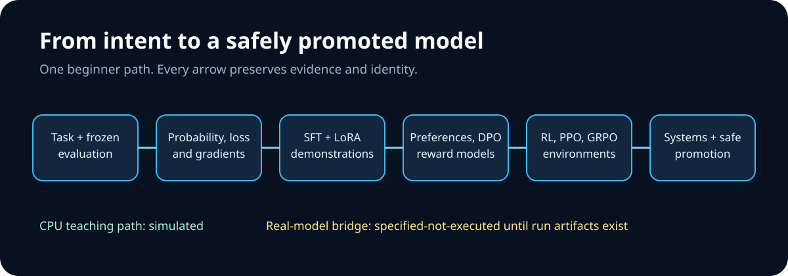

# model optimization, RL, and post-training 101



This is a beginner-first, CPU-first course that connects the whole post-training stack. You begin with probabilities and gradients, build supervised fine-tuning and preference learning, learn reinforcement learning from first principles, and finish with a reproducible promote-or-reject decision.

You need basic Python reading ability. You do **not** need prior machine-learning math, a GPU, model weights, or a paid API for the canonical path.

## Start here

Read the [canonical 23-chapter path](docs/spine/index.md) in order:

```text
task and frozen evaluation
  -> tokens, loss, gradients
  -> data and supervised fine-tuning
  -> LoRA, preferences, and reward models
  -> RL, policy gradients, PPO, DPO, and GRPO
  -> agents and distributed training systems
  -> failure controls, deployment, and capstone
```

Every chapter contains a plain-language mental model, the real mechanism, a worked example, a practical, an understanding check, failure modes, and primary sources. The [algorithm chooser](docs/reference/algorithm-chooser.md) explains when to use SFT, DPO, reward-model-plus-PPO, or GRPO.

Prefer one continuous file? Read the [single-file book](book/model-optimization-rl-post-training-101.md).

## Run the miniature stack

Use Python 3.12:

```bash
python3.12 -m pip install -e .
pt101 pipeline --output build/pipeline.json
```

Inspect one stage at a time:

```bash
pt101 sft
pt101 reward-model
pt101 dpo
pt101 ppo
pt101 grpo
```

These commands run deterministic two-action teaching models. Their output is labeled `simulated`. It proves the implemented arithmetic and stated invariants; it is **not** evidence that an LLM was trained or that any production behavior improved. Read the [evidence contract](docs/reference/evidence.md).

## Use the playground

Open [the post-training loop playground](docs/playgrounds/post-training-loop.html) in a browser. Move the SFT, preference, reward, and KL controls and inspect which gate blocks promotion. The playground is a visual teaching model, not a trainer.

## Bridge to a real model

The default course stays dependency-free so every reader can run it. The [real-training bridge](docs/reference/real-training-bridge.md) maps each teaching component to PyTorch and Hugging Face TRL, gives a capability-gated small-model procedure, and keeps all unexecuted GPU work labeled `specified-not-executed`.

## Verify the repository

```bash
python3.12 scripts/generate_curriculum.py
python3.12 scripts/build_book.py
python3.12 scripts/validate_all.py
python3.12 -m unittest discover -s tests -v
mkdocs build --strict
```

Canonical chapter prose lives in [scripts/curriculum_data.py](scripts/curriculum_data.py). After changing it, regenerate chapters and the book, then run the full validator. A second generation should produce no diff.

## Evidence labels

- `derived`: arithmetic from visible inputs and equations.
- `simulated`: output from the deterministic CPU teaching model.
- `measured`: an observation with a named model, dataset, hardware, software, and run artifact.
- `reported`: a result stated by a cited external source.
- `specified-not-executed`: a runnable plan with no claimed run.

See [LICENSE](LICENSE), [NOTICE](NOTICE), [CONTRIBUTING.md](CONTRIBUTING.md), and [SECURITY.md](SECURITY.md).
