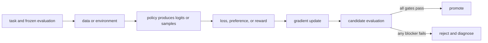

# Model optimization, RL, and post-training 101

A single-file edition of the canonical beginner path. Links to repository reference pages remain relative to `book/`.

<a id="chapter-00"></a>

## 00. Map the post-training stack

**Question:** What are we changing, and why does a pretrained model need another training stack?

**Evidence in this chapter:** stable concepts are explained from cited primary sources. All `pt101` outputs are deterministic `simulated` teaching evidence, not measurements of an LLM.

## The simplest accurate answer

Pretraining teaches a model broad statistical patterns by predicting tokens. Post-training deliberately changes its behavior for a narrower purpose: follow instructions, prefer better answers, solve verifiable tasks, use tools, or satisfy a product contract. Model optimization is the larger loop that chooses data, objective, algorithm, system, and promotion rule—not just the optimizer in code.

## A useful mental model

A pretrained model is like a broadly educated apprentice. Post-training is the apprenticeship for a particular job. A curriculum supplies demonstrations, a reviewer supplies preferences, a scorecard supplies rewards, and exams decide whether the apprentice may serve customers. The analogy stops at agency: a model is a parameterized function, not a person with intent.

## How it works

Every method in this course fits one loop: define behavior; collect task-shaped data; compute a scalar training signal; update parameters; evaluate on held-out tasks; reject or promote the candidate. SFT gets the signal from demonstrated tokens. Preference methods get it from chosen-versus-rejected responses. Online RL gets it from sampled actions and rewards. The production system must preserve dataset, model, code, and evaluator identities so a result is reproducible.



## Work one example

Suppose the prompt is `2 + 3 =`. A base model assigns probabilities to many continuations. SFT raises the probability of a demonstrated `5`. DPO raises the relative probability of `5` over a rejected `6`. RL can sample answers and use an exact checker that returns 1 for `5` and 0 otherwise. These are different paths to a training signal, not interchangeable names for the same algorithm.

## Do it yourself

Run `pt101 pipeline --output build/pipeline.json`. Follow one number from base logits through SFT, reward modeling, DPO, PPO, GRPO, evaluation, and the promotion gate. Label every result `simulated`.

Record the input, configuration, output, evidence label, and one sentence stating what the output **does not** prove. If you change two variables, split the work into two experiments.

## Check your understanding

Can you name the five objects that must exist before an optimizer step is meaningful: task, data or environment, policy, objective or reward, and evaluator?

## Common failure

Do not start with a fashionable trainer. If the evaluation cannot distinguish a better model from a worse one, faster training only produces an untrustworthy candidate sooner.

## Sources

- [Training language models to follow instructions with human feedback](https://arxiv.org/abs/2203.02155)
- [Hugging Face TRL documentation](https://huggingface.co/docs/trl/main/index)

## Course position

- Prerequisite: None. Start here.
- Next: [Chapter 01](../docs/spine/01-numbers-probability-and-sampling.md)


---

<a id="chapter-01"></a>

## 01. Numbers, probability, and sampling

**Question:** How does a model turn scores into a choice?

**Evidence in this chapter:** stable concepts are explained from cited primary sources. All `pt101` outputs are deterministic `simulated` teaching evidence, not measurements of an LLM.

## The simplest accurate answer

A model emits logits: unrestricted scores, one per possible token or action. Softmax converts them into non-negative probabilities that sum to one. Training changes logits; sampling turns probabilities into actual outputs. You need this boundary because losses usually operate on log-probabilities while users observe sampled text.

## A useful mental model

Think of logits as adjustable heights and softmax as water flowing downhill into probability buckets. Raising one height changes every bucket after normalization. This analogy explains competition among actions, but temperature and truncation are explicit mathematical transforms, not physical heat or cutting a bucket.

## How it works

For logits z, softmax gives p_i = exp(z_i) / sum_j exp(z_j). Subtracting the maximum logit before exponentiating gives the same probabilities and avoids overflow. A categorical sample chooses action i with probability p_i. Temperature divides logits before softmax; lower temperature sharpens the distribution. Top-k and top-p remove candidates and renormalize, which changes the behavior policy that generated RL data.


## Work one example

With logits [0, 0], two actions each have probability 0.5. After one toy SFT step the logits become approximately [-0.2, 0.2], so the demonstrated action becomes more likely. Nothing deterministic happened: the policy distribution moved. Greedy decoding would hide this distinction by always selecting the larger logit.

## Do it yourself

Run `pt101 sft`. Recompute the two probabilities by hand using a calculator. Then add the same constant to both logits and prove the probabilities do not change.

Record the input, configuration, output, evidence label, and one sentence stating what the output **does not** prove. If you change two variables, split the work into two experiments.

## Check your understanding

Why is a generated completion evidence about a sample, but not a complete description of the policy?

## Common failure

Never compare token probabilities from different tokenizers or prompt templates as if their event spaces were identical.

## Sources

- [PyTorch automatic differentiation](https://docs.pytorch.org/docs/stable/autograd.html)

## Course position

- Prerequisite: [Chapter 00](../docs/spine/00-map-the-stack.md)
- Next: [Chapter 02](../docs/spine/02-vectors-matrices-and-neural-networks.md)


---

<a id="chapter-02"></a>

## 02. Vectors, matrices, and neural networks

**Question:** What are the objects inside a model before they become probabilities?

**Evidence in this chapter:** stable concepts are explained from cited primary sources. All `pt101` outputs are deterministic `simulated` teaching evidence, not measurements of an LLM.

## The simplest accurate answer

A scalar is one number, a vector is an ordered list of numbers, and a matrix is a rectangular grid of numbers. A tensor generalizes these objects to more axes. Neural networks repeatedly multiply tensors, add learned offsets, and apply simple nonlinear functions. The numbers being learned are the parameters.

## A useful mental model

A spreadsheet is a useful picture of a matrix: rows and columns organize numbers, and a formula can combine them. Matrix multiplication is not ordinary cell-by-cell multiplication; each output cell is a dot product that measures how one row combines with one column.

## How it works

For vector x and matrix W, a linear layer computes y = W*x + b. Each element of y is a weighted sum of x. A nonlinear activation between linear layers prevents the whole stack from collapsing into one linear transformation. An embedding table maps a discrete token ID to a learned vector. A transformer then mixes token vectors through attention and feed-forward layers. Shape notation matters: batch, sequence, hidden dimension, vocabulary, and attention heads name axes with different meanings.


## Work one example

Let x=[2,3] and one output row of W be [0.5,-1]. Their dot product is 0.5*2 + (-1)*3 = -2. Add bias 0.25 and the output is -1.75. A second row produces a second output number. Millions or billions of parameters repeat this same kind of arithmetic at larger shapes.

## Do it yourself

Compute a two-by-two matrix times a two-element vector by hand. Write the shape of every input and output. Then count the parameters in a linear layer with 4 inputs, 3 outputs, and one bias per output.

Record the input, configuration, output, evidence label, and one sentence stating what the output **does not** prove. If you change two variables, split the work into two experiments.

## Check your understanding

Why does changing one matrix row affect one output feature directly, while changing one input element can affect every output feature?

## Common failure

Do not treat tensor shape errors as mere syntax problems. A transposed or broadcast axis can silently optimize a different computation when dimensions happen to fit.

## Sources

- [Attention Is All You Need](https://arxiv.org/abs/1706.03762)
- [PyTorch automatic differentiation](https://docs.pytorch.org/docs/stable/autograd.html)

## Course position

- Prerequisite: [Chapter 01](../docs/spine/01-numbers-probability-and-sampling.md)
- Next: [Chapter 03](../docs/spine/03-parameters-forward-loss-gradient.md)


---

<a id="chapter-03"></a>

## 03. Parameters, forward passes, losses, and gradients

**Question:** What physically changes when a model learns?

**Evidence in this chapter:** stable concepts are explained from cited primary sources. All `pt101` outputs are deterministic `simulated` teaching evidence, not measurements of an LLM.

## The simplest accurate answer

Parameters are stored numbers used by the forward pass. The forward pass maps inputs to logits. A loss maps predictions and targets to one scalar where lower means better for the declared objective. A gradient says how a tiny change in each parameter would change that loss. An optimizer uses gradients to propose a parameter update.

## A useful mental model

Walking downhill is useful: the loss is altitude, a gradient points uphill, and subtracting it takes a downhill step. But real neural losses are high-dimensional, noisy, and can have flat or sharp regions; there is no guarantee that each stochastic step improves held-out behavior.

## How it works

For parameter w and loss L, gradient descent applies w <- w - learning_rate * dL/dw. Backpropagation efficiently applies the chain rule from the scalar loss back through every differentiable operation. A batch averages or sums examples before the update. Optimizers such as Adam maintain moving statistics, but they still need a correctly constructed loss and gradients. Zeroing gradients, choosing precision, clipping norms, and scheduling the learning rate are system decisions with behavioral consequences.


## Work one example

If a one-parameter model predicts y_hat = w*x and squared loss is (y_hat-y)^2, then dL/dw = 2(w*x-y)x. At x=2, y=6, w=1, the gradient is -16. With learning rate 0.1, w becomes 2.6 and the prediction moves from 2 toward 6.

## Do it yourself

Work the one-parameter example for three steps. Change the learning rate to 1.0 and observe overshoot. Record parameters, loss, gradient, and update separately.

Record the input, configuration, output, evidence label, and one sentence stating what the output **does not** prove. If you change two variables, split the work into two experiments.

## Check your understanding

Can you explain why a loss decreasing on the training batch does not prove the model improved on new tasks?

## Common failure

A gradient is local sensitivity, not a causal explanation of model behavior and not a guarantee of generalization.

## Sources

- [PyTorch automatic differentiation](https://docs.pytorch.org/docs/stable/autograd.html)

## Course position

- Prerequisite: [Chapter 02](../docs/spine/02-vectors-matrices-and-neural-networks.md)
- Next: [Chapter 04](../docs/spine/04-language-model-from-tokens-to-loss.md)


---

<a id="chapter-04"></a>

## 04. A language model from tokens to loss

**Question:** Where do post-training losses attach to a transformer?

**Evidence in this chapter:** stable concepts are explained from cited primary sources. All `pt101` outputs are deterministic `simulated` teaching evidence, not measurements of an LLM.

## The simplest accurate answer

A tokenizer maps text to token IDs. The model maps a prefix of IDs to logits for the next token. Repeating that step produces a completion. During teacher-forced training, the model sees known preceding tokens and cross-entropy penalizes low probability on each target token. Instruction tuning usually masks prompt tokens so the loss is charged only on the desired response.

## A useful mental model

Autocomplete is the right starting analogy: at every position the model predicts the next piece. The analogy breaks because a transformer shares parameters across positions, attends to a bounded context, and operates on tokenizer pieces rather than human words.

## How it works

For a response with tokens y_1...y_T, the negative log-likelihood is -sum_t log pi(y_t | prompt, y_<t). Sequence log-probability is therefore a sum of token log-probabilities. Length normalization, end-of-sequence handling, chat templates, padding masks, and truncation can silently change what an objective optimizes. Preference and RL methods often reuse these same sequence log-probabilities inside a different outer loss.


## Work one example

For target-token probabilities [0.5, 0.25], the summed negative log-likelihood is -log(0.5)-log(0.25), about 2.08. A four-token response can accumulate a more negative log-probability than a two-token response even when its per-token predictions are equally good, so raw sequence scores carry a length effect.

## Do it yourself

Write down the exact tokens whose loss is active for one chat record containing system, user, and assistant messages. State what happens if the final response is truncated.

Record the input, configuration, output, evidence label, and one sentence stating what the output **does not** prove. If you change two variables, split the work into two experiments.

## Check your understanding

Why must the tokenizer and chat template be versioned as part of a training run?

## Common failure

Do not call perplexity a complete instruction-following metric; it measures predictive fit to a token distribution.

## Sources

- [Attention Is All You Need](https://arxiv.org/abs/1706.03762)
- [Training language models to follow instructions with human feedback](https://arxiv.org/abs/2203.02155)

## Course position

- Prerequisite: [Chapter 03](../docs/spine/03-parameters-forward-loss-gradient.md)
- Next: [Chapter 05](../docs/spine/05-objectives-and-experiments.md)


---

<a id="chapter-05"></a>

## 05. Objectives, baselines, and experiments

**Question:** How do we know an update caused a useful improvement?

**Evidence in this chapter:** stable concepts are explained from cited primary sources. All `pt101` outputs are deterministic `simulated` teaching evidence, not measurements of an LLM.

## The simplest accurate answer

An objective is what training directly optimizes. An evaluator is what you use to judge the resulting model. They may overlap, but keeping them separate is essential: optimizing a proxy can improve the proxy while harming the real task. A baseline and a controlled comparison turn an anecdote into an experiment.

## A useful mental model

A speedometer is a proxy for safe driving. Maximizing its number would be absurd because the goal is not the instrument. Training rewards and automated judges are also instruments. They are valuable only while their relationship to the real behavior remains tested.

## How it works

Freeze the task set before looking at candidate results. Split train, development, and test data by leakage units such as user, source document, problem family, or time—not merely by random rows. Compare a candidate with the exact baseline under the same decoding and evaluator settings. Report central tendency, tails, uncertainty, regressions, cost, and the number of independent seeds when training variance matters.


## Work one example

If pass rate rises from 60/100 to 66/100, the observed lift is six percentage points. That does not prove the true lift is exactly six points. Inspect which six changed, whether any prior passes regressed, whether the items leaked into training, and whether the evaluator would accept subtly wrong answers.

## Do it yourself

Create a one-page experiment card with hypothesis, single changed variable, frozen test set, primary metric, three guardrails, seed plan, stop condition, and promotion rule.

Record the input, configuration, output, evidence label, and one sentence stating what the output **does not** prove. If you change two variables, split the work into two experiments.

## Check your understanding

What observation would falsify your claim that the training method—not a prompt-template change—caused the lift?

## Common failure

Changing data, template, decoding, and algorithm in one run produces a candidate but not an attribution.

## Sources

- [Training language models to follow instructions with human feedback](https://arxiv.org/abs/2203.02155)

## Course position

- Prerequisite: [Chapter 04](../docs/spine/04-language-model-from-tokens-to-loss.md)
- Next: [Chapter 06](../docs/spine/06-data-pipeline.md)


---

<a id="chapter-06"></a>

## 06. Build the data pipeline

**Question:** How do raw interactions become trustworthy training records?

**Evidence in this chapter:** stable concepts are explained from cited primary sources. All `pt101` outputs are deterministic `simulated` teaching evidence, not measurements of an LLM.

## The simplest accurate answer

Post-training data is a product specification written in examples. A useful pipeline defines a schema, validates it, removes or controls duplicates, records provenance and consent, transforms records deterministically, and freezes immutable train and evaluation snapshots.

## A useful mental model

Ingredients determine what a cook can make. Cleaning labels on jars matters, but it cannot turn a biased ingredient set into a balanced meal. Likewise, schema validation prevents malformed records; it does not prove coverage, correctness, or representativeness.

## How it works

Common record shapes are prompt-response demonstrations, prompt-chosen-rejected preference pairs, and prompt-completion-reward trajectories. Preserve raw source IDs, transformation code version, tokenizer/template identity, filtering reason, annotator or judge policy, and dataset digest. Deduplicate before splitting so near-identical examples do not cross the evaluation boundary. Treat model-generated synthetic data as generated evidence and audit error amplification.


## Work one example

A preference record should not be only two strings. It needs the shared prompt, chosen response, rejected response, rubric or collection protocol, source identity, and flags for ties or invalid comparisons. Otherwise downstream code cannot distinguish a genuine preference from formatting noise.

## Do it yourself

Design JSON schemas for demonstration, preference, and trajectory records. List five rejection cases and create a dataset card that states known coverage gaps.

Record the input, configuration, output, evidence label, and one sentence stating what the output **does not** prove. If you change two variables, split the work into two experiments.

## Check your understanding

Can you trace one final token back to its raw record, transform, template, and license or consent boundary?

## Common failure

Do not randomly split after generating many variants of the same seed prompt; that leaks problem identity.

## Sources

- [TRL dataset formats](https://huggingface.co/docs/trl/main/dataset_formats)
- [Datasheets for Datasets](https://arxiv.org/abs/1803.09010)

## Course position

- Prerequisite: [Chapter 05](../docs/spine/05-objectives-and-experiments.md)
- Next: [Chapter 07](../docs/spine/07-evaluation-harness.md)


---

<a id="chapter-07"></a>

## 07. Build the evaluation harness first

**Question:** What must be measured before any training run?

**Evidence in this chapter:** stable concepts are explained from cited primary sources. All `pt101` outputs are deterministic `simulated` teaching evidence, not measurements of an LLM.

## The simplest accurate answer

A baseline evaluation establishes whether the task, runner, and scoring rule work before model weights change. The harness must pin prompts, decoding, environment, judge, retries, and aggregation. It should store per-example artifacts so a score can be audited.

## A useful mental model

A before-and-after photograph only helps if the camera, lighting, angle, and subject are controlled. In model evaluation, prompt formatting, sampling temperature, tool availability, and judge version are the camera settings.

## How it works

Use exact or executable checkers when the task supports them. Use human or model judges for open-ended properties, but calibrate them against adjudicated examples, randomize answer order, measure position bias, and keep judge prompts versioned. Track task success as the primary metric, then safety, regressions, latency, token cost, and format validity as guardrails. Aggregate scores never replace per-slice analysis.


## Work one example

If a code agent passes 8/10 tasks but modifies forbidden files on two passing tasks, raw pass rate hides a contract violation. A correct harness makes workspace integrity a guardrail and denies promotion.

## Do it yourself

Run the untrained toy pipeline and inspect `evaluation` and `promotion`. Add a hypothetical safety regression even while quality rises; make the gate fail.

Record the input, configuration, output, evidence label, and one sentence stating what the output **does not** prove. If you change two variables, split the work into two experiments.

## Check your understanding

Could a candidate learn the evaluator's surface pattern without learning the intended behavior? Name one adversarial test.

## Common failure

Do not train directly against a held-out judge set and still call it held out.

## Sources

- [Holistic Evaluation of Language Models](https://arxiv.org/abs/2211.09110)
- [Training language models to follow instructions with human feedback](https://arxiv.org/abs/2203.02155)

## Course position

- Prerequisite: [Chapter 06](../docs/spine/06-data-pipeline.md)
- Next: [Chapter 08](../docs/spine/08-supervised-fine-tuning.md)


---

<a id="chapter-08"></a>

## 08. Supervised fine-tuning

**Question:** How does imitation turn examples into a usable instruction model?

**Evidence in this chapter:** stable concepts are explained from cited primary sources. All `pt101` outputs are deterministic `simulated` teaching evidence, not measurements of an LLM.

## The simplest accurate answer

Supervised fine-tuning (SFT) continues next-token training on curated demonstrations. It teaches the response distribution directly: given this prompt and previous response tokens, raise the probability of the demonstrated next token. SFT is usually the simplest strong baseline and often establishes formats and skills needed before preference optimization or online RL.

## A useful mental model

SFT is copying worked solutions with feedback from an answer key. It efficiently transfers demonstrated patterns. It cannot learn a better response than the demonstrations merely because the loss ran longer.

## How it works

Format each record with the production chat template, mask non-response tokens according to the declared objective, pack examples only when boundaries and attention masks remain correct, and monitor token-level loss. Choose learning rate, effective batch size, epochs or steps, sequence length, precision, and checkpoint cadence. Evaluate during training but make promotion decisions on a frozen test set. More epochs can memorize narrow data and erase general capabilities.


## Work one example

The toy SFT command starts with two equal logits. Cross-entropy's gradient is probability minus one-hot target, so the target logit rises and the other falls. A real model performs the same conceptual operation across vocabulary logits at every active response token.

## Do it yourself

Run `pt101 sft --output build/sft.json`. Derive the gradient by hand. Then plan a real SFT dry run with 32 records and a tiny open model, but label it `specified-not-executed` until artifacts exist.

Record the input, configuration, output, evidence label, and one sentence stating what the output **does not** prove. If you change two variables, split the work into two experiments.

## Check your understanding

What behavior can never be learned if no demonstration or transferable pattern gives the model evidence for it?

## Common failure

A falling SFT loss can mean memorization. Always compare held-out task behavior and general-capability regressions.

## Sources

- [Training language models to follow instructions with human feedback](https://arxiv.org/abs/2203.02155)
- [TRL SFT Trainer](https://huggingface.co/docs/trl/main/sft_trainer)

## Course position

- Prerequisite: [Chapter 07](../docs/spine/07-evaluation-harness.md)
- Next: [Chapter 09](../docs/spine/09-lora-and-memory.md)


---

<a id="chapter-09"></a>

## 09. LoRA, adapters, and training memory

**Question:** How can we update a large model without training every weight?

**Evidence in this chapter:** stable concepts are explained from cited primary sources. All `pt101` outputs are deterministic `simulated` teaching evidence, not measurements of an LLM.

## The simplest accurate answer

Low-Rank Adaptation (LoRA) freezes a base weight matrix and learns a product of two smaller matrices as its update. It reduces trainable parameters and optimizer-state memory. It does not make activations, attention, data quality, or evaluation free.

## A useful mental model

Instead of rebuilding a large wall, LoRA bolts on a thin adjustable frame. The frame can redirect the structure's behavior with fewer new pieces, but the original wall still occupies space and the fit depends on where the frame attaches.

## How it works

For base matrix W, LoRA uses W' = W + scale * B*A where A and B have rank r much smaller than W's dimensions. Decide target modules, rank, scaling, dropout, and whether to train biases. QLoRA additionally stores the frozen base in a quantized representation while computing adapter updates at a suitable precision. Deployment may keep adapters separate or merge them, each with provenance and serving implications.


## Work one example

A 4096 by 4096 dense update has about 16.8 million entries. Two rank-8 factors have 4096*8 + 8*4096 = 65,536 entries, about 256 times fewer update entries. This derived parameter ratio is not a claim of 256 times faster end-to-end training.

## Do it yourself

Compute dense-versus-LoRA trainable entries for three layer sizes and ranks. Write a memory ledger containing weights, gradients, optimizer states, activations, temporary buffers, and allocator headroom.

Record the input, configuration, output, evidence label, and one sentence stating what the output **does not** prove. If you change two variables, split the work into two experiments.

## Check your understanding

Why can LoRA reduce optimizer memory substantially while leaving long-sequence activation memory as a blocker?

## Common failure

Do not translate trainable-parameter reduction directly into wall-clock speedup or quality equivalence.

## Sources

- [LoRA: Low-Rank Adaptation of Large Language Models](https://arxiv.org/abs/2106.09685)
- [QLoRA: Efficient Finetuning of Quantized LLMs](https://arxiv.org/abs/2305.14314)

## Course position

- Prerequisite: [Chapter 08](../docs/spine/08-supervised-fine-tuning.md)
- Next: [Chapter 10](../docs/spine/10-preference-data.md)


---

<a id="chapter-10"></a>

## 10. Preference data and feedback

**Question:** How do we turn human or AI judgments into usable comparisons?

**Evidence in this chapter:** stable concepts are explained from cited primary sources. All `pt101` outputs are deterministic `simulated` teaching evidence, not measurements of an LLM.

## The simplest accurate answer

Preference learning asks which response is better under a rubric. A pairwise comparison is often easier than assigning an absolute score, but it is still a measurement made by a person, model, or program under a specific protocol.

## A useful mental model

A tournament can rank players from wins and losses without giving an absolute skill score. Yet matchups matter: repeatedly pairing one player only with beginners gives a distorted ranking. Preference data also depends on candidate diversity and pairing policy.

## How it works

Sample candidates from declared policies and decoding settings. Randomize display order, allow ties or invalid items, train annotators on a concrete rubric, use overlap to estimate agreement, adjudicate hard cases, and preserve slice labels. AI feedback can scale collection, but it imports judge biases and may reward stylistic imitation. Preference coverage should match the deployment prompt distribution and include negative examples that expose important failure modes.


## Work one example

If both candidates are wrong but one is more fluent, a vague `which is better?` rubric may select fluent error. A correctness-first rubric plus an executable checker changes the observation. The pair is not ground truth outside that rubric.

## Do it yourself

Write five candidate pairs for one task. Include a tie, two jointly bad pairs, and a pair where verbosity conflicts with correctness. Create explicit adjudication rules.

Record the input, configuration, output, evidence label, and one sentence stating what the output **does not** prove. If you change two variables, split the work into two experiments.

## Check your understanding

Would reversing response order or hiding formatting change the label? Test it before scaling collection.

## Common failure

Do not discard disagreement automatically; it may reveal an underspecified task or heterogeneous user preferences.

## Sources

- [Training language models to follow instructions with human feedback](https://arxiv.org/abs/2203.02155)
- [Constitutional AI: Harmlessness from AI Feedback](https://arxiv.org/abs/2212.08073)

## Course position

- Prerequisite: [Chapter 09](../docs/spine/09-lora-and-memory.md)
- Next: [Chapter 11](../docs/spine/11-reward-models.md)


---

<a id="chapter-11"></a>

## 11. Reward models

**Question:** How can comparisons train a scalar scorer?

**Evidence in this chapter:** stable concepts are explained from cited primary sources. All `pt101` outputs are deterministic `simulated` teaching evidence, not measurements of an LLM.

## The simplest accurate answer

A reward model maps a prompt-response pair to a scalar. Pairwise training raises the chosen response's score above the rejected response's score. The scalar is useful for ranking and RL, but it is a learned proxy whose reliability is bounded by the comparison distribution.

## A useful mental model

A trained judge learns from past verdicts. It can make future review cheaper, but a clever contestant may exploit patterns in the judge rather than satisfy the real rules. That exploitation is reward hacking.

## How it works

A common Bradley-Terry loss is -log sigmoid(r_chosen-r_rejected). Only score differences matter, so adding the same constant to both rewards changes nothing. Evaluate pairwise accuracy, calibration where meaningful, slice robustness, out-of-distribution behavior, and sensitivity to superficial features. During RL the policy distribution moves, so a reward model accurate on old candidates can become unreliable on new ones.


## Work one example

At equal scores the model assigns 0.5 probability that the chosen item wins and loss is about 0.693. One gradient step increases the score gap. Run the toy reward model to see that movement; it proves the formula implementation, not judge quality.

## Do it yourself

Run `pt101 reward-model`. Create adversarial responses that are longer, more confident, or copy rubric words while remaining wrong. Check whether a proposed scorer is fooled.

Record the input, configuration, output, evidence label, and one sentence stating what the output **does not** prove. If you change two variables, split the work into two experiments.

## Check your understanding

What new candidate distribution would make the reward model's held-out accuracy irrelevant?

## Common failure

Never report reward increase alone as product improvement; audit real task outcomes on fresh samples.

## Sources

- [Training language models to follow instructions with human feedback](https://arxiv.org/abs/2203.02155)
- [TRL Reward Trainer](https://huggingface.co/docs/trl/main/reward_trainer)

## Course position

- Prerequisite: [Chapter 10](../docs/spine/10-preference-data.md)
- Next: [Chapter 12](../docs/spine/12-rl-from-bandits-to-mdps.md)


---

<a id="chapter-12"></a>

## 12. RL from bandits to Markov decision processes

**Question:** What makes reinforcement learning different from supervised learning?

**Evidence in this chapter:** stable concepts are explained from cited primary sources. All `pt101` outputs are deterministic `simulated` teaching evidence, not measurements of an LLM.

## The simplest accurate answer

Reinforcement learning trains a policy from consequences of sampled actions. In a bandit there is one decision and reward. In a Markov decision process (MDP), actions change state, rewards can arrive later, and the policy must account for future outcomes.

## A useful mental model

Trying restaurants is a bandit: choose once and observe a meal. Navigating a city is sequential: an early turn changes which later streets are reachable. The analogy breaks when a language model's state is a token history and the environment may include tools, users, or program execution.

## How it works

An MDP defines states, actions, transitions, rewards, and a discount factor. A trajectory is s_0,a_0,r_0,... . Return is the discounted sum of future rewards. A value function predicts expected return from a state; an action-value function conditions on an action; an advantage compares an action with the baseline expectation. LLM generation can be modeled with token actions, but sequence-level actions are often used for tractability.


## Work one example

For rewards [0,0,1] and discount 0.9, return from the start is 0.81. The terminal success supplies credit to earlier actions. With sparse rewards, many samples provide little information, which motivates better exploration, shaping, curricula, or process feedback.

## Do it yourself

Draw an MDP for a two-step tool task. Specify terminal states, invalid actions, timeout reward, success reward, and which observations the policy receives.

Record the input, configuration, output, evidence label, and one sentence stating what the output **does not** prove. If you change two variables, split the work into two experiments.

## Check your understanding

Is your task truly sequential, or is contextual-bandit feedback enough? Using a simpler model can reduce variance and system complexity.

## Common failure

Do not call DPO online RL: it learns from a fixed preference dataset and does not sample environment consequences during each update.

## Sources

- [Reinforcement Learning: An Introduction](http://incompleteideas.net/book/the-book-2nd.html)

## Course position

- Prerequisite: [Chapter 11](../docs/spine/11-reward-models.md)
- Next: [Chapter 13](../docs/spine/13-policy-gradients.md)


---

<a id="chapter-13"></a>

## 13. Policy gradients and REINFORCE

**Question:** How can a non-differentiable reward change differentiable model weights?

**Evidence in this chapter:** stable concepts are explained from cited primary sources. All `pt101` outputs are deterministic `simulated` teaching evidence, not measurements of an LLM.

## The simplest accurate answer

The policy-gradient trick differentiates the log-probability of sampled actions and weights it by observed return. The reward itself need not be differentiable. Actions with above-baseline outcomes become more likely; below-baseline actions become less likely.

## A useful mental model

A coach cannot differentiate the final score, but can reinforce decisions associated with better-than-expected games. This analogy hides confounding: one sampled game is noisy evidence about each decision.

## How it works

REINFORCE estimates gradient E[R * grad log pi(a|s)]. Subtracting a baseline independent of the sampled action preserves the expectation while reducing variance. In sequence models, sum token log-probabilities for the sampled completion and multiply by an advantage estimate. Batches, reward normalization, value baselines, entropy bonuses, and KL penalties stabilize learning but also change the effective objective.


## Work one example

With two equally likely actions, choosing action 1 and receiving reward above baseline increases action 1's logit relative to action 0. A second sample may push the other way. The average across representative trajectories estimates the desired direction.

## Do it yourself

Use the Python API `reinforce_step([0,0], action=1, reward=1, baseline=0.5)`. Repeat for below-baseline reward and explain the sign change.

Record the input, configuration, output, evidence label, and one sentence stating what the output **does not** prove. If you change two variables, split the work into two experiments.

## Check your understanding

Why does a baseline reduce noise without changing which policy is optimal in expectation?

## Common failure

High reward variance, stale samples, and incorrect masks can overwhelm the useful learning signal even when the formula looks right.

## Sources

- [Simple Statistical Gradient-Following Algorithms](https://link.springer.com/article/10.1007/BF00992696)
- [Reinforcement Learning: An Introduction](http://incompleteideas.net/book/the-book-2nd.html)

## Course position

- Prerequisite: [Chapter 12](../docs/spine/12-rl-from-bandits-to-mdps.md)
- Next: [Chapter 14](../docs/spine/14-ppo-and-kl-control.md)


---

<a id="chapter-14"></a>

## 14. PPO and KL control

**Question:** Why constrain how far the policy moves?

**Evidence in this chapter:** stable concepts are explained from cited primary sources. All `pt101` outputs are deterministic `simulated` teaching evidence, not measurements of an LLM.

## The simplest accurate answer

Proximal Policy Optimization (PPO) reuses sampled trajectories while limiting incentives for large probability-ratio changes. In LLM post-training it is commonly paired with a value model for advantages and a reference policy or KL penalty to preserve useful behavior.

## A useful mental model

If feedback comes from yesterday's driving, a driver should not rewrite every habit overnight. PPO's clip is a guardrail on the update incentive, not a guarantee that the final model is safe or close everywhere.

## How it works

For sampled action a, ratio = pi_new(a|s)/pi_old(a|s). The clipped surrogate takes the smaller of ratio*A and clip(ratio,1-epsilon,1+epsilon)*A. Positive and negative advantages produce asymmetric constraints. A complete PPO loop needs rollout policy identity, stored old log-probabilities, returns, advantage estimation, minibatch epochs, value loss, entropy or KL terms, and freshness controls.


## Work one example

Run the toy case ratio 1.35, advantage 0.8, epsilon 0.2. The unclipped objective is 1.08 but the clipped objective is 0.96, so the surrogate stops rewarding that extra increase for this sample. Gradients and aggregate behavior still require the full batch.

## Do it yourself

Run `pt101 ppo`. Evaluate four cases: ratio above and below the interval crossed with positive and negative advantages. Explain each minimum.

Record the input, configuration, output, evidence label, and one sentence stating what the output **does not** prove. If you change two variables, split the work into two experiments.

## Check your understanding

Why does clipping the sampled-action ratio not bound KL divergence for every prompt and token?

## Common failure

A PPO run is on-policy only within a freshness tolerance; serving rollouts from unidentified or lagging weights corrupts ratios.

## Sources

- [Proximal Policy Optimization Algorithms](https://arxiv.org/abs/1707.06347)
- [Training language models to follow instructions with human feedback](https://arxiv.org/abs/2203.02155)
- [TRL PPO Trainer](https://huggingface.co/docs/trl/main/ppo_trainer)

## Course position

- Prerequisite: [Chapter 13](../docs/spine/13-policy-gradients.md)
- Next: [Chapter 15](../docs/spine/15-dpo.md)


---

<a id="chapter-15"></a>

## 15. Direct Preference Optimization

**Question:** Can we optimize preferences without an explicit reward-model-and-PPO loop?

**Evidence in this chapter:** stable concepts are explained from cited primary sources. All `pt101` outputs are deterministic `simulated` teaching evidence, not measurements of an LLM.

## The simplest accurate answer

Direct Preference Optimization (DPO) trains a policy directly on chosen and rejected responses while comparing both with a fixed reference policy. It converts a particular KL-regularized preference objective into a classification-style loss.

## A useful mental model

DPO is like teaching from side-by-side corrections without first hiring a separate judge who assigns reusable scores. This is operationally simpler, but the corrections are fixed: the learner does not discover new mistakes by acting in an environment during training.

## How it works

For each pair, compute policy and reference sequence log-probability gaps between chosen and rejected. DPO increases beta times the policy gap relative to the reference gap through a log-sigmoid loss. Beta controls the scale in the stated formulation, but implementations and conventions must be checked. Tokenization, length effects, reference identity, pair quality, and loss variants all matter.


## Work one example

If policy and reference gaps are equal, the DPO margin is zero and loss is about 0.693. The gradient increases the policy's chosen-minus-rejected gap. `pt101 dpo` performs that scalar step.

## Do it yourself

Run `pt101 dpo`. Recompute the margin and loss. Then swap chosen and rejected and show why the update reverses.

Record the input, configuration, output, evidence label, and one sentence stating what the output **does not** prove. If you change two variables, split the work into two experiments.

## Check your understanding

When would online sampling and environment feedback reveal failures that a frozen preference dataset cannot cover?

## Common failure

DPO is not automatically better than PPO; it trades a simpler training loop for dependence on static comparison coverage.

## Sources

- [Direct Preference Optimization](https://arxiv.org/abs/2305.18290)
- [TRL DPO Trainer](https://huggingface.co/docs/trl/main/dpo_trainer)

## Course position

- Prerequisite: [Chapter 14](../docs/spine/14-ppo-and-kl-control.md)
- Next: [Chapter 16](../docs/spine/16-verifiable-rewards-and-rlaif.md)


---

<a id="chapter-16"></a>

## 16. Verifiable rewards, human feedback, and AI feedback

**Question:** Where should rewards come from?

**Evidence in this chapter:** stable concepts are explained from cited primary sources. All `pt101` outputs are deterministic `simulated` teaching evidence, not measurements of an LLM.

## The simplest accurate answer

Reward sources form a spectrum: executable checkers, environment outcomes, human judgments, AI judgments, and learned reward models. Choose the most direct reliable signal available, and combine it with guardrails for behavior the scalar omits.

## A useful mental model

A unit test gives crisp feedback on code that has a formal contract; an editor judges clarity that no single test captures. Using an editor where a compiler suffices adds cost and variance. Using a compiler to judge prose misses the task.

## How it works

Verifiable rewards work well for math answers, code tests, games, and tool outcomes, but checkers can be incomplete or exploitable. Human feedback captures nuanced preferences but is slow and inconsistent. AI feedback scales but inherits the evaluator model's blind spots and correlated errors. Constitutional AI is one approach that uses written principles and AI feedback; it does not eliminate the need to validate the resulting behavior.


## Work one example

A code reward of `tests_passed / total_tests` can be hacked by deleting tests unless workspace integrity and hidden tests are enforced. The reward function is part of the attack surface.

## Do it yourself

Threat-model a reward for a coding, math, or tool-use task. List ten ways the policy could earn reward without satisfying user intent, then add independent checks.

Record the input, configuration, output, evidence label, and one sentence stating what the output **does not** prove. If you change two variables, split the work into two experiments.

## Check your understanding

What trusted mechanism produces each reward bit, and can the policy influence that mechanism?

## Common failure

Reward shaping can accelerate learning while changing the optimum; prove or test that shaping preserves the intended task.

## Sources

- [Constitutional AI: Harmlessness from AI Feedback](https://arxiv.org/abs/2212.08073)
- [Training language models to follow instructions with human feedback](https://arxiv.org/abs/2203.02155)

## Course position

- Prerequisite: [Chapter 15](../docs/spine/15-dpo.md)
- Next: [Chapter 17](../docs/spine/17-grpo.md)


---

<a id="chapter-17"></a>

## 17. GRPO and group-relative advantages

**Question:** How can a group of completions provide a baseline without a separate critic?

**Evidence in this chapter:** stable concepts are explained from cited primary sources. All `pt101` outputs are deterministic `simulated` teaching evidence, not measurements of an LLM.

## The simplest accurate answer

Group Relative Policy Optimization (GRPO) samples multiple completions for the same prompt and normalizes their rewards within the group to form relative advantages. The original DeepSeekMath formulation was introduced as a PPO variant that avoids a separate value model.

## A useful mental model

A class curve tells which solutions were better than classmates on the same exam. It removes the need to predict an absolute expected grade, but a class where everyone receives the same score gives no ranking signal.

## How it works

For rewards r_1...r_G, a common group-relative estimate subtracts the group mean and divides by group standard deviation. Implementations add details such as clipping, KL terms, token-level aggregation, multiple update iterations, or different normalization. Groups must share the intended conditioning context; mixing unrelated tasks makes the baseline harder to interpret. Zero-variance groups produce no relative signal in the toy implementation.


## Work one example

For rewards [0,1,1,0.5], the mean is 0.625. Above-mean samples get positive advantages and below-mean samples negative ones. Run the command to inspect normalized values and verify their mean is approximately zero.

## Do it yourself

Run `pt101 grpo`. Try all-equal rewards, one extreme outlier, and group sizes two and eight. Explain variance and robustness tradeoffs.

Record the input, configuration, output, evidence label, and one sentence stating what the output **does not** prove. If you change two variables, split the work into two experiments.

## Check your understanding

What happens if one prompt is much harder than another but their samples are incorrectly combined into a group?

## Common failure

GRPO removes a learned critic in the stated design; it does not remove rollout cost, reward design, reference control, or evaluation.

## Sources

- [DeepSeekMath and GRPO](https://arxiv.org/abs/2402.03300)
- [TRL GRPO Trainer](https://huggingface.co/docs/trl/main/grpo_trainer)

## Course position

- Prerequisite: [Chapter 16](../docs/spine/16-verifiable-rewards-and-rlaif.md)
- Next: [Chapter 18](../docs/spine/18-agents-tools-and-environments.md)


---

<a id="chapter-18"></a>

## 18. Agents, tools, and environments

**Question:** What changes when the model acts over multiple steps?

**Evidence in this chapter:** stable concepts are explained from cited primary sources. All `pt101` outputs are deterministic `simulated` teaching evidence, not measurements of an LLM.

## The simplest accurate answer

Agent post-training couples a policy to a stateful environment. The model observes, emits text or tool calls, receives tool results, and continues until success, failure, or a limit. The training record must preserve the whole trajectory and environment identity.

## A useful mental model

Training a chess move from the final result is harder than grading a single answer because early actions change later choices. Tool agents add another complication: the board itself may be nondeterministic, permissioned, or mutable.

## How it works

Define an environment reset, observation schema, action grammar, transition, reward, terminal condition, timeout, and sandbox. Separate model errors from tool failures and harness failures. Pin tool versions and fixtures. Use idempotent or disposable environments for training. For real systems, enforce least privilege and prevent reward channels from authorizing broader actions.


## Work one example

A bug-fixing agent may earn success when tests pass. A valid environment also checks the requested tests existed, forbidden files were untouched, dependencies were not maliciously replaced, and the patch actually addresses a hidden case.

## Do it yourself

Design a three-step calculator environment on paper, then a repository-fix environment. Mark every mutation boundary and cleanup action.

Record the input, configuration, output, evidence label, and one sentence stating what the output **does not** prove. If you change two variables, split the work into two experiments.

## Check your understanding

Can two replays of the same trajectory produce different observations? If yes, how will you attribute the reward?

## Common failure

Never let training rewards grant permissions. Authorization is an external system constraint, not a behavior learned from penalties.

## Sources

- [TRL GRPO Trainer](https://huggingface.co/docs/trl/main/grpo_trainer)

## Course position

- Prerequisite: [Chapter 17](../docs/spine/17-grpo.md)
- Next: [Chapter 19](../docs/spine/19-training-systems.md)


---

<a id="chapter-19"></a>

## 19. The training system: memory, parallelism, and rollouts

**Question:** How does an algorithm become a reliable distributed job?

**Evidence in this chapter:** stable concepts are explained from cited primary sources. All `pt101` outputs are deterministic `simulated` teaching evidence, not measurements of an LLM.

## The simplest accurate answer

A post-training system moves model weights, activations, gradients, optimizer states, batches, rollouts, log-probabilities, and checkpoints through hardware. Algorithm correctness and systems correctness meet at identities: every sample must be scored and updated against the intended policy, reference, reward, and tokenizer.

## A useful mental model

A factory can have a perfect recipe and still ship wrong products if parts are mislabeled or assembly lines are out of sync. Distributed training failures are often identity and freshness failures, not only numerical failures.

## How it works

Data parallelism replicates computation and combines gradients. Sharded data parallelism partitions parameters, gradients, and optimizer state with communication around computation. Tensor and pipeline parallelism split model execution. Online RL also needs rollout workers and sometimes separate inference engines, creating policy-lag and weight-broadcast problems. Build a memory ledger and communication timeline before choosing a topology.


## Work one example

If a model, gradients, and two Adam moments each occupy one unit per parameter at the chosen precision, naive replicated training already needs multiple parameter-sized units before activations and temporary buffers. Sharding changes residency and communication, not the mathematical need to update parameters.

## Do it yourself

Draft a topology for SFT and for online RL. For each process, list resident models, mutable state, input queue, output artifact, synchronization event, and failure recovery.

Record the input, configuration, output, evidence label, and one sentence stating what the output **does not** prove. If you change two variables, split the work into two experiments.

## Check your understanding

How does the learner prove that a stored old log-probability came from the exact rollout policy checkpoint?

## Common failure

Do not choose FSDP, ZeRO, tensor parallelism, or an inference engine from model size alone; derive memory, bandwidth, latency, and operational constraints.

## Sources

- [PyTorch Fully Sharded Data Parallel](https://docs.pytorch.org/docs/stable/fsdp.html)
- [DeepSpeed ZeRO](https://www.deepspeed.ai/tutorials/zero/)
- [TRL distributed training](https://huggingface.co/docs/trl/main/distributing_training)

## Course position

- Prerequisite: [Chapter 18](../docs/spine/18-agents-tools-and-environments.md)
- Next: [Chapter 20](../docs/spine/20-failure-modes-and-safety.md)


---

<a id="chapter-20"></a>

## 20. Failure modes, reward hacking, and safety

**Question:** How does optimization fail even when the training chart is green?

**Evidence in this chapter:** stable concepts are explained from cited primary sources. All `pt101` outputs are deterministic `simulated` teaching evidence, not measurements of an LLM.

## The simplest accurate answer

Optimization amplifies whatever produces the training signal. If the proxy is incomplete, the policy may exploit it. If data is narrow, capabilities may regress elsewhere. If feedback is biased, those biases can become more consistent. Safety is therefore a set of independent constraints and evaluations, not one reward term.

## A useful mental model

A student told that only the final numeric answer matters may learn to copy answer keys. The score improved; the desired competence did not. Models search high-dimensional behavior spaces where proxy loopholes can be harder to anticipate.

## How it works

Watch for reward hacking, judge hacking, sycophancy, mode collapse, verbosity bias, length gaming, catastrophic forgetting, KL drift, memorization, data contamination, capability elicitation gaps, and distribution shift. Use held-out adversarial tasks, canaries, human audits, independent evaluators, per-slice regression budgets, and rollback-ready checkpoints. Red-team the evaluator as aggressively as the policy.

```mermaid
flowchart LR
    A[task and frozen evaluation] --> B[data or environment]
    B --> C[policy produces logits or samples]
    C --> D[loss, preference, or reward]
    D --> E[gradient update]
    E --> F[candidate evaluation]
    F -->|all gates pass| G[promote]
    F -->|any blocker fails| H[reject and diagnose]
```

## Work one example

A candidate gets a higher helpfulness score by always agreeing with the user's premise. A factuality slice shows more confident errors. The promotion rule must block the candidate even though the optimized metric improved.

## Do it yourself

Write a failure register for one planned run: symptom, detector, threshold, containment, rollback, and owner. Include failures in data, trainer, rollout system, evaluator, and deployment.

Record the input, configuration, output, evidence label, and one sentence stating what the output **does not** prove. If you change two variables, split the work into two experiments.

## Check your understanding

Which safety property is enforced outside the model so an optimized policy cannot trade it away?

## Common failure

A KL limit constrains distributional movement relative to a reference; it is not a semantic safety guarantee.

## Sources

- [Training language models to follow instructions with human feedback](https://arxiv.org/abs/2203.02155)
- [Constitutional AI: Harmlessness from AI Feedback](https://arxiv.org/abs/2212.08073)

## Course position

- Prerequisite: [Chapter 19](../docs/spine/19-training-systems.md)
- Next: [Chapter 21](../docs/spine/21-production-loop.md)


---

<a id="chapter-21"></a>

## 21. Promotion, deployment, monitoring, and iteration

**Question:** When is a trained checkpoint ready to serve?

**Evidence in this chapter:** stable concepts are explained from cited primary sources. All `pt101` outputs are deterministic `simulated` teaching evidence, not measurements of an LLM.

## The simplest accurate answer

A checkpoint becomes a release candidate only after reproducible offline evaluation, artifact validation, and a promotion decision against predeclared gates. Deployment then needs staged exposure, online monitoring, rollback, and a feedback path that does not silently turn production traffic into ungoverned training data.

## A useful mental model

Releasing a model resembles releasing code with an extra statistical surface. Unit tests and checksums matter, but behavior varies across prompts and sampling. Canary exposure is an experiment, not a substitute for pre-release evidence.

## How it works

Bind base model, adapters or weights, tokenizer, template, training code, configuration, datasets, environment, reward, evaluator, and metrics by immutable IDs. Compare baseline and candidate blindly where possible. Start with shadow or internal traffic, then a bounded canary. Monitor task outcomes, safety signals, refusals, latency, cost, drift, and rollback triggers. Preserve sampled traces under privacy and retention controls.

```mermaid
flowchart LR
    A[task and frozen evaluation] --> B[data or environment]
    B --> C[policy produces logits or samples]
    C --> D[loss, preference, or reward]
    D --> E[gradient update]
    E --> F[candidate evaluation]
    F -->|all gates pass| G[promote]
    F -->|any blocker fails| H[reject and diagnose]
```

## Work one example

The toy pipeline promotes only if preferred-action probability improves and KL remains below a limit. A real gate should also require confidence, no critical slice regression, artifact integrity, operational readiness, and human approval for material risk.

## Do it yourself

Run `pt101 pipeline`. Modify the gate on paper to add safety, latency, and cost. Decide which are hard blockers and which permit bounded tradeoffs.

Record the input, configuration, output, evidence label, and one sentence stating what the output **does not** prove. If you change two variables, split the work into two experiments.

## Check your understanding

What exact evidence would cause automatic rollback after deployment?

## Common failure

Never continuously train on production feedback without provenance, consent, contamination controls, and a new evaluation cycle.

## Sources

- [Training language models to follow instructions with human feedback](https://arxiv.org/abs/2203.02155)

## Course position

- Prerequisite: [Chapter 20](../docs/spine/20-failure-modes-and-safety.md)
- Next: [Chapter 22](../docs/spine/22-capstone.md)


---

<a id="chapter-22"></a>

## 22. Capstone: optimize one small model end to end

**Question:** Can you operate the entire stack without confusing a proxy, a simulation, and a measured result?

**Evidence in this chapter:** stable concepts are explained from cited primary sources. All `pt101` outputs are deterministic `simulated` teaching evidence, not measurements of an LLM.

## The simplest accurate answer

The capstone asks you to improve one narrow behavior while preserving explicit guardrails. Start with the CPU toy pipeline to prove your reasoning. Then, only if hardware and licenses permit, replace components with a small open model and a real framework while keeping the same contracts.

## A useful mental model

This is a flight simulator followed by a supervised flight. The simulator teaches control relationships cheaply. It cannot certify performance of a real aircraft, so the real run needs its own environment record and evidence.

## How it works

Phase A freezes a task contract and baseline. Phase B creates demonstration and preference data. Phase C runs SFT and evaluates. Phase D chooses either DPO for fixed pairs or online RL for an executable environment, with the choice justified by feedback availability. Phase E performs independent regression and safety evaluation. Phase F packages immutable artifacts and makes a promote-or-reject decision. Every phase has a stop condition.

```mermaid
flowchart LR
    A[task and frozen evaluation] --> B[data or environment]
    B --> C[policy produces logits or samples]
    C --> D[loss, preference, or reward]
    D --> E[gradient update]
    E --> F[candidate evaluation]
    F -->|all gates pass| G[promote]
    F -->|any blocker fails| H[reject and diagnose]
```

## Work one example

A suitable task is structured transformation or arithmetic with exact validation and a format guardrail. An unsuitable first capstone is open-domain truthfulness with a single model judge, because the ground truth and evaluator boundary are too weak for a beginner experiment.

## Do it yourself

Follow `docs/capstones/end-to-end.md`. Produce an experiment card, dataset cards, baseline record, training manifest, per-example evaluation, failure register, model card, and promotion decision. Run `python3.12 scripts/validate_all.py` before claiming completion.

Record the input, configuration, output, evidence label, and one sentence stating what the output **does not** prove. If you change two variables, split the work into two experiments.

## Check your understanding

Can another person reproduce the candidate and independently reach the same promotion decision from your frozen artifacts?

## Common failure

Do not upgrade `specified-not-executed` plans or CPU simulations to `measured` claims. Evidence labels are part of the result.

## Sources

- [Hugging Face TRL documentation](https://huggingface.co/docs/trl/main/index)
- [PyTorch Fully Sharded Data Parallel](https://docs.pytorch.org/docs/stable/fsdp.html)

## Course position

- Prerequisite: [Chapter 21](../docs/spine/21-production-loop.md)
- Next: Proceed to the capstone packet.


---

<a id="research-track"></a>

# Important and current research track

The following lessons are a dated research appendix. Their paper results are reported evidence, not local reproductions.

<a id="research-r00"></a>

## R00. Read post-training research without being fooled

| Field | Value |
| --- | --- |
| First publication | 2026-08-12 |
| Status checked 2026-08-12 | course synthesis; not a research paper |
| Prerequisite | Spine 05, objectives and experiments |
| Repository evidence | `reported` paper claims plus a `specified-not-executed` practical |

## Why this belongs in the course

Fast-moving post-training papers often change the model, data, reward, sampling budget, and evaluation at once. A leaderboard gain can be real while the claimed cause remains uncertain. This lesson gives you an evidence contract before you read the papers that follow.

## The simplest accurate answer

Treat a paper as an argument with inspectable parts: a claim, a comparison, an intervention, observations, and limits. Your job is not to decide whether the authors are smart. Your job is to decide exactly which claim the evidence supports.

## A useful mental model

A paper is like a controlled repair report. If a mechanic changes the engine, tires, fuel, and driver and the lap becomes faster, the car is faster under that configuration. The report has not isolated which change caused the gain. The analogy stops because ML experiments also sample stochastic training and evaluation processes.

## What changed

Extract six objects: the base checkpoint; train data and contamination controls; algorithm and resolved configuration; reward or preference source; evaluation protocol including sampling budget; and comparator. Then mark each result as reported, reproduced, or independently measured. Check whether the ablation removes one causal ingredient at a time, whether seeds expose variance, and whether pass@1, pass@k, best-of-N, and token budgets are matched. Record publication status and paper version because a preprint may change.

```mermaid
flowchart LR
    A["Prior method or base policy"] --> B["Paper's intervention"]
    B --> C["Reported experiment"]
    C --> D{"Matched controls?"}
    D -->|"yes"| E["Narrow causal evidence"]
    D -->|"partial"| F["Working recipe; attribution remains bounded"]
    E --> G["Independent reproduction"]
    F --> G
```

## What the paper reports

The lessons in this track report only what the cited primary source claims. The repository does not reproduce their GPU runs. Where a paper supplies code, that improves inspectability but does not prove the published result on this machine.

This is a `reported` result. Read the paper's exact tables, model identities, prompts, token budgets, sampling counts, and exclusions before quoting a number.

## What it does not prove

A paper can demonstrate a result on named models and benchmarks without establishing a universal law, a production safety claim, or an isolated causal mechanism. Absence of a baseline is missing evidence, not evidence that the baseline loses.

## Reproduce the idea at the smallest useful scale

Pick one result table from any later lesson. Write a claim ledger with columns for claim, direct evidence, alternative explanation, missing control, and the smallest reproduction that could falsify the claim. Check the exact arXiv version and publication status on the day you read it.

Write an experiment record before running. Keep the base checkpoint, evaluation set, decoding, and compute accounting fixed. A CPU toy result stays `simulated`; a real run becomes `measured` only with the environment and raw artifacts required by the [evidence contract](../docs/reference/evidence.md).

## Check your understanding

Can you state a paper's strongest supported claim without repeating its title or upgrading correlation into causation?

## Primary source

- [Paper or official publication page](https://arxiv.org/)
- No code link is claimed by this lesson; inspect the paper for current artifacts.

## Snapshot boundary

This lesson was selected and status-checked on 2026-08-12. “Latest” means current to that date, not permanently current. Later revisions, replications, or retractions must update the canonical research record and regenerate this page.


---

<a id="research-r01"></a>

## R01. LoRA: learn a low-rank weight update instead of every weight

| Field | Value |
| --- | --- |
| First publication | 2021 |
| Status checked 2026-08-12 | ICLR 2022 conference paper |
| Prerequisite | Spine 02, matrices, and Spine 09, LoRA |
| Repository evidence | `reported` paper claims plus a `specified-not-executed` practical |

## Why this belongs in the course

LoRA changed the economics and artifact shape of model adaptation. Instead of storing a complete new copy of every trained weight, it freezes the base model and learns small low-rank matrices inside selected layers.

## The simplest accurate answer

A large weight matrix stays fixed. Training learns two thin matrices whose product is added to it. If the useful task update lies near a low-dimensional subspace, far fewer trainable numbers can approximate it.

## A useful mental model

Rather than replacing an entire wall, install a small adjustable frame that changes how forces pass through it. The frame still depends on the exact wall, and a narrow frame cannot express every possible reconstruction.

## What changed

For a base weight W with input width d and output width k, LoRA uses W plus a scaled product B*A where A and B have rank r much smaller than d or k. The base receives no gradient update; optimizer state is needed only for adapter parameters. Placement, rank, scaling, initialization, dropout, target modules, and whether adapters are merged at deployment remain explicit choices. The paper studies transformer adaptation across language tasks and analyzes update rank.

```mermaid
flowchart LR
    A["Prior method or base policy"] --> B["Paper's intervention"]
    B --> C["Reported experiment"]
    C --> D{"Matched controls?"}
    D -->|"yes"| E["Narrow causal evidence"]
    D -->|"partial"| F["Working recipe; attribution remains bounded"]
    E --> G["Independent reproduction"]
    F --> G
```

## What the paper reports

The paper reports matching or exceeding full fine-tuning on several tested models and tasks while training dramatically fewer parameters and avoiding additional inference latency when the update is merged. Read the exact model/task tables before reusing those comparisons.

This is a `reported` result. Read the paper's exact tables, model identities, prompts, token budgets, sampling counts, and exclusions before quoting a number.

## What it does not prove

Fewer trainable parameters do not imply the same reduction in activations, forward compute, wall-clock time, or total GPU memory. Low rank is an inductive bias, not proof that every task update is low rank. An adapter is tied to its base-model identity.

## Reproduce the idea at the smallest useful scale

For a 4096-by-4096 weight, compute dense update entries and rank-8 LoRA entries. Then create a memory ledger separating frozen weights, trainable adapters, gradients, optimizer states, activations, and temporary buffers. State which categories LoRA directly changes.

Write an experiment record before running. Keep the base checkpoint, evaluation set, decoding, and compute accounting fixed. A CPU toy result stays `simulated`; a real run becomes `measured` only with the environment and raw artifacts required by the [evidence contract](../docs/reference/evidence.md).

## Check your understanding

Why can LoRA cut optimizer-state memory sharply while a long sequence still causes an out-of-memory failure?

## Primary source

- [Paper or official publication page](https://arxiv.org/abs/2106.09685)
- [Official code or artifacts](https://github.com/microsoft/LoRA)

## Snapshot boundary

This lesson was selected and status-checked on 2026-08-12. “Latest” means current to that date, not permanently current. Later revisions, replications, or retractions must update the canonical research record and regenerate this page.


---

<a id="research-r02"></a>

## R02. QLoRA: quantize the frozen base while training adapters

| Field | Value |
| --- | --- |
| First publication | 2023 |
| Status checked 2026-08-12 | NeurIPS 2023 paper |
| Prerequisite | LoRA lesson and Spine 09 |
| Repository evidence | `reported` paper claims plus a `specified-not-executed` practical |

## Why this belongs in the course

QLoRA made useful fine-tuning experiments possible on much smaller hardware by combining a frozen 4-bit base representation with trainable LoRA adapters and memory controls.

## The simplest accurate answer

Store the large frozen reference weights compactly, dequantize them as needed for computation, and send gradients into the small adapter weights rather than the quantized base. The model is quantized for storage during training; the learned update is not simply four-bit gradient descent on every parameter.

## A useful mental model

Keep a compressed encyclopedia on the desk and write corrections in a small notebook. You consult the encyclopedia during every answer, so compression saves shelf space but does not remove reading work or notebook quality requirements.

## What changed

The paper introduces 4-bit NormalFloat for normally distributed weights, double quantization of quantization constants, and paged optimizers for memory spikes, combined with LoRA. Gradients pass through operations involving the dequantized frozen weights into adapters. The work trains a large set of models across sizes and instruction datasets and evaluates chatbot behavior with automated and human comparisons.

```mermaid
flowchart LR
    A["Prior method or base policy"] --> B["Paper's intervention"]
    B --> C["Reported experiment"]
    C --> D{"Matched controls?"}
    D -->|"yes"| E["Narrow causal evidence"]
    D -->|"partial"| F["Working recipe; attribution remains bounded"]
    E --> G["Independent reproduction"]
    F --> G
```

## What the paper reports

The paper reports fine-tuning a 65B model on one 48GB GPU in its setup while preserving the tested full-precision fine-tuning performance, and reports Guanaco evaluation results. It also reports that common chatbot benchmarks and automated judges have reliability limitations.

This is a `reported` result. Read the paper's exact tables, model identities, prompts, token budgets, sampling counts, and exclusions before quoting a number.

## What it does not prove

A model fitting in memory does not mean it trains quickly, that its kernel path is efficient on every GPU, or that four-bit deployment is implied. 'Preserving performance' is bounded to tested tasks and configurations. Quantization errors, adapter rank, and compute dtype can interact.

## Reproduce the idea at the smallest useful scale

Given a hypothetical 7B-parameter base, derive only the raw 16-bit-versus-4-bit weight storage ratio, then explicitly list everything that estimate omits. Design a QLoRA-versus-LoRA comparison with matched data, updates, sequence length, and evaluation.

Write an experiment record before running. Keep the base checkpoint, evaluation set, decoding, and compute accounting fixed. A CPU toy result stays `simulated`; a real run becomes `measured` only with the environment and raw artifacts required by the [evidence contract](../docs/reference/evidence.md).

## Check your understanding

Which weights receive optimizer updates in QLoRA, and why is that different from quantization-aware full-parameter training?

## Primary source

- [Paper or official publication page](https://arxiv.org/abs/2305.14314)
- [Official code or artifacts](https://github.com/artidoro/qlora)

## Snapshot boundary

This lesson was selected and status-checked on 2026-08-12. “Latest” means current to that date, not permanently current. Later revisions, replications, or retractions must update the canonical research record and regenerate this page.


---

<a id="research-r03"></a>

## R03. From REINFORCE to RLOO: the simple policy-gradient line

| Field | Value |
| --- | --- |
| First publication | 1992; RLOO paper 2024 |
| Status checked 2026-08-12 | REINFORCE: journal paper; RLOO: ACL 2024 paper |
| Prerequisite | Spine 13, policy gradients |
| Repository evidence | `reported` paper claims plus a `specified-not-executed` practical |

## Why this belongs in the course

REINFORCE is the small equation underneath much modern language-model RL. The 2024 RLOO study is important because it asks whether language-model feedback tasks need PPO's learned critic and complexity at all.

## The simplest accurate answer

Sample several answers to the same prompt. Score them. For each answer, compare its score with the average score of the other answers. Increase the probability of above-peer answers and decrease the probability of below-peer answers.

## A useful mental model

Imagine four runners on the same course and day. Each runner's baseline is the other three runners, not a separate coach predicting an absolute time. This controls some prompt difficulty. It fails when every runner gets the same score or when the small group is unrepresentative.

## What changed

REINFORCE weights a sampled sequence log-probability by return minus a baseline. RLOO samples k responses per prompt and gives response i a leave-one-out advantage: its reward minus the mean reward of the other k-1 responses. The baseline does not depend on response i, preserving the policy-gradient expectation under the stated sampling assumptions. The method can retain a reference-policy KL term while deleting PPO's learned value model, generalized advantage estimation, and value loss.

```mermaid
flowchart LR
    A["Prior method or base policy"] --> B["Paper's intervention"]
    B --> C["Reported experiment"]
    C --> D{"Matched controls?"}
    D -->|"yes"| E["Narrow causal evidence"]
    D -->|"partial"| F["Working recipe; attribution remains bounded"]
    E --> G["Independent reproduction"]
    F --> G
```

## What the paper reports

The ACL 2024 paper reports that REINFORCE-style methods, particularly RLOO, can match or outperform PPO and some direct-alignment methods on its tested RLHF setups while using a simpler loop. Read its tasks, judge, model scales, and compute accounting before carrying that conclusion elsewhere.

This is a `reported` result. Read the paper's exact tables, model identities, prompts, token budgets, sampling counts, and exclusions before quoting a number.

## What it does not prove

RLOO does not eliminate online sampling, reward misspecification, reference-model memory, or variance. A result on preference rewards does not establish the same ranking for sparse multi-step agent environments.

## Reproduce the idea at the smallest useful scale

Using rewards [0, 1, 1, 0.5], compute each leave-one-out baseline and advantage. Compare them with this repository's group mean and standard-deviation advantages. Then specify a matched RLOO-versus-GRPO experiment with identical prompts, samples, rewards, tokens, and update budget.

Write an experiment record before running. Keep the base checkpoint, evaluation set, decoding, and compute accounting fixed. A CPU toy result stays `simulated`; a real run becomes `measured` only with the environment and raw artifacts required by the [evidence contract](../docs/reference/evidence.md).

## Check your understanding

Why is the leave-one-out baseline less biased than subtracting a baseline that includes the current sample's own reward?

## Primary source

- [Paper or official publication page](https://aclanthology.org/2024.acl-long.662/)
- [Official code or artifacts](https://github.com/huggingface/trl/blob/main/trl/trainer/rloo_trainer.py)

## Snapshot boundary

This lesson was selected and status-checked on 2026-08-12. “Latest” means current to that date, not permanently current. Later revisions, replications, or retractions must update the canonical research record and regenerate this page.


---

<a id="research-r04"></a>

## R04. PPO: the general-purpose optimizer that entered RLHF

| Field | Value |
| --- | --- |
| First publication | 2017 |
| Status checked 2026-08-12 | arXiv technical paper; widely used algorithm |
| Prerequisite | Spine 14, PPO and KL control |
| Repository evidence | `reported` paper claims plus a `specified-not-executed` practical |

## Why this belongs in the course

PPO became a central reference point because it offered a practical compromise between one tiny on-policy update and a difficult trust-region optimization. Later post-training work is often best understood as retaining, deleting, or changing one PPO component.

## The simplest accurate answer

PPO asks: how can we learn more than once from fresh experience without letting the new policy become so different that the experience stops describing it? Its clipped surrogate limits the reward for pushing a sampled action's probability ratio too far.

## A useful mental model

A receipt from yesterday can guide today's purchase only while prices stay similar. Reusing it after prices change radically is misleading. The probability ratio measures that local change for sampled actions; the clip stops paying for some excessive movement but is not a global safety fence.

## What changed

Collect trajectories with an old policy, save old action log-probabilities, estimate advantages with returns and often a value function, then optimize minibatches for multiple epochs. The objective uses the minimum of the unclipped ratio-times-advantage and a clipped version. The original paper evaluates continuous-control and Atari environments. RLHF systems later add sequence modeling, learned rewards, reference-policy KL penalties, and distributed rollouts—those are adaptations, not all properties of the 2017 paper.

```mermaid
flowchart LR
    A["Prior method or base policy"] --> B["Paper's intervention"]
    B --> C["Reported experiment"]
    C --> D{"Matched controls?"}
    D -->|"yes"| E["Narrow causal evidence"]
    D -->|"partial"| F["Working recipe; attribution remains bounded"]
    E --> G["Independent reproduction"]
    F --> G
```

## What the paper reports

The paper reports competitive performance and simpler implementation than trust-region policy optimization across its tested environments. It does not contain modern LLM experiments; its importance to this course is algorithmic lineage.

This is a `reported` result. Read the paper's exact tables, model identities, prompts, token budgets, sampling counts, and exclusions before quoting a number.

## What it does not prove

Clipping a sampled-action ratio does not bound every distributional change, guarantee monotonic improvement, or solve reward hacking. PPO results depend on implementation details, advantage normalization, minibatching, value fitting, and sample freshness.

## Reproduce the idea at the smallest useful scale

Run `pt101 ppo` and enumerate all four sign-and-ratio cases. Then draw the state kept by a real learner: policy, old log-probabilities, rewards, advantages, reference log-probabilities, value targets, masks, and checkpoint IDs. Mark which identities must match.

Write an experiment record before running. Keep the base checkpoint, evaluation set, decoding, and compute accounting fixed. A CPU toy result stays `simulated`; a real run becomes `measured` only with the environment and raw artifacts required by the [evidence contract](../docs/reference/evidence.md).

## Check your understanding

Which parts of an LLM PPO stack come from the original PPO algorithm, and which come from the RLHF application?

## Primary source

- [Paper or official publication page](https://arxiv.org/abs/1707.06347)
- [Official code or artifacts](https://github.com/openai/baselines)

## Snapshot boundary

This lesson was selected and status-checked on 2026-08-12. “Latest” means current to that date, not permanently current. Later revisions, replications, or retractions must update the canonical research record and regenerate this page.


---

<a id="research-r05"></a>

## R05. InstructGPT: demonstrations, preferences, reward model, and PPO

| Field | Value |
| --- | --- |
| First publication | 2022 |
| Status checked 2026-08-12 | NeurIPS 2022 paper |
| Prerequisite | Spine 08 through 14 |
| Repository evidence | `reported` paper claims plus a `specified-not-executed` practical |

## Why this belongs in the course

InstructGPT is the clearest influential end-to-end RLHF system paper: it connects labeler demonstrations, pairwise rankings, a learned reward model, PPO, and human evaluation into one pipeline. It also shows why parameter count and instruction-following quality are different axes.

## The simplest accurate answer

First show the model examples of desired answers. Then ask humans which sampled answers are better. Train a judge from those comparisons. Finally let the model generate answers and update it toward higher judge scores while constraining drift.

## A useful mental model

It resembles teaching, exams, and coaching, but the learned reward model is not a human conscience. It is a statistical proxy trained on a bounded comparison distribution and can be exploited outside that distribution.

## What changed

The paper starts with supervised fine-tuning on demonstrations, trains a reward model with a Bradley–Terry-style pairwise loss, and optimizes the policy using PPO against reward minus a KL-related constraint. It also mixes a pretraining objective in one variant to reduce capability regressions. Evaluation includes labeler preferences and public NLP datasets, with labeler screening and held-out customer prompts described in the paper.

```mermaid
flowchart LR
    A["Prior method or base policy"] --> B["Paper's intervention"]
    B --> C["Reported experiment"]
    C --> D{"Matched controls?"}
    D -->|"yes"| E["Narrow causal evidence"]
    D -->|"partial"| F["Working recipe; attribution remains bounded"]
    E --> G["Independent reproduction"]
    F --> G
```

## What the paper reports

The paper reports that its 1.3B InstructGPT model was preferred to 175B GPT-3 on its human evaluation distribution, alongside improvements in truthfulness and toxicity measures and some remaining mistakes. That is a reported result under the paper's models, raters, prompts, and 2022 evaluation protocol.

This is a `reported` result. Read the paper's exact tables, model identities, prompts, token budgets, sampling counts, and exclusions before quoting a number.

## What it does not prove

It does not prove all smaller aligned models outperform larger base models, that reward models capture human values, or that the pipeline removes harmful behavior. The authors explicitly discuss residual failures and alignment limitations.

## Reproduce the idea at the smallest useful scale

Draw the complete data lineage: raw prompt, demonstration, SFT checkpoint, sampled candidates, comparison, reward-model checkpoint, PPO trajectory, candidate, held-out human evaluation. For every arrow write the identity and artifact needed to reproduce it.

Write an experiment record before running. Keep the base checkpoint, evaluation set, decoding, and compute accounting fixed. A CPU toy result stays `simulated`; a real run becomes `measured` only with the environment and raw artifacts required by the [evidence contract](../docs/reference/evidence.md).

## Check your understanding

Why is evaluation by fresh held-out labelers stronger evidence than reporting only the reward model's score after PPO?

## Primary source

- [Paper or official publication page](https://arxiv.org/abs/2203.02155)
- No code link is claimed by this lesson; inspect the paper for current artifacts.

## Snapshot boundary

This lesson was selected and status-checked on 2026-08-12. “Latest” means current to that date, not permanently current. Later revisions, replications, or retractions must update the canonical research record and regenerate this page.


---

<a id="research-r06"></a>

## R06. Constitutional AI: principles, self-revision, and AI feedback

| Field | Value |
| --- | --- |
| First publication | 2022 |
| Status checked 2026-08-12 | arXiv research paper |
| Prerequisite | InstructGPT lesson and Spine 16 |
| Repository evidence | `reported` paper claims plus a `specified-not-executed` practical |

## Why this belongs in the course

Constitutional AI is a foundational RLAIF recipe. It explores how written principles and model-generated critiques/preferences can reduce the amount of direct human harmlessness labeling while keeping human oversight at the level of selecting the constitution and evaluating results.

## The simplest accurate answer

Give a model a set of principles. Have it critique and revise problematic answers using those principles. Then use AI-generated preference comparisons to train a preference model and optimize an assistant.

## A useful mental model

A style guide lets editors apply consistent rules without asking the publisher about every sentence. The guide is still written and interpreted by people, can contain conflicts, and does not guarantee the editor spots every violation.

## What changed

The pipeline has a supervised self-critique-and-revision stage followed by reinforcement learning from AI feedback. A helpful-only model produces responses; a model critiques and revises them using sampled constitutional principles, creating supervised data. For the RL stage, a model compares response pairs under principles, those preferences train a preference model, and the assistant is optimized against it. The constitution, critique prompts, preference model, and human evaluation are distinct artifacts.

```mermaid
flowchart LR
    A["Prior method or base policy"] --> B["Paper's intervention"]
    B --> C["Reported experiment"]
    C --> D{"Matched controls?"}
    D -->|"yes"| E["Narrow causal evidence"]
    D -->|"partial"| F["Working recipe; attribution remains bounded"]
    E --> G["Independent reproduction"]
    F --> G
```

## What the paper reports

The paper reports improved harmlessness relative to stated baselines while seeking to preserve helpfulness, and studies a less evasive assistant. Its human evaluations are the evidence for behavior; AI preference agreement alone would be circular.

This is a `reported` result. Read the paper's exact tables, model identities, prompts, token budgets, sampling counts, and exclusions before quoting a number.

## What it does not prove

AI feedback does not remove human values, bias, or oversight—it relocates them into principles, prompts, base models, and evaluation. A written constitution is incomplete, and the policy or feedback model may exploit its surface form.

## Reproduce the idea at the smallest useful scale

Write five concrete principles for one narrow support task, including a precedence rule for conflicts. Produce one unsafe response, a principle-linked critique, and a revision. Then write an adversarial response that follows the wording while violating the intent.

Write an experiment record before running. Keep the base checkpoint, evaluation set, decoding, and compute accounting fixed. A CPU toy result stays `simulated`; a real run becomes `measured` only with the environment and raw artifacts required by the [evidence contract](../docs/reference/evidence.md).

## Check your understanding

Where do human decisions enter an RLAIF system even when humans label no individual training comparison?

## Primary source

- [Paper or official publication page](https://arxiv.org/abs/2212.08073)
- No code link is claimed by this lesson; inspect the paper for current artifacts.

## Snapshot boundary

This lesson was selected and status-checked on 2026-08-12. “Latest” means current to that date, not permanently current. Later revisions, replications, or retractions must update the canonical research record and regenerate this page.


---

<a id="research-r07"></a>

## R07. Let's Verify Step by Step: outcome versus process supervision

| Field | Value |
| --- | --- |
| First publication | 2023 |
| Status checked 2026-08-12 | arXiv research paper; PRM800K data released |
| Prerequisite | Spine 11 and 16, reward models and verifiable feedback |
| Repository evidence | `reported` paper claims plus a `specified-not-executed` practical |

## Why this belongs in the course

A final-answer reward cannot tell which intermediate step first went wrong. This paper made process reward models and step-level feedback concrete at scale for mathematical reasoning.

## The simplest accurate answer

Outcome supervision grades only the final answer. Process supervision marks each reasoning step. The second signal is denser and can identify a plausible-looking path that arrives at the right answer for the wrong reason.

## A useful mental model

Checking only a destination is like grading a navigation route by whether the driver arrived. Step checks inspect each turn. But a step grader can still miss a hidden shortcut or penalize an unconventional valid route.

## What changed

The work collects human labels on intermediate steps and trains process-supervised reward models, then compares them with outcome-supervised reward models on MATH problems. It also uses active learning to spend labels on useful examples. A process reward can rank candidate solutions by aggregating step assessments. This is reward modeling and selection evidence; do not silently translate it into a claim about a particular online RL algorithm.

```mermaid
flowchart LR
    A["Prior method or base policy"] --> B["Paper's intervention"]
    B --> C["Reported experiment"]
    C --> D{"Matched controls?"}
    D -->|"yes"| E["Narrow causal evidence"]
    D -->|"partial"| F["Working recipe; attribution remains bounded"]
    E --> G["Independent reproduction"]
    F --> G
```

## What the paper reports

The paper reports that process supervision outperformed outcome supervision in its setting and that its best process-supervised model solved 78 percent of a representative MATH test subset. PRM800K contains the released step-level labels.

This is a `reported` result. Read the paper's exact tables, model identities, prompts, token budgets, sampling counts, and exclusions before quoting a number.

## What it does not prove

The result is domain- and protocol-specific. Human step labels are expensive and can disagree. A written chain of thought is not guaranteed to be a faithful causal trace of the model's internal computation, and a process verifier can itself be gamed.

## Reproduce the idea at the smallest useful scale

Take three short arithmetic solutions: correct path/correct answer, wrong path/correct answer, and correct prefix/wrong final step. Build outcome and step label tables. Show which pairs outcome supervision cannot distinguish. Write a policy for ambiguous but valid alternative steps.

Write an experiment record before running. Keep the base checkpoint, evaluation set, decoding, and compute accounting fixed. A CPU toy result stays `simulated`; a real run becomes `measured` only with the environment and raw artifacts required by the [evidence contract](../docs/reference/evidence.md).

## Check your understanding

When is a process label actually more informative than a trusted executable outcome checker, and when does it merely add another proxy?

## Primary source

- [Paper or official publication page](https://arxiv.org/abs/2305.20050)
- [Official code or artifacts](https://github.com/openai/prm800k)

## Snapshot boundary

This lesson was selected and status-checked on 2026-08-12. “Latest” means current to that date, not permanently current. Later revisions, replications, or retractions must update the canonical research record and regenerate this page.


---

<a id="research-r08"></a>

## R08. DPO: turn preference optimization into a classification loss

| Field | Value |
| --- | --- |
| First publication | 2023 |
| Status checked 2026-08-12 | NeurIPS 2023 paper |
| Prerequisite | Spine 15, Direct Preference Optimization |
| Repository evidence | `reported` paper claims plus a `specified-not-executed` practical |

## Why this belongs in the course

DPO changed the operational shape of preference optimization. Under its stated KL-regularized reward model, it derives a policy objective that uses preference pairs and a reference model without fitting an explicit reward model or running online PPO.

## The simplest accurate answer

For each chosen and rejected answer, ask whether the trainable policy prefers the chosen answer more strongly than the frozen reference does. Increase that relative margin.

## A useful mental model

A before-and-after comparison is the right analogy: the reference says how much the starting system preferred A over B; DPO rewards the candidate for moving that odds ratio toward the labeled winner. It does not discover new pairs while training.

## What changed

Compute sequence log-probabilities for chosen and rejected answers under policy and reference. Form the difference of their log-probability gaps, scale it by beta, and minimize a negative log-sigmoid loss. The derivation connects the optimal policy of a particular KL-constrained reward objective to an implicit reward parameterization. In practice, tokenization, prompt masking, length, beta convention, reference identity, and pair construction materially affect results.

```mermaid
flowchart LR
    A["Prior method or base policy"] --> B["Paper's intervention"]
    B --> C["Reported experiment"]
    C --> D{"Matched controls?"}
    D -->|"yes"| E["Narrow causal evidence"]
    D -->|"partial"| F["Working recipe; attribution remains bounded"]
    E --> G["Independent reproduction"]
    F --> G
```

## What the paper reports

The paper reports competitive or stronger results than its PPO-based RLHF baselines on sentiment control, summarization, and dialogue while using a simpler training pipeline in the tested settings.

This is a `reported` result. Read the paper's exact tables, model identities, prompts, token budgets, sampling counts, and exclusions before quoting a number.

## What it does not prove

DPO is offline preference optimization, not an interactive RL loop. Its comparisons may be stale for the updated policy. Later work finds settings where online PPO performs better, so 'DPO replaces PPO' is too broad.

## Reproduce the idea at the smallest useful scale

Run `pt101 dpo`, derive its scalar gradient, and reverse the pair. Then design an experiment comparing DPO with continued SFT and PPO using matched base model, prompts, evaluation, and total generated tokens. State how you will handle answer length.

Write an experiment record before running. Keep the base checkpoint, evaluation set, decoding, and compute accounting fixed. A CPU toy result stays `simulated`; a real run becomes `measured` only with the environment and raw artifacts required by the [evidence contract](../docs/reference/evidence.md).

## Check your understanding

What coverage failure can no amount of DPO optimization repair if the relevant behavior never appears in the fixed preference pairs?

## Primary source

- [Paper or official publication page](https://arxiv.org/abs/2305.18290)
- [Official code or artifacts](https://github.com/eric-mitchell/direct-preference-optimization)

## Snapshot boundary

This lesson was selected and status-checked on 2026-08-12. “Latest” means current to that date, not permanently current. Later revisions, replications, or retractions must update the canonical research record and regenerate this page.


---

<a id="research-r09"></a>

## R09. KTO: learn from desirable and undesirable examples without pairs

| Field | Value |
| --- | --- |
| First publication | 2024 |
| Status checked 2026-08-12 | ICML 2024 conference paper |
| Prerequisite | DPO lesson |
| Repository evidence | `reported` paper claims plus a `specified-not-executed` practical |

## Why this belongs in the course

DPO requires a chosen and rejected response for the same prompt. KTO is important when feedback arrives as independent thumbs-up or thumbs-down examples and natural pairs are expensive or artificial.

## The simplest accurate answer

Instead of asking which of two answers wins, label each observed answer as desirable or undesirable. Compare its policy-versus-reference likelihood signal with a distribution-level reference point and optimize a loss shaped by different attitudes toward gains and losses.

## A useful mental model

A user can say 'this trip was bad' without taking the same trip with a second driver for comparison. The missing counterfactual makes learning harder, and the interpretation depends on what counts as an ordinary outcome.

## What changed

The paper frames several alignment objectives as human-aware losses and draws on prospect-theoretic utility. KTO uses binary desirability labels, a reference policy, and a KL-related reference point. Desirable and undesirable examples can receive separately weighted loss terms, which matters when feedback classes are imbalanced. The method is offline and inherits the coverage and policy-shift limits of its fixed data.

```mermaid
flowchart LR
    A["Prior method or base policy"] --> B["Paper's intervention"]
    B --> C["Reported experiment"]
    C --> D{"Matched controls?"}
    D -->|"yes"| E["Narrow causal evidence"]
    D -->|"partial"| F["Working recipe; attribution remains bounded"]
    E --> G["Independent reproduction"]
    F --> G
```

## What the paper reports

The paper reports matching or exceeding preference-pair methods on tested model scales from 1B to 30B while learning from unary desirable/undesirable signals. It also argues that no one human-aware loss is universally superior.

This is a `reported` result. Read the paper's exact tables, model identities, prompts, token budgets, sampling counts, and exclusions before quoting a number.

## What it does not prove

Prospect theory is a modeling inspiration, not proof that the loss captures actual human psychology in deployment. Unary labels can hide which alternative would be better and are sensitive to class balance, source policy, and labeling threshold.

## Reproduce the idea at the smallest useful scale

Convert a four-pair preference dataset into eight unary labels, then remove one member from half the pairs. State what KTO can still use and what relational information is lost. Design a class-imbalance stress test.

Write an experiment record before running. Keep the base checkpoint, evaluation set, decoding, and compute accounting fixed. A CPU toy result stays `simulated`; a real run becomes `measured` only with the environment and raw artifacts required by the [evidence contract](../docs/reference/evidence.md).

## Check your understanding

When is a cheap unary signal worth the loss of within-prompt comparative information?

## Primary source

- [Paper or official publication page](https://arxiv.org/abs/2402.01306)
- [Official code or artifacts](https://github.com/ContextualAI/HALOs)

## Snapshot boundary

This lesson was selected and status-checked on 2026-08-12. “Latest” means current to that date, not permanently current. Later revisions, replications, or retractions must update the canonical research record and regenerate this page.


---

<a id="research-r10"></a>

## R10. SimPO: reference-free preference optimization with a length-normalized reward

| Field | Value |
| --- | --- |
| First publication | 2024 |
| Status checked 2026-08-12 | NeurIPS 2024 conference paper |
| Prerequisite | DPO and KTO lessons |
| Repository evidence | `reported` paper claims plus a `specified-not-executed` practical |

## Why this belongs in the course

SimPO tests whether offline preference optimization needs a separate frozen reference model. It replaces DPO's policy-versus-reference implicit reward with the policy's average response log-probability and adds a target margin.

## The simplest accurate answer

Raise the chosen response's average per-token log-probability above the rejected response's by at least a desired gap. Averaging addresses raw sequence-length accumulation, and dropping the reference reduces memory and computation.

## A useful mental model

Compare average score per question rather than total points when exams have different lengths. This reduces one length effect but does not prove verbosity, brevity, or content quality is fully controlled.

## What changed

For each preference pair, SimPO computes average log-probability per response under the trainable policy, takes the chosen-minus-rejected difference, subtracts a target reward margin, and applies a Bradley–Terry-style log-sigmoid loss. There is no reference-policy forward pass. The margin asks the policy to separate responses rather than merely order them. Data source and offline coverage remain unchanged.

```mermaid
flowchart LR
    A["Prior method or base policy"] --> B["Paper's intervention"]
    B --> C["Reported experiment"]
    C --> D{"Matched controls?"}
    D -->|"yes"| E["Narrow causal evidence"]
    D -->|"partial"| F["Working recipe; attribution remains bounded"]
    E --> G["Independent reproduction"]
    F --> G
```

## What the paper reports

The NeurIPS 2024 paper reports improvements over DPO and tested variants on AlpacaEval 2, MT-Bench, Arena-Hard, and a real-user leaderboard comparison under its model and training setups, while reporting limited length exploitation in those evaluations.

This is a `reported` result. Read the paper's exact tables, model identities, prompts, token budgets, sampling counts, and exclusions before quoting a number.

## What it does not prove

Reference-free does not mean unconstrained, safe, or immune to likelihood over-optimization. Judge-based chat benchmarks can favor style. Average token log-probability introduces its own length and tokenization behavior.

## Reproduce the idea at the smallest useful scale

For a two-token chosen response and four-token rejected response, compute total and average log-probability gaps. Add a target margin and evaluate whether the loss is satisfied. Then compare memory ledgers for DPO and SimPO.

Write an experiment record before running. Keep the base checkpoint, evaluation set, decoding, and compute accounting fixed. A CPU toy result stays `simulated`; a real run becomes `measured` only with the environment and raw artifacts required by the [evidence contract](../docs/reference/evidence.md).

## Check your understanding

What behavior was controlled by DPO's reference model that must now be detected by external regression evaluation in SimPO?

## Primary source

- [Paper or official publication page](https://papers.nips.cc/paper_files/paper/2024/hash/e099c1c9699814af0be873a175361713-Abstract-Conference.html)
- [Official code or artifacts](https://github.com/princeton-nlp/SimPO)

## Snapshot boundary

This lesson was selected and status-checked on 2026-08-12. “Latest” means current to that date, not permanently current. Later revisions, replications, or retractions must update the canonical research record and regenerate this page.


---

<a id="research-r11"></a>

## R11. DeepSeekMath: GRPO and verifiable mathematical rewards

| Field | Value |
| --- | --- |
| First publication | 2024 |
| Status checked 2026-08-12 | arXiv technical report |
| Prerequisite | Spine 16 and 17, verifiable rewards and GRPO |
| Repository evidence | `reported` paper claims plus a `specified-not-executed` practical |

## Why this belongs in the course

DeepSeekMath introduced Group Relative Policy Optimization in a complete math-model recipe. It is the bridge between general RLHF and the later wave of reasoning models trained from executable or exact rewards.

## The simplest accurate answer

Sample a group of answers to one problem. Use the group's rewards to decide which samples were better than their peers. Update the policy without training a separate value network.

## A useful mental model

A classroom curve supplies a local baseline for one exam. It saves a separate predictor of expected grades, but it yields no ranking when everyone ties and it can be distorted by a tiny or mismatched group.

## What changed

GRPO samples multiple outputs for each question, normalizes rewards within the group to estimate advantages, and optimizes a PPO-like clipped objective with a KL term in the paper's formulation. DeepSeekMath combines this with continued pretraining on math-related data and supervised fine-tuning. The components must be separated when attributing results: the model is not evidence for GRPO alone.

```mermaid
flowchart LR
    A["Prior method or base policy"] --> B["Paper's intervention"]
    B --> C["Reported experiment"]
    C --> D{"Matched controls?"}
    D -->|"yes"| E["Narrow causal evidence"]
    D -->|"partial"| F["Working recipe; attribution remains bounded"]
    E --> G["Independent reproduction"]
    F --> G
```

## What the paper reports

The report gives DeepSeekMath model results across mathematical benchmarks and introduces GRPO as a memory-reducing alternative to PPO's critic. The exact benchmark numbers are reported evidence tied to its data, model, sampling, and evaluation settings.

This is a `reported` result. Read the paper's exact tables, model identities, prompts, token budgets, sampling counts, and exclusions before quoting a number.

## What it does not prove

Removing a critic does not remove multiple rollout samples, reference computation, reward design, or distributed synchronization. Group normalization can erase signal in constant-reward groups and later research identifies length-related biases in common implementations.

## Reproduce the idea at the smallest useful scale

Run `pt101 grpo` with mixed and equal rewards. Compute mean, standard deviation, and advantages. Then write an ablation matrix separating continued pretraining, SFT, reward choice, GRPO, sampling count, and test-time voting.

Write an experiment record before running. Keep the base checkpoint, evaluation set, decoding, and compute accounting fixed. A CPU toy result stays `simulated`; a real run becomes `measured` only with the environment and raw artifacts required by the [evidence contract](../docs/reference/evidence.md).

## Check your understanding

Why can a paper prove that a full recipe works while leaving the marginal contribution of one algorithm uncertain?

## Primary source

- [Paper or official publication page](https://arxiv.org/abs/2402.03300)
- [Official code or artifacts](https://github.com/deepseek-ai/DeepSeek-Math)

## Snapshot boundary

This lesson was selected and status-checked on 2026-08-12. “Latest” means current to that date, not permanently current. Later revisions, replications, or retractions must update the canonical research record and regenerate this page.


---

<a id="research-r12"></a>

## R12. Tulu 3: an open post-training pipeline, not one magic loss

| Field | Value |
| --- | --- |
| First publication | 2024 |
| Status checked 2026-08-12 | arXiv technical report; open artifacts |
| Prerequisite | Spine 05 through 21 |
| Repository evidence | `reported` paper claims plus a `specified-not-executed` practical |

## Why this belongs in the course

Tulu 3 matters because it treats post-training as a reproducible system: data curation, SFT, preference optimization, RL with verifiable rewards, decontamination, development evaluation, unseen evaluation, and released recipes.

## The simplest accurate answer

The lesson is not that one loss won. The lesson is that a strong model is assembled through staged data and evaluation decisions, and failed methods are useful evidence when the comparisons are controlled.

## A useful mental model

A restaurant is not explained by its oven alone. Ingredients, preparation order, quality checks, and service all affect the meal. Likewise, a trainer name cannot summarize a post-training pipeline.

## What changed

The report builds on Llama 3.1 base models and uses SFT, DPO, and a method called RLVR. It emphasizes multi-task development and unseen evaluations, benchmark decontamination, dataset mixing, and open release of data, code, model weights, and configurations. Inspect the exact recipe for each checkpoint rather than assuming every Tulu 3 model passed through identical stages.

```mermaid
flowchart LR
    A["Prior method or base policy"] --> B["Paper's intervention"]
    B --> C["Reported experiment"]
    C --> D{"Matched controls?"}
    D -->|"yes"| E["Narrow causal evidence"]
    D -->|"partial"| F["Working recipe; attribution remains bounded"]
    E --> G["Independent reproduction"]
    F --> G
```

## What the paper reports

The paper reports strong results for its open post-trained models relative to named open and closed comparators and discusses methods that did not reliably help. Its unusually broad artifact release makes it a useful reproduction target.

This is a `reported` result. Read the paper's exact tables, model identities, prompts, token budgets, sampling counts, and exclusions before quoting a number.

## What it does not prove

A complete open recipe still does not make its aggregate score a universal measure, guarantee uncontaminated data, or prove every stage is necessary. Closed-model comparisons can drift as APIs change.

## Reproduce the idea at the smallest useful scale

Choose one Tulu 3 checkpoint and produce an artifact graph from base revision to final evaluation. Mark every dataset, code revision, stage, and evaluator. Then propose a tiny reproduction that keeps the stage order but reduces model and data scale, and state which claims it cannot test.

Write an experiment record before running. Keep the base checkpoint, evaluation set, decoding, and compute accounting fixed. A CPU toy result stays `simulated`; a real run becomes `measured` only with the environment and raw artifacts required by the [evidence contract](../docs/reference/evidence.md).

## Check your understanding

Why is unseen evaluation after development tuning different from merely adding more benchmark rows to one reported average?

## Primary source

- [Paper or official publication page](https://arxiv.org/abs/2411.15124)
- [Official code or artifacts](https://github.com/allenai/open-instruct)

## Snapshot boundary

This lesson was selected and status-checked on 2026-08-12. “Latest” means current to that date, not permanently current. Later revisions, replications, or retractions must update the canonical research record and regenerate this page.


---

<a id="research-r13"></a>

## R13. DeepSeek-R1: pure RL experiment versus the production recipe

| Field | Value |
| --- | --- |
| First publication | 2025 |
| Status checked 2026-08-12 | arXiv technical report; open model artifacts |
| Prerequisite | DeepSeekMath lesson and Spine 16 |
| Repository evidence | `reported` paper claims plus a `specified-not-executed` practical |

## Why this belongs in the course

DeepSeek-R1 made large-scale RL for reasoning visible, but its most important teaching distinction is between R1-Zero and R1. R1-Zero tests RL without an SFT warm-up; R1 uses cold-start data and multiple stages to improve readability, language consistency, and overall behavior.

## The simplest accurate answer

R1-Zero asks whether verifiable reward can amplify reasoning behavior from a base model. R1 asks how to turn that experiment into a more usable model through curated starts, RL, rejection sampling, supervised training, and additional alignment.

## A useful mental model

Letting a student discover a solution style from exam scores tests exploration. Giving a small set of worked formats first makes the writing usable. The analogy does not show what reasoning was already latent in pretraining.

## What changed

The report applies large-scale RL with rule-based accuracy and format rewards to DeepSeek-V3-Base for R1-Zero. The R1 pipeline adds cold-start supervised data, reasoning-oriented RL, rejection sampling and SFT, and another RL phase spanning helpfulness and harmlessness. It also distills reasoning outputs into smaller Qwen- and Llama-based dense models. These are distinct interventions and checkpoints.

```mermaid
flowchart LR
    A["Prior method or base policy"] --> B["Paper's intervention"]
    B --> C["Reported experiment"]
    C --> D{"Matched controls?"}
    D -->|"yes"| E["Narrow causal evidence"]
    D -->|"partial"| F["Working recipe; attribution remains bounded"]
    E --> G["Independent reproduction"]
    F --> G
```

## What the paper reports

The paper reports reasoning benchmark results for R1-Zero, R1, and distilled models, plus observed behaviors such as longer reasoning and self-reflection. It also reports R1-Zero problems including readability and language mixing.

This is a `reported` result. Read the paper's exact tables, model identities, prompts, token budgets, sampling counts, and exclusions before quoting a number.

## What it does not prove

An observed 'aha moment' is not proof that RL created a capability absent from pretraining. Benchmark comparison does not isolate training compute, data, base-model strength, or test-time token budget. Distillation results are not direct RL results for the student models.

## Reproduce the idea at the smallest useful scale

Create a table with rows R1-Zero, R1, and distilled student and columns base model, SFT before RL, reward, later SFT, direct RL weight update, and reported limitation. This prevents collapsing three different training paths into one claim.

Write an experiment record before running. Keep the base checkpoint, evaluation set, decoding, and compute accounting fixed. A CPU toy result stays `simulated`; a real run becomes `measured` only with the environment and raw artifacts required by the [evidence contract](../docs/reference/evidence.md).

## Check your understanding

Which DeepSeek-R1 artifact received direct RL gradients, and which artifacts learned by supervised distillation instead?

## Primary source

- [Paper or official publication page](https://arxiv.org/abs/2501.12948)
- [Official code or artifacts](https://github.com/deepseek-ai/DeepSeek-R1)

## Snapshot boundary

This lesson was selected and status-checked on 2026-08-12. “Latest” means current to that date, not permanently current. Later revisions, replications, or retractions must update the canonical research record and regenerate this page.


---

<a id="research-r14"></a>

## R14. Kimi k1.5: long-context RL and long-to-short transfer

| Field | Value |
| --- | --- |
| First publication | 2025 |
| Status checked 2026-08-12 | arXiv technical report |
| Prerequisite | DeepSeek-R1 lesson and Spine 19 |
| Repository evidence | `reported` paper claims plus a `specified-not-executed` practical |

## Why this belongs in the course

Kimi k1.5 broadens the reasoning-RL picture beyond one algorithm. It emphasizes long-context rollouts, improved policy optimization, multimodal data, infrastructure, and transferring long reasoning into shorter responses.

## The simplest accurate answer

The recipe spends training compute letting the policy explore long solutions, then uses those solutions to improve a model that answers more briefly. Training-time exploration length and serving-time answer length can be separate design choices.

## A useful mental model

A researcher may use a long scratchpad while discovering a proof and later write a concise solution. But a model's visible tokens are sampled outputs, not guaranteed faithful private thoughts, and shorter distillation can discard useful diversity.

## What changed

The report describes an RL framework without Monte Carlo tree search, a learned value function, or a process reward model. It discusses long-context scaling, rollout and policy-optimization techniques, multimodal training, partial rollout reuse, and several long-to-short approaches including model merging, shortest rejection sampling, DPO, and long-CoT-to-short-CoT SFT. Treat these as a system recipe, not one ablated variable.

```mermaid
flowchart LR
    A["Prior method or base policy"] --> B["Paper's intervention"]
    B --> C["Reported experiment"]
    C --> D{"Matched controls?"}
    D -->|"yes"| E["Narrow causal evidence"]
    D -->|"partial"| F["Working recipe; attribution remains bounded"]
    E --> G["Independent reproduction"]
    F --> G
```

## What the paper reports

The paper reports strong benchmark results on mathematical, coding, and multimodal reasoning for long- and short-chain-of-thought variants. Those numbers depend on the stated evaluation and test-time setup and remain reported, not reproduced here.

This is a `reported` result. Read the paper's exact tables, model identities, prompts, token budgets, sampling counts, and exclusions before quoting a number.

## What it does not prove

The report does not show that longer reasoning is always better, that tree search is unnecessary for all tasks, or that a short model internalizes the same mechanism as the long model. Infrastructure scale limits direct reproduction.

## Reproduce the idea at the smallest useful scale

For one task, define matched pass@1, pass@k, and token-budget evaluations for a long and short policy. Specify how you would distinguish accuracy gained by training from accuracy gained by sampling more tokens at test time.

Write an experiment record before running. Keep the base checkpoint, evaluation set, decoding, and compute accounting fixed. A CPU toy result stays `simulated`; a real run becomes `measured` only with the environment and raw artifacts required by the [evidence contract](../docs/reference/evidence.md).

## Check your understanding

Why must a claimed long-to-short improvement be evaluated under a fixed output-token budget as well as ordinary benchmark settings?

## Primary source

- [Paper or official publication page](https://arxiv.org/abs/2501.12599)
- No code link is claimed by this lesson; inspect the paper for current artifacts.

## Snapshot boundary

This lesson was selected and status-checked on 2026-08-12. “Latest” means current to that date, not permanently current. Later revisions, replications, or retractions must update the canonical research record and regenerate this page.


---

<a id="research-r15"></a>

## R15. DAPO: make large-scale reasoning RL trainable and inspectable

| Field | Value |
| --- | --- |
| First publication | 2025 |
| Status checked 2026-08-12 | arXiv technical report; code and data released |
| Prerequisite | DeepSeek-R1 lesson and Spine 14 through 19 |
| Repository evidence | `reported` paper claims plus a `specified-not-executed` practical |

## Why this belongs in the course

DAPO is important as an engineering paper: it identifies concrete failure modes encountered while scaling reasoning RL and releases a recipe intended to make the training path reproducible.

## The simplest accurate answer

A mathematically valid optimizer can still stall when every sampled answer ties, when clipping suppresses useful changes asymmetrically, or when long answers receive accidental advantages. DAPO changes sampling and loss details to keep useful learning signal flowing.

## A useful mental model

Think of a factory line with four jams. Fixing the product blueprint is insufficient; each jam needs an operational control. The analogy does not prove every control generalizes beyond the reported model and math task.

## What changed

DAPO names four techniques: decoupled clipping with separate lower and upper ranges; dynamic sampling that filters groups with no reward variation; token-level policy-gradient loss; and overlong-reward shaping. The system is implemented using verl and reports a Qwen2.5-32B math run. Each technique changes either which samples reach training or how their token losses and constraints are aggregated.

```mermaid
flowchart LR
    A["Prior method or base policy"] --> B["Paper's intervention"]
    B --> C["Reported experiment"]
    C --> D{"Matched controls?"}
    D -->|"yes"| E["Narrow causal evidence"]
    D -->|"partial"| F["Working recipe; attribution remains bounded"]
    E --> G["Independent reproduction"]
    F --> G
```

## What the paper reports

The paper reports a score of 50 on AIME 2024 for its Qwen2.5-32B base-model recipe and provides code, processed data, and training details. Its ablations are the primary evidence for the proposed techniques.

This is a `reported` result. Read the paper's exact tables, model identities, prompts, token budgets, sampling counts, and exclusions before quoting a number.

## What it does not prove

A single benchmark score does not establish general instruction following, safety, or cross-domain transfer. Dynamic filtering changes the effective training distribution. Overlong penalties can suppress valid long solutions if the budget is poorly chosen.

## Reproduce the idea at the smallest useful scale

Create four synthetic reward groups: all wrong, all correct, mixed, and one outlier. Show which dynamic sampling retains. Then compare sequence-level and token-level averaging for one short and one long response with the same advantage.

Write an experiment record before running. Keep the base checkpoint, evaluation set, decoding, and compute accounting fixed. A CPU toy result stays `simulated`; a real run becomes `measured` only with the environment and raw artifacts required by the [evidence contract](../docs/reference/evidence.md).

## Check your understanding

How can filtering zero-variance groups improve optimizer efficiency while also hiding that the current curriculum is too easy or too hard?

## Primary source

- [Paper or official publication page](https://arxiv.org/abs/2503.14476)
- [Official code or artifacts](https://github.com/volcengine/verl/blob/main/docs/algo/dapo.md)

## Snapshot boundary

This lesson was selected and status-checked on 2026-08-12. “Latest” means current to that date, not permanently current. Later revisions, replications, or retractions must update the canonical research record and regenerate this page.


---

<a id="research-r16"></a>

## R16. Dr. GRPO: find length bias before celebrating longer reasoning

| Field | Value |
| --- | --- |
| First publication | 2025 |
| Status checked 2026-08-12 | arXiv critical study; code released |
| Prerequisite | GRPO and DeepSeek-R1 lessons |
| Repository evidence | `reported` paper claims plus a `specified-not-executed` practical |

## Why this belongs in the course

This paper is important because it challenges two tempting stories: that reasoning behaviors necessarily emerge only during RL, and that longer outputs during GRPO necessarily mean deeper reasoning.

## The simplest accurate answer

Inspect the base model before crediting RL, and inspect the loss normalization before crediting longer thought. An optimizer can accidentally reward response length even when extra tokens belong to incorrect answers.

## A useful mental model

If a race score is divided by each runner's distance in one place and by a fixed distance elsewhere, incentives can favor running farther rather than reaching the finish efficiently. The exact analogy depends on the loss normalization being studied.

## What changed

The authors evaluate several base models for pre-existing reasoning behaviors and analyze common GRPO normalization. They argue that sample-level and token-level normalization choices introduce an optimization bias that increases response length, especially for incorrect outputs. Dr. GRPO removes the identified normalization terms in their formulation. The paper also presents a smaller R1-Zero-style training recipe.

```mermaid
flowchart LR
    A["Prior method or base policy"] --> B["Paper's intervention"]
    B --> C["Reported experiment"]
    C --> D{"Matched controls?"}
    D -->|"yes"| E["Narrow causal evidence"]
    D -->|"partial"| F["Working recipe; attribution remains bounded"]
    E --> G["Independent reproduction"]
    F --> G
```

## What the paper reports

The paper reports strong AIME 2024 performance for its 7B setup, improved token efficiency, and evidence that some apparent 'aha' behavior exists in base models before RL. These are reported findings under its prompts, models, and sampling analysis.

This is a `reported` result. Read the paper's exact tables, model identities, prompts, token budgets, sampling counts, and exclusions before quoting a number.

## What it does not prove

The critique does not show that all length growth is spurious, that RL cannot discover new strategies, or that Dr. GRPO wins on all domains. Base-model sampling has finite coverage, so failure to observe a behavior is not proof of absence.

## Reproduce the idea at the smallest useful scale

Construct two responses with equal reward and advantage but lengths 10 and 100. Apply per-sequence and per-token normalization choices and inspect total gradient weight. Then design a plot splitting correct and incorrect response lengths over training.

Write an experiment record before running. Keep the base checkpoint, evaluation set, decoding, and compute accounting fixed. A CPU toy result stays `simulated`; a real run becomes `measured` only with the environment and raw artifacts required by the [evidence contract](../docs/reference/evidence.md).

## Check your understanding

What evidence would distinguish useful additional reasoning from an optimizer-induced length artifact?

## Primary source

- [Paper or official publication page](https://arxiv.org/abs/2503.20783)
- [Official code or artifacts](https://github.com/sail-sg/understand-r1-zero)

## Snapshot boundary

This lesson was selected and status-checked on 2026-08-12. “Latest” means current to that date, not permanently current. Later revisions, replications, or retractions must update the canonical research record and regenerate this page.


---

<a id="research-r17"></a>

## R17. ProRL: does prolonged RL expand the reasoning boundary?

| Field | Value |
| --- | --- |
| First publication | 2025 |
| Status checked 2026-08-12 | arXiv research paper; weights released |
| Prerequisite | DeepSeek-R1 and Dr. GRPO lessons |
| Repository evidence | `reported` paper claims plus a `specified-not-executed` practical |

## Why this belongs in the course

A central dispute is whether RL teaches new reasoning strategies or only makes already-likely correct samples more common. ProRL attacks that question with longer training and pass@k comparisons against extensive base-model sampling.

## The simplest accurate answer

If the trained model solves problems that the base model still misses after many attempts, the result is harder to explain as merely choosing a previously common answer. It is evidence of an expanded sampled solution region, subject to finite-search limits.

## A useful mental model

Searching a library longer can reveal a book that was always present; learning can also write a new route into the catalog. Finite base-model sampling cannot prove a route was absent, but matched large-k curves give stronger evidence than pass@1 alone.

## What changed

ProRL combines prolonged online RL, KL control, reference-policy resetting, and diverse tasks. It evaluates both pass@1 and pass@k, including tasks where extensive base sampling fails. Reference resetting changes which policy anchors the KL constraint over a long run. Diverse tasks aim to avoid narrow collapse and keep the reward frontier active.

```mermaid
flowchart LR
    A["Prior method or base policy"] --> B["Paper's intervention"]
    B --> C["Reported experiment"]
    C --> D{"Matched controls?"}
    D -->|"yes"| E["Narrow causal evidence"]
    D -->|"partial"| F["Working recipe; attribution remains bounded"]
    E --> G["Independent reproduction"]
    F --> G
```

## What the paper reports

The paper reports that its RL models outperform base models across pass@k evaluations and solve some tested problems not reached by large base-model sample sets. It reports relationships among base competence, duration, and gains and releases model weights.

This is a `reported` result. Read the paper's exact tables, model identities, prompts, token budgets, sampling counts, and exclusions before quoting a number.

## What it does not prove

Finite pass@k cannot prove mathematical absence from the base distribution. Training data or verifier leakage can create apparent novelty. The result does not settle whether all RL gains across models are capability expansion rather than distribution sharpening.

## Reproduce the idea at the smallest useful scale

Plot hypothetical pass@k curves for base and candidate at k=1, 8, 64, and 1024. Define three patterns: pure pass@1 sharpening, persistent candidate frontier, and uncertain crossing. State the sample and token matching needed for each inference.

Write an experiment record before running. Keep the base checkpoint, evaluation set, decoding, and compute accounting fixed. A CPU toy result stays `simulated`; a real run becomes `measured` only with the environment and raw artifacts required by the [evidence contract](../docs/reference/evidence.md).

## Check your understanding

What claim remains justified if the base model eventually matches the RL model at very large k but costs 100 times more samples?

## Primary source

- [Paper or official publication page](https://arxiv.org/abs/2505.24864)
- [Official code or artifacts](https://huggingface.co/nvidia/Nemotron-Research-Reasoning-Qwen-1.5B)

## Snapshot boundary

This lesson was selected and status-checked on 2026-08-12. “Latest” means current to that date, not permanently current. Later revisions, replications, or retractions must update the canonical research record and regenerate this page.


---

<a id="research-r18"></a>

## R18. Breaking Barriers: RL gains often fail to cross domains

| Field | Value |
| --- | --- |
| First publication | 2026 conference publication; first posted 2025 |
| Status checked 2026-08-12 | ICLR 2026 conference paper |
| Prerequisite | Spine 05, 07, and 20 |
| Repository evidence | `reported` paper claims plus a `specified-not-executed` practical |

## Why this belongs in the course

This is an important negative result. Post-training can produce large gains near its training domain while improvements shrink or disappear on domains that require different reasoning patterns.

## The simplest accurate answer

Training on one kind of puzzle can teach a model to recognize that puzzle's structure without teaching a general problem-solving method. You need evaluations that cross the boundary you claim the model learned to cross.

## A useful mental model

A student drilled on algebra may improve on new algebra worksheets but not geometry. That is not failure if algebra was the task; it is failure only if the claim was general mathematical reasoning.

## What changed

The paper uses two forms of evidence. Its observational study compares multiple open-weight reinforcement-post-trained models with their corresponding base models across seen and unseen domains. Its interventional study trains on individual domains and evaluates across multiple domains. Agreement between these approaches strengthens the distribution-specific interpretation, though neither covers every model or domain.

```mermaid
flowchart LR
    A["Prior method or base policy"] --> B["Paper's intervention"]
    B --> C["Reported experiment"]
    C --> D{"Matched controls?"}
    D -->|"yes"| E["Narrow causal evidence"]
    D -->|"partial"| F["Working recipe; attribution remains bounded"]
    E --> G["Independent reproduction"]
    F --> G
```

## What the paper reports

The ICLR 2026 paper reports substantial gains on tasks similar to training data and inconsistent transfer, including gains that vanish on domains with different reasoning patterns.

This is a `reported` result. Read the paper's exact tables, model identities, prompts, token budgets, sampling counts, and exclusions before quoting a number.

## What it does not prove

The paper does not show that RL never generalizes, that in-domain specialization lacks value, or that its chosen domain taxonomy captures every transferable skill. Negative transfer evidence must still be tied to exact datasets and models.

## Reproduce the idea at the smallest useful scale

Build a train-by-test matrix with at least four problem families. Freeze family-level splits before training. Report both diagonal in-domain gains and off-diagonal transfer, plus a general-capability suite. Refuse to publish one blended average that hides the matrix.

Write an experiment record before running. Keep the base checkpoint, evaluation set, decoding, and compute accounting fixed. A CPU toy result stays `simulated`; a real run becomes `measured` only with the environment and raw artifacts required by the [evidence contract](../docs/reference/evidence.md).

## Check your understanding

What is the narrowest honest capability claim supported by an in-domain gain with zero off-domain transfer?

## Primary source

- [Paper or official publication page](https://openreview.net/forum?id=mvLhN0veUd)
- No code link is claimed by this lesson; inspect the paper for current artifacts.

## Snapshot boundary

This lesson was selected and status-checked on 2026-08-12. “Latest” means current to that date, not permanently current. Later revisions, replications, or retractions must update the canonical research record and regenerate this page.


---

<a id="research-r19"></a>

## R19. Easy-to-hard curriculum RL: keep the policy in a learnable zone

| Field | Value |
| --- | --- |
| First publication | 2026 conference publication; first posted 2025 |
| Status checked 2026-08-12 | ICLR 2026 conference paper |
| Prerequisite | DAPO dynamic sampling and cross-domain lessons |
| Repository evidence | `reported` paper claims plus a `specified-not-executed` practical |

## Why this belongs in the course

Sparse rewards on hard tasks can give nearly every rollout a zero, leaving no contrast for policy gradients. Easy-to-hard curriculum learning changes the prompt distribution so the policy first receives informative successes, then shifts toward the target difficulty.

## The simplest accurate answer

Practice where success is possible, then increase difficulty. Remove easy drills after they have served their purpose, or the model spends its budget repeating mastered behavior.

## A useful mental model

A climbing wall needs reachable holds before the final overhang. But a curriculum can teach shortcuts specific to the easy stages, and a human difficulty label may not match the current policy's difficulty.

## What changed

E2H Reasoner partitions or schedules task distributions from easier to harder and fades easy tasks during training. The paper frames the process using approximate policy iteration and provides sample-complexity analysis under its assumptions. Empirically it studies small language models across multiple reasoning domains. The curriculum changes data selection; the underlying reward and policy optimizer must still be specified.

```mermaid
flowchart LR
    A["Prior method or base policy"] --> B["Paper's intervention"]
    B --> C["Reported experiment"]
    C --> D{"Matched controls?"}
    D -->|"yes"| E["Narrow causal evidence"]
    D -->|"partial"| F["Working recipe; attribution remains bounded"]
    E --> G["Independent reproduction"]
    F --> G
```

## What the paper reports

The ICLR 2026 paper reports better reasoning performance than direct hard-task RL for tested 1.5B-to-3B models and finds that fading easy tasks helps prevent overfitting. It reports theoretical guarantees for its formalized setting, not arbitrary neural training.

This is a `reported` result. Read the paper's exact tables, model identities, prompts, token budgets, sampling counts, and exclusions before quoting a number.

## What it does not prove

Difficulty is policy-dependent and changes during training. A static bucket can become stale. Easy-to-hard gains do not prove cross-domain transfer, and theoretical assumptions may not hold for the full LLM system.

## Reproduce the idea at the smallest useful scale

Create four prompt buckets using baseline success probability, not topic labels. At each evaluation checkpoint compute reward variance and mastery. Write a promotion rule that advances difficulty and a retirement rule that removes mastered easy prompts.

Write an experiment record before running. Keep the base checkpoint, evaluation set, decoding, and compute accounting fixed. A CPU toy result stays `simulated`; a real run becomes `measured` only with the environment and raw artifacts required by the [evidence contract](../docs/reference/evidence.md).

## Check your understanding

Why is baseline error rate a more operational difficulty signal than a human label, and when can it still mislead?

## Primary source

- [Paper or official publication page](https://openreview.net/forum?id=KJvHnl3kUv)
- [Official code or artifacts](https://github.com/divelab/E2H-Reasoning)

## Snapshot boundary

This lesson was selected and status-checked on 2026-08-12. “Latest” means current to that date, not permanently current. Later revisions, replications, or retractions must update the canonical research record and regenerate this page.


---

<a id="research-r20"></a>

## R20. Scalable Power Sampling: test distribution sharpening before training

| Field | Value |
| --- | --- |
| First publication | 2026 |
| Status checked 2026-08-12 | ICML 2026 conference paper |
| Prerequisite | ProRL lesson and Spine 01 |
| Repository evidence | `reported` paper claims plus a `specified-not-executed` practical |

## Why this belongs in the course

This paper represents the strongest counterargument to broad claims that RL creates new reasoning. It asks whether sharpening the base model's existing distribution at inference time can recover similar gains without training or external rewards.

## The simplest accurate answer

Before paying to update weights, test whether a better sampling rule can make high-quality paths that already exist become easier to draw. If it can, the product gain may be real while the capability-acquisition story is too strong.

## A useful mental model

A weighted die can be sharpened so its already-likely faces occur more often; no new face is created. Language sequences are harder because token choices affect future paths, so local temperature alone is not identical to a global sequence power distribution.

## What changed

The work starts from a power distribution over complete sequences and derives an autoregressive approximation using scaled low-temperature sampling plus a factor representing future trajectory quality. It positions the method against expensive MCMC approaches and one-shot GRPO comparisons. Because it is training-free and verifier-free, it provides a useful control for separating policy-distribution changes from newly learned task information.

```mermaid
flowchart LR
    A["Prior method or base policy"] --> B["Paper's intervention"]
    B --> C["Reported experiment"]
    C --> D{"Matched controls?"}
    D -->|"yes"| E["Narrow causal evidence"]
    D -->|"partial"| F["Working recipe; attribution remains bounded"]
    E --> G["Independent reproduction"]
    F --> G
```

## What the paper reports

The ICML 2026 paper reports matching or surpassing one-shot GRPO on tested math, QA, and code tasks across four models, with much lower latency than MCMC-based power sampling.

This is a `reported` result. Read the paper's exact tables, model identities, prompts, token budgets, sampling counts, and exclusions before quoting a number.

## What it does not prove

Matching one-shot GRPO does not match prolonged RL, all model scales, or all domains. A sampling algorithm can spend more inference compute or use approximations that change latency and quality. The result does not show RL is useless.

## Reproduce the idea at the smallest useful scale

For one base model, compare greedy, temperature sweep, best-of-N with a verifier, power sampling, and an RL checkpoint under equal total generated tokens and wall-clock reporting. Plot pass@1 and pass@k. Do not tune sampling on the test set.

Write an experiment record before running. Keep the base checkpoint, evaluation set, decoding, and compute accounting fixed. A CPU toy result stays `simulated`; a real run becomes `measured` only with the environment and raw artifacts required by the [evidence contract](../docs/reference/evidence.md).

## Check your understanding

If training-free sharpening matches RL at pass@1 but RL retains a pass@k frontier, what different product and scientific conclusions follow?

## Primary source

- [Paper or official publication page](https://openreview.net/forum?id=SVyjXhZlDe)
- No code link is claimed by this lesson; inspect the paper for current artifacts.

## Snapshot boundary

This lesson was selected and status-checked on 2026-08-12. “Latest” means current to that date, not permanently current. Later revisions, replications, or retractions must update the canonical research record and regenerate this page.


---

<a id="research-r21"></a>

## R21. Re²: teach the policy to abandon a bad reasoning path

| Field | Value |
| --- | --- |
| First publication | 2026-03-07 |
| Status checked 2026-08-12 | arXiv preprint; frontier snapshot |
| Prerequisite | DeepSeek-R1 and ProRL lessons |
| Repository evidence | `reported` paper claims plus a `specified-not-executed` practical |

## Why this belongs in the course

Longer reasoning is not useful when the initial direction is wrong and the model keeps elaborating it. Re² studies a different behavior: explicitly restart the solution rather than always extend the current chain.

## The simplest accurate answer

When a path is clearly unproductive, begin again from the problem instead of spending every remaining token defending the first idea. The policy must learn both when to restart and how to use the fresh attempt.

## A useful mental model

A maze solver can backtrack to the entrance rather than continue down a dead end. Natural-language reasoning has no perfect dead-end detector, so unnecessary restarts can waste compute or discard a nearly complete solution.

## What changed

The paper defines reinforcement learning with re-solving, giving the policy an opportunity or structure to abandon a prior chain and produce a new solution. It uses verifiable rewards and studies changes in redo behavior, solution direction, training-compute-matched performance, and test-time sampling. Inspect the exact prompt and trajectory construction before treating restart as an environment action.

```mermaid
flowchart LR
    A["Prior method or base policy"] --> B["Paper's intervention"]
    B --> C["Reported experiment"]
    C --> D{"Matched controls?"}
    D -->|"yes"| E["Narrow causal evidence"]
    D -->|"partial"| F["Working recipe; attribution remains bounded"]
    E --> G["Independent reproduction"]
    F --> G
```

## What the paper reports

The March 2026 preprint reports increasing rare redo behavior from about 0.5 percent to above 30 percent and performance gains over its standard RLVR comparison under the paper's training-compute budget.

This is a `reported` result. Read the paper's exact tables, model identities, prompts, token budgets, sampling counts, and exclusions before quoting a number.

## What it does not prove

This is a preprint, not an independently reproduced result here. More restart tokens can alter effective test-time compute. A behavior-frequency change does not by itself prove improved reasoning quality or generalization.

## Reproduce the idea at the smallest useful scale

Design a toy search task where the first branch is sometimes poisoned. Compare commit-only, backtracking, and full restart policies under the same action budget. Record success, wasted steps, false restarts, and success conditional on initial branch quality.

Write an experiment record before running. Keep the base checkpoint, evaluation set, decoding, and compute accounting fixed. A CPU toy result stays `simulated`; a real run becomes `measured` only with the environment and raw artifacts required by the [evidence contract](../docs/reference/evidence.md).

## Check your understanding

What matched-budget measurement distinguishes useful re-solving from simply buying a second independent sample?

## Primary source

- [Paper or official publication page](https://arxiv.org/abs/2603.07197)
- No code link is claimed by this lesson; inspect the paper for current artifacts.

## Snapshot boundary

This lesson was selected and status-checked on 2026-08-12. “Latest” means current to that date, not permanently current. Later revisions, replications, or retractions must update the canonical research record and regenerate this page.


---

<a id="research-r22"></a>

## R22. Agent² RL-Bench: can agents engineer their own post-training loop?

| Field | Value |
| --- | --- |
| First publication | 2026-04-12 |
| Status checked 2026-08-12 | arXiv preprint and Microsoft Research publication page; frontier snapshot |
| Prerequisite | Spine 18 through 21 |
| Repository evidence | `reported` paper claims plus a `specified-not-executed` practical |

## Why this belongs in the course

This work moves the object of evaluation up one level. The policy being judged is an engineering agent that must design, implement, and run a post-training pipeline—not merely the model produced by one fixed trainer.

## The simplest accurate answer

Give an agent a bounded workspace, training task, grading API, and budget. Score both the improved model and the process used to reach it. Static code generation is easier than closing the loop over real training results.

## A useful mental model

It resembles a lab practical where a student must run the experiment, diagnose failures, and revise the method. The driver model, scaffold, tools, and budget are part of the experimental subject.

## What changed

The benchmark defines six tasks across three levels, from static rule-based construction to online RL with trajectory collection. Isolated workspaces, submission instrumentation, code revisions, and post-hoc reports make the process auditable. It evaluates multiple agent systems and driver models and separates gains from SFT warm-up and online RL where possible.

```mermaid
flowchart LR
    A["Prior method or base policy"] --> B["Paper's intervention"]
    B --> C["Reported experiment"]
    C --> D{"Matched controls?"}
    D -->|"yes"| E["Narrow causal evidence"]
    D -->|"partial"| F["Working recipe; attribution remains bounded"]
    E --> G["Independent reproduction"]
    F --> G
```

## What the paper reports

The April 2026 paper reports large interactive gains on some tasks and marginal gains within evaluation noise on others. It reports strong driver-model effects and finds that supervised pipelines dominate under fixed budgets in much of the benchmark, with online RL the final best route only in a subset.

This is a `reported` result. Read the paper's exact tables, model identities, prompts, token budgets, sampling counts, and exclusions before quoting a number.

## What it does not prove

This is a benchmark result, not proof that autonomous agents can safely operate unrestricted training infrastructure. Task graders can be gamed, and scaffold or driver changes confound broad claims about 'the agent.'

## Reproduce the idea at the smallest useful scale

Design a levelled benchmark for this repository: level 1 selects an algorithm from a manifest, level 2 fixes a broken toy reward loop, level 3 iterates against held-out results. Log every patch, command, artifact digest, budget, and grader response.

Write an experiment record before running. Keep the base checkpoint, evaluation set, decoding, and compute accounting fixed. A CPU toy result stays `simulated`; a real run becomes `measured` only with the environment and raw artifacts required by the [evidence contract](../docs/reference/evidence.md).

## Check your understanding

Why must an agentic post-training benchmark score the engineering trajectory and environment integrity, not only the final model metric?

## Primary source

- [Paper or official publication page](https://arxiv.org/abs/2604.10547)
- [Official code or artifacts](https://github.com/microsoft/RD-Agent/tree/main/rdagent/scenarios/rl/autorl_bench)

## Snapshot boundary

This lesson was selected and status-checked on 2026-08-12. “Latest” means current to that date, not permanently current. Later revisions, replications, or retractions must update the canonical research record and regenerate this page.


---

<a id="research-r23"></a>

## R23. RL with Verifiable Physics: replace binary reward with graded reality

| Field | Value |
| --- | --- |
| First publication | 2026-07-11 |
| Status checked 2026-08-12 | arXiv preprint; latest dated frontier lesson in this snapshot |
| Prerequisite | Spine 16 and the process-supervision lesson |
| Repository evidence | `reported` paper claims plus a `specified-not-executed` practical |

## Why this belongs in the course

Many RLVR tasks reduce reward to pass or fail. Scientific and engineering tasks often contain richer error structure: two programs can execute while one is orders of magnitude more accurate. This July 2026 paper studies hybrid executable and continuous physics rewards for PDE solver generation.

## The simplest accurate answer

First reject programs that do not run. Among programs that run, score how closely the numerical solution satisfies the target physics. The policy receives more information than a single compiler bit.

## A useful mental model

A bridge inspection first checks that the bridge exists, then measures deflection and stress rather than labeling every standing bridge equally correct. The simulator and discretization still approximate reality and can contain exploitable blind spots.

## What changed

RLVP combines hard program-validity checks with continuous rewards based on function-space accuracy and PDE-residual consistency. A single policy is trained across multiple partial-differential-equation families, and evaluation includes held-out PDEs. The reward therefore encodes both software execution and domain equations. Exact environment versions, numerical tolerances, grids, and resource limits become part of the reward contract.

```mermaid
flowchart LR
    A["Prior method or base policy"] --> B["Paper's intervention"]
    B --> C["Reported experiment"]
    C --> D{"Matched controls?"}
    D -->|"yes"| E["Narrow causal evidence"]
    D -->|"partial"| F["Working recipe; attribution remains bounded"]
    E --> G["Independent reproduction"]
    F --> G
```

## What the paper reports

The July 2026 preprint reports improvements over pretrained and supervised-only baselines on its PDE benchmarks, transfer to held-out PDEs, and compositional reuse of numerical motifs. These are reported frontier findings awaiting independent reproduction here.

This is a `reported` result. Read the paper's exact tables, model identities, prompts, token budgets, sampling counts, and exclusions before quoting a number.

## What it does not prove

A low residual on sampled points does not guarantee stability, convergence, physical validity under all conditions, or production solver quality. Continuous rewards can be scaled poorly, dominated by easy terms, or exploited between evaluation points.

## Reproduce the idea at the smallest useful scale

Build a tiny reward for approximating dy/dx=y with a generated Euler step: syntax validity, finite output, residual error, and held-out initial condition. Vary reward scaling and show how a large syntax bonus can drown out accuracy improvements.

Write an experiment record before running. Keep the base checkpoint, evaluation set, decoding, and compute accounting fixed. A CPU toy result stays `simulated`; a real run becomes `measured` only with the environment and raw artifacts required by the [evidence contract](../docs/reference/evidence.md).

## Check your understanding

What independent numerical test would catch a policy that optimizes residual samples while producing an unstable solver between them?

## Primary source

- [Paper or official publication page](https://arxiv.org/abs/2607.10474)
- No code link is claimed by this lesson; inspect the paper for current artifacts.

## Snapshot boundary

This lesson was selected and status-checked on 2026-08-12. “Latest” means current to that date, not permanently current. Later revisions, replications, or retractions must update the canonical research record and regenerate this page.


---
