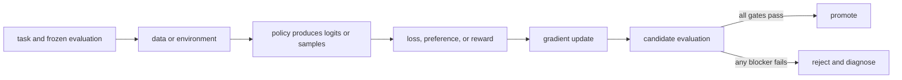

# Model optimization, RL, and post-training 101

A single-file edition of the canonical beginner path. Links to repository reference pages remain relative to `book/`.

<a id="chapter-00"></a>

## 00. Map the post-training stack

**Question:** What are we changing, and why does a pretrained model need another training stack?

**Evidence in this chapter:** stable concepts are explained from cited primary sources. All `pt101` outputs are deterministic `simulated` teaching evidence, not measurements of an LLM.

## The simplest accurate answer

Pretraining teaches a model broad statistical patterns by predicting tokens. Post-training deliberately changes its behavior for a narrower purpose: follow instructions, prefer better answers, solve verifiable tasks, use tools, or satisfy a product contract. Model optimization is the larger loop that chooses data, objective, algorithm, system, and promotion rule—not just the optimizer in code.

## A useful mental model

A pretrained model is like a broadly educated apprentice. Post-training is the apprenticeship for a particular job. A curriculum supplies demonstrations, a reviewer supplies preferences, a scorecard supplies rewards, and exams decide whether the apprentice may serve customers. The analogy stops at agency: a model is a parameterized function, not a person with intent.

## How it works

Every method in this course fits one loop: define behavior; collect task-shaped data; compute a scalar training signal; update parameters; evaluate on held-out tasks; reject or promote the candidate. SFT gets the signal from demonstrated tokens. Preference methods get it from chosen-versus-rejected responses. Online RL gets it from sampled actions and rewards. The production system must preserve dataset, model, code, and evaluator identities so a result is reproducible.



## Work one example

Suppose the prompt is `2 + 3 =`. A base model assigns probabilities to many continuations. SFT raises the probability of a demonstrated `5`. DPO raises the relative probability of `5` over a rejected `6`. RL can sample answers and use an exact checker that returns 1 for `5` and 0 otherwise. These are different paths to a training signal, not interchangeable names for the same algorithm.

## Do it yourself

Run `pt101 pipeline --output build/pipeline.json`. Follow one number from base logits through SFT, reward modeling, DPO, PPO, GRPO, evaluation, and the promotion gate. Label every result `simulated`.

Record the input, configuration, output, evidence label, and one sentence stating what the output **does not** prove. If you change two variables, split the work into two experiments.

## Check your understanding

Can you name the five objects that must exist before an optimizer step is meaningful: task, data or environment, policy, objective or reward, and evaluator?

## Common failure

Do not start with a fashionable trainer. If the evaluation cannot distinguish a better model from a worse one, faster training only produces an untrustworthy candidate sooner.

## Sources

- [Training language models to follow instructions with human feedback](https://arxiv.org/abs/2203.02155)
- [Hugging Face TRL documentation](https://huggingface.co/docs/trl/main/index)

## Course position

- Prerequisite: None. Start here.
- Next: [Chapter 01](../docs/spine/01-numbers-probability-and-sampling.md)


---

<a id="chapter-01"></a>

## 01. Numbers, probability, and sampling

**Question:** How does a model turn scores into a choice?

**Evidence in this chapter:** stable concepts are explained from cited primary sources. All `pt101` outputs are deterministic `simulated` teaching evidence, not measurements of an LLM.

## The simplest accurate answer

A model emits logits: unrestricted scores, one per possible token or action. Softmax converts them into non-negative probabilities that sum to one. Training changes logits; sampling turns probabilities into actual outputs. You need this boundary because losses usually operate on log-probabilities while users observe sampled text.

## A useful mental model

Think of logits as adjustable heights and softmax as water flowing downhill into probability buckets. Raising one height changes every bucket after normalization. This analogy explains competition among actions, but temperature and truncation are explicit mathematical transforms, not physical heat or cutting a bucket.

## How it works

For logits z, softmax gives p_i = exp(z_i) / sum_j exp(z_j). Subtracting the maximum logit before exponentiating gives the same probabilities and avoids overflow. A categorical sample chooses action i with probability p_i. Temperature divides logits before softmax; lower temperature sharpens the distribution. Top-k and top-p remove candidates and renormalize, which changes the behavior policy that generated RL data.


## Work one example

With logits [0, 0], two actions each have probability 0.5. After one toy SFT step the logits become approximately [-0.2, 0.2], so the demonstrated action becomes more likely. Nothing deterministic happened: the policy distribution moved. Greedy decoding would hide this distinction by always selecting the larger logit.

## Do it yourself

Run `pt101 sft`. Recompute the two probabilities by hand using a calculator. Then add the same constant to both logits and prove the probabilities do not change.

Record the input, configuration, output, evidence label, and one sentence stating what the output **does not** prove. If you change two variables, split the work into two experiments.

## Check your understanding

Why is a generated completion evidence about a sample, but not a complete description of the policy?

## Common failure

Never compare token probabilities from different tokenizers or prompt templates as if their event spaces were identical.

## Sources

- [PyTorch automatic differentiation](https://docs.pytorch.org/docs/stable/autograd.html)

## Course position

- Prerequisite: [Chapter 00](../docs/spine/00-map-the-stack.md)
- Next: [Chapter 02](../docs/spine/02-vectors-matrices-and-neural-networks.md)


---

<a id="chapter-02"></a>

## 02. Vectors, matrices, and neural networks

**Question:** What are the objects inside a model before they become probabilities?

**Evidence in this chapter:** stable concepts are explained from cited primary sources. All `pt101` outputs are deterministic `simulated` teaching evidence, not measurements of an LLM.

## The simplest accurate answer

A scalar is one number, a vector is an ordered list of numbers, and a matrix is a rectangular grid of numbers. A tensor generalizes these objects to more axes. Neural networks repeatedly multiply tensors, add learned offsets, and apply simple nonlinear functions. The numbers being learned are the parameters.

## A useful mental model

A spreadsheet is a useful picture of a matrix: rows and columns organize numbers, and a formula can combine them. Matrix multiplication is not ordinary cell-by-cell multiplication; each output cell is a dot product that measures how one row combines with one column.

## How it works

For vector x and matrix W, a linear layer computes y = W*x + b. Each element of y is a weighted sum of x. A nonlinear activation between linear layers prevents the whole stack from collapsing into one linear transformation. An embedding table maps a discrete token ID to a learned vector. A transformer then mixes token vectors through attention and feed-forward layers. Shape notation matters: batch, sequence, hidden dimension, vocabulary, and attention heads name axes with different meanings.


## Work one example

Let x=[2,3] and one output row of W be [0.5,-1]. Their dot product is 0.5*2 + (-1)*3 = -2. Add bias 0.25 and the output is -1.75. A second row produces a second output number. Millions or billions of parameters repeat this same kind of arithmetic at larger shapes.

## Do it yourself

Compute a two-by-two matrix times a two-element vector by hand. Write the shape of every input and output. Then count the parameters in a linear layer with 4 inputs, 3 outputs, and one bias per output.

Record the input, configuration, output, evidence label, and one sentence stating what the output **does not** prove. If you change two variables, split the work into two experiments.

## Check your understanding

Why does changing one matrix row affect one output feature directly, while changing one input element can affect every output feature?

## Common failure

Do not treat tensor shape errors as mere syntax problems. A transposed or broadcast axis can silently optimize a different computation when dimensions happen to fit.

## Sources

- [Attention Is All You Need](https://arxiv.org/abs/1706.03762)
- [PyTorch automatic differentiation](https://docs.pytorch.org/docs/stable/autograd.html)

## Course position

- Prerequisite: [Chapter 01](../docs/spine/01-numbers-probability-and-sampling.md)
- Next: [Chapter 03](../docs/spine/03-parameters-forward-loss-gradient.md)


---

<a id="chapter-03"></a>

## 03. Parameters, forward passes, losses, and gradients

**Question:** What physically changes when a model learns?

**Evidence in this chapter:** stable concepts are explained from cited primary sources. All `pt101` outputs are deterministic `simulated` teaching evidence, not measurements of an LLM.

## The simplest accurate answer

Parameters are stored numbers used by the forward pass. The forward pass maps inputs to logits. A loss maps predictions and targets to one scalar where lower means better for the declared objective. A gradient says how a tiny change in each parameter would change that loss. An optimizer uses gradients to propose a parameter update.

## A useful mental model

Walking downhill is useful: the loss is altitude, a gradient points uphill, and subtracting it takes a downhill step. But real neural losses are high-dimensional, noisy, and can have flat or sharp regions; there is no guarantee that each stochastic step improves held-out behavior.

## How it works

For parameter w and loss L, gradient descent applies w <- w - learning_rate * dL/dw. Backpropagation efficiently applies the chain rule from the scalar loss back through every differentiable operation. A batch averages or sums examples before the update. Optimizers such as Adam maintain moving statistics, but they still need a correctly constructed loss and gradients. Zeroing gradients, choosing precision, clipping norms, and scheduling the learning rate are system decisions with behavioral consequences.


## Work one example

If a one-parameter model predicts y_hat = w*x and squared loss is (y_hat-y)^2, then dL/dw = 2(w*x-y)x. At x=2, y=6, w=1, the gradient is -16. With learning rate 0.1, w becomes 2.6 and the prediction moves from 2 toward 6.

## Do it yourself

Work the one-parameter example for three steps. Change the learning rate to 1.0 and observe overshoot. Record parameters, loss, gradient, and update separately.

Record the input, configuration, output, evidence label, and one sentence stating what the output **does not** prove. If you change two variables, split the work into two experiments.

## Check your understanding

Can you explain why a loss decreasing on the training batch does not prove the model improved on new tasks?

## Common failure

A gradient is local sensitivity, not a causal explanation of model behavior and not a guarantee of generalization.

## Sources

- [PyTorch automatic differentiation](https://docs.pytorch.org/docs/stable/autograd.html)

## Course position

- Prerequisite: [Chapter 02](../docs/spine/02-vectors-matrices-and-neural-networks.md)
- Next: [Chapter 04](../docs/spine/04-language-model-from-tokens-to-loss.md)


---

<a id="chapter-04"></a>

## 04. A language model from tokens to loss

**Question:** Where do post-training losses attach to a transformer?

**Evidence in this chapter:** stable concepts are explained from cited primary sources. All `pt101` outputs are deterministic `simulated` teaching evidence, not measurements of an LLM.

## The simplest accurate answer

A tokenizer maps text to token IDs. The model maps a prefix of IDs to logits for the next token. Repeating that step produces a completion. During teacher-forced training, the model sees known preceding tokens and cross-entropy penalizes low probability on each target token. Instruction tuning usually masks prompt tokens so the loss is charged only on the desired response.

## A useful mental model

Autocomplete is the right starting analogy: at every position the model predicts the next piece. The analogy breaks because a transformer shares parameters across positions, attends to a bounded context, and operates on tokenizer pieces rather than human words.

## How it works

For a response with tokens y_1...y_T, the negative log-likelihood is -sum_t log pi(y_t | prompt, y_<t). Sequence log-probability is therefore a sum of token log-probabilities. Length normalization, end-of-sequence handling, chat templates, padding masks, and truncation can silently change what an objective optimizes. Preference and RL methods often reuse these same sequence log-probabilities inside a different outer loss.


## Work one example

For target-token probabilities [0.5, 0.25], the summed negative log-likelihood is -log(0.5)-log(0.25), about 2.08. A four-token response can accumulate a more negative log-probability than a two-token response even when its per-token predictions are equally good, so raw sequence scores carry a length effect.

## Do it yourself

Write down the exact tokens whose loss is active for one chat record containing system, user, and assistant messages. State what happens if the final response is truncated.

Record the input, configuration, output, evidence label, and one sentence stating what the output **does not** prove. If you change two variables, split the work into two experiments.

## Check your understanding

Why must the tokenizer and chat template be versioned as part of a training run?

## Common failure

Do not call perplexity a complete instruction-following metric; it measures predictive fit to a token distribution.

## Sources

- [Attention Is All You Need](https://arxiv.org/abs/1706.03762)
- [Training language models to follow instructions with human feedback](https://arxiv.org/abs/2203.02155)

## Course position

- Prerequisite: [Chapter 03](../docs/spine/03-parameters-forward-loss-gradient.md)
- Next: [Chapter 05](../docs/spine/05-objectives-and-experiments.md)


---

<a id="chapter-05"></a>

## 05. Objectives, baselines, and experiments

**Question:** How do we know an update caused a useful improvement?

**Evidence in this chapter:** stable concepts are explained from cited primary sources. All `pt101` outputs are deterministic `simulated` teaching evidence, not measurements of an LLM.

## The simplest accurate answer

An objective is what training directly optimizes. An evaluator is what you use to judge the resulting model. They may overlap, but keeping them separate is essential: optimizing a proxy can improve the proxy while harming the real task. A baseline and a controlled comparison turn an anecdote into an experiment.

## A useful mental model

A speedometer is a proxy for safe driving. Maximizing its number would be absurd because the goal is not the instrument. Training rewards and automated judges are also instruments. They are valuable only while their relationship to the real behavior remains tested.

## How it works

Freeze the task set before looking at candidate results. Split train, development, and test data by leakage units such as user, source document, problem family, or time—not merely by random rows. Compare a candidate with the exact baseline under the same decoding and evaluator settings. Report central tendency, tails, uncertainty, regressions, cost, and the number of independent seeds when training variance matters.


## Work one example

If pass rate rises from 60/100 to 66/100, the observed lift is six percentage points. That does not prove the true lift is exactly six points. Inspect which six changed, whether any prior passes regressed, whether the items leaked into training, and whether the evaluator would accept subtly wrong answers.

## Do it yourself

Create a one-page experiment card with hypothesis, single changed variable, frozen test set, primary metric, three guardrails, seed plan, stop condition, and promotion rule.

Record the input, configuration, output, evidence label, and one sentence stating what the output **does not** prove. If you change two variables, split the work into two experiments.

## Check your understanding

What observation would falsify your claim that the training method—not a prompt-template change—caused the lift?

## Common failure

Changing data, template, decoding, and algorithm in one run produces a candidate but not an attribution.

## Sources

- [Training language models to follow instructions with human feedback](https://arxiv.org/abs/2203.02155)

## Course position

- Prerequisite: [Chapter 04](../docs/spine/04-language-model-from-tokens-to-loss.md)
- Next: [Chapter 06](../docs/spine/06-data-pipeline.md)


---

<a id="chapter-06"></a>

## 06. Build the data pipeline

**Question:** How do raw interactions become trustworthy training records?

**Evidence in this chapter:** stable concepts are explained from cited primary sources. All `pt101` outputs are deterministic `simulated` teaching evidence, not measurements of an LLM.

## The simplest accurate answer

Post-training data is a product specification written in examples. A useful pipeline defines a schema, validates it, removes or controls duplicates, records provenance and consent, transforms records deterministically, and freezes immutable train and evaluation snapshots.

## A useful mental model

Ingredients determine what a cook can make. Cleaning labels on jars matters, but it cannot turn a biased ingredient set into a balanced meal. Likewise, schema validation prevents malformed records; it does not prove coverage, correctness, or representativeness.

## How it works

Common record shapes are prompt-response demonstrations, prompt-chosen-rejected preference pairs, and prompt-completion-reward trajectories. Preserve raw source IDs, transformation code version, tokenizer/template identity, filtering reason, annotator or judge policy, and dataset digest. Deduplicate before splitting so near-identical examples do not cross the evaluation boundary. Treat model-generated synthetic data as generated evidence and audit error amplification.


## Work one example

A preference record should not be only two strings. It needs the shared prompt, chosen response, rejected response, rubric or collection protocol, source identity, and flags for ties or invalid comparisons. Otherwise downstream code cannot distinguish a genuine preference from formatting noise.

## Do it yourself

Design JSON schemas for demonstration, preference, and trajectory records. List five rejection cases and create a dataset card that states known coverage gaps.

Record the input, configuration, output, evidence label, and one sentence stating what the output **does not** prove. If you change two variables, split the work into two experiments.

## Check your understanding

Can you trace one final token back to its raw record, transform, template, and license or consent boundary?

## Common failure

Do not randomly split after generating many variants of the same seed prompt; that leaks problem identity.

## Sources

- [TRL dataset formats](https://huggingface.co/docs/trl/main/dataset_formats)
- [Datasheets for Datasets](https://arxiv.org/abs/1803.09010)

## Course position

- Prerequisite: [Chapter 05](../docs/spine/05-objectives-and-experiments.md)
- Next: [Chapter 07](../docs/spine/07-evaluation-harness.md)


---

<a id="chapter-07"></a>

## 07. Build the evaluation harness first

**Question:** What must be measured before any training run?

**Evidence in this chapter:** stable concepts are explained from cited primary sources. All `pt101` outputs are deterministic `simulated` teaching evidence, not measurements of an LLM.

## The simplest accurate answer

A baseline evaluation establishes whether the task, runner, and scoring rule work before model weights change. The harness must pin prompts, decoding, environment, judge, retries, and aggregation. It should store per-example artifacts so a score can be audited.

## A useful mental model

A before-and-after photograph only helps if the camera, lighting, angle, and subject are controlled. In model evaluation, prompt formatting, sampling temperature, tool availability, and judge version are the camera settings.

## How it works

Use exact or executable checkers when the task supports them. Use human or model judges for open-ended properties, but calibrate them against adjudicated examples, randomize answer order, measure position bias, and keep judge prompts versioned. Track task success as the primary metric, then safety, regressions, latency, token cost, and format validity as guardrails. Aggregate scores never replace per-slice analysis.


## Work one example

If a code agent passes 8/10 tasks but modifies forbidden files on two passing tasks, raw pass rate hides a contract violation. A correct harness makes workspace integrity a guardrail and denies promotion.

## Do it yourself

Run the untrained toy pipeline and inspect `evaluation` and `promotion`. Add a hypothetical safety regression even while quality rises; make the gate fail.

Record the input, configuration, output, evidence label, and one sentence stating what the output **does not** prove. If you change two variables, split the work into two experiments.

## Check your understanding

Could a candidate learn the evaluator's surface pattern without learning the intended behavior? Name one adversarial test.

## Common failure

Do not train directly against a held-out judge set and still call it held out.

## Sources

- [Holistic Evaluation of Language Models](https://arxiv.org/abs/2211.09110)
- [Training language models to follow instructions with human feedback](https://arxiv.org/abs/2203.02155)

## Course position

- Prerequisite: [Chapter 06](../docs/spine/06-data-pipeline.md)
- Next: [Chapter 08](../docs/spine/08-supervised-fine-tuning.md)


---

<a id="chapter-08"></a>

## 08. Supervised fine-tuning

**Question:** How does imitation turn examples into a usable instruction model?

**Evidence in this chapter:** stable concepts are explained from cited primary sources. All `pt101` outputs are deterministic `simulated` teaching evidence, not measurements of an LLM.

## The simplest accurate answer

Supervised fine-tuning (SFT) continues next-token training on curated demonstrations. It teaches the response distribution directly: given this prompt and previous response tokens, raise the probability of the demonstrated next token. SFT is usually the simplest strong baseline and often establishes formats and skills needed before preference optimization or online RL.

## A useful mental model

SFT is copying worked solutions with feedback from an answer key. It efficiently transfers demonstrated patterns. It cannot learn a better response than the demonstrations merely because the loss ran longer.

## How it works

Format each record with the production chat template, mask non-response tokens according to the declared objective, pack examples only when boundaries and attention masks remain correct, and monitor token-level loss. Choose learning rate, effective batch size, epochs or steps, sequence length, precision, and checkpoint cadence. Evaluate during training but make promotion decisions on a frozen test set. More epochs can memorize narrow data and erase general capabilities.


## Work one example

The toy SFT command starts with two equal logits. Cross-entropy's gradient is probability minus one-hot target, so the target logit rises and the other falls. A real model performs the same conceptual operation across vocabulary logits at every active response token.

## Do it yourself

Run `pt101 sft --output build/sft.json`. Derive the gradient by hand. Then plan a real SFT dry run with 32 records and a tiny open model, but label it `specified-not-executed` until artifacts exist.

Record the input, configuration, output, evidence label, and one sentence stating what the output **does not** prove. If you change two variables, split the work into two experiments.

## Check your understanding

What behavior can never be learned if no demonstration or transferable pattern gives the model evidence for it?

## Common failure

A falling SFT loss can mean memorization. Always compare held-out task behavior and general-capability regressions.

## Sources

- [Training language models to follow instructions with human feedback](https://arxiv.org/abs/2203.02155)
- [TRL SFT Trainer](https://huggingface.co/docs/trl/main/sft_trainer)

## Course position

- Prerequisite: [Chapter 07](../docs/spine/07-evaluation-harness.md)
- Next: [Chapter 09](../docs/spine/09-lora-and-memory.md)


---

<a id="chapter-09"></a>

## 09. LoRA, adapters, and training memory

**Question:** How can we update a large model without training every weight?

**Evidence in this chapter:** stable concepts are explained from cited primary sources. All `pt101` outputs are deterministic `simulated` teaching evidence, not measurements of an LLM.

## The simplest accurate answer

Low-Rank Adaptation (LoRA) freezes a base weight matrix and learns a product of two smaller matrices as its update. It reduces trainable parameters and optimizer-state memory. It does not make activations, attention, data quality, or evaluation free.

## A useful mental model

Instead of rebuilding a large wall, LoRA bolts on a thin adjustable frame. The frame can redirect the structure's behavior with fewer new pieces, but the original wall still occupies space and the fit depends on where the frame attaches.

## How it works

For base matrix W, LoRA uses W' = W + scale * B*A where A and B have rank r much smaller than W's dimensions. Decide target modules, rank, scaling, dropout, and whether to train biases. QLoRA additionally stores the frozen base in a quantized representation while computing adapter updates at a suitable precision. Deployment may keep adapters separate or merge them, each with provenance and serving implications.


## Work one example

A 4096 by 4096 dense update has about 16.8 million entries. Two rank-8 factors have 4096*8 + 8*4096 = 65,536 entries, about 256 times fewer update entries. This derived parameter ratio is not a claim of 256 times faster end-to-end training.

## Do it yourself

Compute dense-versus-LoRA trainable entries for three layer sizes and ranks. Write a memory ledger containing weights, gradients, optimizer states, activations, temporary buffers, and allocator headroom.

Record the input, configuration, output, evidence label, and one sentence stating what the output **does not** prove. If you change two variables, split the work into two experiments.

## Check your understanding

Why can LoRA reduce optimizer memory substantially while leaving long-sequence activation memory as a blocker?

## Common failure

Do not translate trainable-parameter reduction directly into wall-clock speedup or quality equivalence.

## Sources

- [LoRA: Low-Rank Adaptation of Large Language Models](https://arxiv.org/abs/2106.09685)
- [QLoRA: Efficient Finetuning of Quantized LLMs](https://arxiv.org/abs/2305.14314)

## Course position

- Prerequisite: [Chapter 08](../docs/spine/08-supervised-fine-tuning.md)
- Next: [Chapter 10](../docs/spine/10-preference-data.md)


---

<a id="chapter-10"></a>

## 10. Preference data and feedback

**Question:** How do we turn human or AI judgments into usable comparisons?

**Evidence in this chapter:** stable concepts are explained from cited primary sources. All `pt101` outputs are deterministic `simulated` teaching evidence, not measurements of an LLM.

## The simplest accurate answer

Preference learning asks which response is better under a rubric. A pairwise comparison is often easier than assigning an absolute score, but it is still a measurement made by a person, model, or program under a specific protocol.

## A useful mental model

A tournament can rank players from wins and losses without giving an absolute skill score. Yet matchups matter: repeatedly pairing one player only with beginners gives a distorted ranking. Preference data also depends on candidate diversity and pairing policy.

## How it works

Sample candidates from declared policies and decoding settings. Randomize display order, allow ties or invalid items, train annotators on a concrete rubric, use overlap to estimate agreement, adjudicate hard cases, and preserve slice labels. AI feedback can scale collection, but it imports judge biases and may reward stylistic imitation. Preference coverage should match the deployment prompt distribution and include negative examples that expose important failure modes.


## Work one example

If both candidates are wrong but one is more fluent, a vague `which is better?` rubric may select fluent error. A correctness-first rubric plus an executable checker changes the observation. The pair is not ground truth outside that rubric.

## Do it yourself

Write five candidate pairs for one task. Include a tie, two jointly bad pairs, and a pair where verbosity conflicts with correctness. Create explicit adjudication rules.

Record the input, configuration, output, evidence label, and one sentence stating what the output **does not** prove. If you change two variables, split the work into two experiments.

## Check your understanding

Would reversing response order or hiding formatting change the label? Test it before scaling collection.

## Common failure

Do not discard disagreement automatically; it may reveal an underspecified task or heterogeneous user preferences.

## Sources

- [Training language models to follow instructions with human feedback](https://arxiv.org/abs/2203.02155)
- [Constitutional AI: Harmlessness from AI Feedback](https://arxiv.org/abs/2212.08073)

## Course position

- Prerequisite: [Chapter 09](../docs/spine/09-lora-and-memory.md)
- Next: [Chapter 11](../docs/spine/11-reward-models.md)


---

<a id="chapter-11"></a>

## 11. Reward models

**Question:** How can comparisons train a scalar scorer?

**Evidence in this chapter:** stable concepts are explained from cited primary sources. All `pt101` outputs are deterministic `simulated` teaching evidence, not measurements of an LLM.

## The simplest accurate answer

A reward model maps a prompt-response pair to a scalar. Pairwise training raises the chosen response's score above the rejected response's score. The scalar is useful for ranking and RL, but it is a learned proxy whose reliability is bounded by the comparison distribution.

## A useful mental model

A trained judge learns from past verdicts. It can make future review cheaper, but a clever contestant may exploit patterns in the judge rather than satisfy the real rules. That exploitation is reward hacking.

## How it works

A common Bradley-Terry loss is -log sigmoid(r_chosen-r_rejected). Only score differences matter, so adding the same constant to both rewards changes nothing. Evaluate pairwise accuracy, calibration where meaningful, slice robustness, out-of-distribution behavior, and sensitivity to superficial features. During RL the policy distribution moves, so a reward model accurate on old candidates can become unreliable on new ones.


## Work one example

At equal scores the model assigns 0.5 probability that the chosen item wins and loss is about 0.693. One gradient step increases the score gap. Run the toy reward model to see that movement; it proves the formula implementation, not judge quality.

## Do it yourself

Run `pt101 reward-model`. Create adversarial responses that are longer, more confident, or copy rubric words while remaining wrong. Check whether a proposed scorer is fooled.

Record the input, configuration, output, evidence label, and one sentence stating what the output **does not** prove. If you change two variables, split the work into two experiments.

## Check your understanding

What new candidate distribution would make the reward model's held-out accuracy irrelevant?

## Common failure

Never report reward increase alone as product improvement; audit real task outcomes on fresh samples.

## Sources

- [Training language models to follow instructions with human feedback](https://arxiv.org/abs/2203.02155)
- [TRL Reward Trainer](https://huggingface.co/docs/trl/main/reward_trainer)

## Course position

- Prerequisite: [Chapter 10](../docs/spine/10-preference-data.md)
- Next: [Chapter 12](../docs/spine/12-rl-from-bandits-to-mdps.md)


---

<a id="chapter-12"></a>

## 12. RL from bandits to Markov decision processes

**Question:** What makes reinforcement learning different from supervised learning?

**Evidence in this chapter:** stable concepts are explained from cited primary sources. All `pt101` outputs are deterministic `simulated` teaching evidence, not measurements of an LLM.

## The simplest accurate answer

Reinforcement learning trains a policy from consequences of sampled actions. In a bandit there is one decision and reward. In a Markov decision process (MDP), actions change state, rewards can arrive later, and the policy must account for future outcomes.

## A useful mental model

Trying restaurants is a bandit: choose once and observe a meal. Navigating a city is sequential: an early turn changes which later streets are reachable. The analogy breaks when a language model's state is a token history and the environment may include tools, users, or program execution.

## How it works

An MDP defines states, actions, transitions, rewards, and a discount factor. A trajectory is s_0,a_0,r_0,... . Return is the discounted sum of future rewards. A value function predicts expected return from a state; an action-value function conditions on an action; an advantage compares an action with the baseline expectation. LLM generation can be modeled with token actions, but sequence-level actions are often used for tractability.


## Work one example

For rewards [0,0,1] and discount 0.9, return from the start is 0.81. The terminal success supplies credit to earlier actions. With sparse rewards, many samples provide little information, which motivates better exploration, shaping, curricula, or process feedback.

## Do it yourself

Draw an MDP for a two-step tool task. Specify terminal states, invalid actions, timeout reward, success reward, and which observations the policy receives.

Record the input, configuration, output, evidence label, and one sentence stating what the output **does not** prove. If you change two variables, split the work into two experiments.

## Check your understanding

Is your task truly sequential, or is contextual-bandit feedback enough? Using a simpler model can reduce variance and system complexity.

## Common failure

Do not call DPO online RL: it learns from a fixed preference dataset and does not sample environment consequences during each update.

## Sources

- [Reinforcement Learning: An Introduction](http://incompleteideas.net/book/the-book-2nd.html)

## Course position

- Prerequisite: [Chapter 11](../docs/spine/11-reward-models.md)
- Next: [Chapter 13](../docs/spine/13-policy-gradients.md)


---

<a id="chapter-13"></a>

## 13. Policy gradients and REINFORCE

**Question:** How can a non-differentiable reward change differentiable model weights?

**Evidence in this chapter:** stable concepts are explained from cited primary sources. All `pt101` outputs are deterministic `simulated` teaching evidence, not measurements of an LLM.

## The simplest accurate answer

The policy-gradient trick differentiates the log-probability of sampled actions and weights it by observed return. The reward itself need not be differentiable. Actions with above-baseline outcomes become more likely; below-baseline actions become less likely.

## A useful mental model

A coach cannot differentiate the final score, but can reinforce decisions associated with better-than-expected games. This analogy hides confounding: one sampled game is noisy evidence about each decision.

## How it works

REINFORCE estimates gradient E[R * grad log pi(a|s)]. Subtracting a baseline independent of the sampled action preserves the expectation while reducing variance. In sequence models, sum token log-probabilities for the sampled completion and multiply by an advantage estimate. Batches, reward normalization, value baselines, entropy bonuses, and KL penalties stabilize learning but also change the effective objective.


## Work one example

With two equally likely actions, choosing action 1 and receiving reward above baseline increases action 1's logit relative to action 0. A second sample may push the other way. The average across representative trajectories estimates the desired direction.

## Do it yourself

Use the Python API `reinforce_step([0,0], action=1, reward=1, baseline=0.5)`. Repeat for below-baseline reward and explain the sign change.

Record the input, configuration, output, evidence label, and one sentence stating what the output **does not** prove. If you change two variables, split the work into two experiments.

## Check your understanding

Why does a baseline reduce noise without changing which policy is optimal in expectation?

## Common failure

High reward variance, stale samples, and incorrect masks can overwhelm the useful learning signal even when the formula looks right.

## Sources

- [Simple Statistical Gradient-Following Algorithms](https://link.springer.com/article/10.1007/BF00992696)
- [Reinforcement Learning: An Introduction](http://incompleteideas.net/book/the-book-2nd.html)

## Course position

- Prerequisite: [Chapter 12](../docs/spine/12-rl-from-bandits-to-mdps.md)
- Next: [Chapter 14](../docs/spine/14-ppo-and-kl-control.md)


---

<a id="chapter-14"></a>

## 14. PPO and KL control

**Question:** Why constrain how far the policy moves?

**Evidence in this chapter:** stable concepts are explained from cited primary sources. All `pt101` outputs are deterministic `simulated` teaching evidence, not measurements of an LLM.

## The simplest accurate answer

Proximal Policy Optimization (PPO) reuses sampled trajectories while limiting incentives for large probability-ratio changes. In LLM post-training it is commonly paired with a value model for advantages and a reference policy or KL penalty to preserve useful behavior.

## A useful mental model

If feedback comes from yesterday's driving, a driver should not rewrite every habit overnight. PPO's clip is a guardrail on the update incentive, not a guarantee that the final model is safe or close everywhere.

## How it works

For sampled action a, ratio = pi_new(a|s)/pi_old(a|s). The clipped surrogate takes the smaller of ratio*A and clip(ratio,1-epsilon,1+epsilon)*A. Positive and negative advantages produce asymmetric constraints. A complete PPO loop needs rollout policy identity, stored old log-probabilities, returns, advantage estimation, minibatch epochs, value loss, entropy or KL terms, and freshness controls.


## Work one example

Run the toy case ratio 1.35, advantage 0.8, epsilon 0.2. The unclipped objective is 1.08 but the clipped objective is 0.96, so the surrogate stops rewarding that extra increase for this sample. Gradients and aggregate behavior still require the full batch.

## Do it yourself

Run `pt101 ppo`. Evaluate four cases: ratio above and below the interval crossed with positive and negative advantages. Explain each minimum.

Record the input, configuration, output, evidence label, and one sentence stating what the output **does not** prove. If you change two variables, split the work into two experiments.

## Check your understanding

Why does clipping the sampled-action ratio not bound KL divergence for every prompt and token?

## Common failure

A PPO run is on-policy only within a freshness tolerance; serving rollouts from unidentified or lagging weights corrupts ratios.

## Sources

- [Proximal Policy Optimization Algorithms](https://arxiv.org/abs/1707.06347)
- [Training language models to follow instructions with human feedback](https://arxiv.org/abs/2203.02155)
- [TRL PPO Trainer](https://huggingface.co/docs/trl/main/ppo_trainer)

## Course position

- Prerequisite: [Chapter 13](../docs/spine/13-policy-gradients.md)
- Next: [Chapter 15](../docs/spine/15-dpo.md)


---

<a id="chapter-15"></a>

## 15. Direct Preference Optimization

**Question:** Can we optimize preferences without an explicit reward-model-and-PPO loop?

**Evidence in this chapter:** stable concepts are explained from cited primary sources. All `pt101` outputs are deterministic `simulated` teaching evidence, not measurements of an LLM.

## The simplest accurate answer

Direct Preference Optimization (DPO) trains a policy directly on chosen and rejected responses while comparing both with a fixed reference policy. It converts a particular KL-regularized preference objective into a classification-style loss.

## A useful mental model

DPO is like teaching from side-by-side corrections without first hiring a separate judge who assigns reusable scores. This is operationally simpler, but the corrections are fixed: the learner does not discover new mistakes by acting in an environment during training.

## How it works

For each pair, compute policy and reference sequence log-probability gaps between chosen and rejected. DPO increases beta times the policy gap relative to the reference gap through a log-sigmoid loss. Beta controls the scale in the stated formulation, but implementations and conventions must be checked. Tokenization, length effects, reference identity, pair quality, and loss variants all matter.


## Work one example

If policy and reference gaps are equal, the DPO margin is zero and loss is about 0.693. The gradient increases the policy's chosen-minus-rejected gap. `pt101 dpo` performs that scalar step.

## Do it yourself

Run `pt101 dpo`. Recompute the margin and loss. Then swap chosen and rejected and show why the update reverses.

Record the input, configuration, output, evidence label, and one sentence stating what the output **does not** prove. If you change two variables, split the work into two experiments.

## Check your understanding

When would online sampling and environment feedback reveal failures that a frozen preference dataset cannot cover?

## Common failure

DPO is not automatically better than PPO; it trades a simpler training loop for dependence on static comparison coverage.

## Sources

- [Direct Preference Optimization](https://arxiv.org/abs/2305.18290)
- [TRL DPO Trainer](https://huggingface.co/docs/trl/main/dpo_trainer)

## Course position

- Prerequisite: [Chapter 14](../docs/spine/14-ppo-and-kl-control.md)
- Next: [Chapter 16](../docs/spine/16-verifiable-rewards-and-rlaif.md)


---

<a id="chapter-16"></a>

## 16. Verifiable rewards, human feedback, and AI feedback

**Question:** Where should rewards come from?

**Evidence in this chapter:** stable concepts are explained from cited primary sources. All `pt101` outputs are deterministic `simulated` teaching evidence, not measurements of an LLM.

## The simplest accurate answer

Reward sources form a spectrum: executable checkers, environment outcomes, human judgments, AI judgments, and learned reward models. Choose the most direct reliable signal available, and combine it with guardrails for behavior the scalar omits.

## A useful mental model

A unit test gives crisp feedback on code that has a formal contract; an editor judges clarity that no single test captures. Using an editor where a compiler suffices adds cost and variance. Using a compiler to judge prose misses the task.

## How it works

Verifiable rewards work well for math answers, code tests, games, and tool outcomes, but checkers can be incomplete or exploitable. Human feedback captures nuanced preferences but is slow and inconsistent. AI feedback scales but inherits the evaluator model's blind spots and correlated errors. Constitutional AI is one approach that uses written principles and AI feedback; it does not eliminate the need to validate the resulting behavior.


## Work one example

A code reward of `tests_passed / total_tests` can be hacked by deleting tests unless workspace integrity and hidden tests are enforced. The reward function is part of the attack surface.

## Do it yourself

Threat-model a reward for a coding, math, or tool-use task. List ten ways the policy could earn reward without satisfying user intent, then add independent checks.

Record the input, configuration, output, evidence label, and one sentence stating what the output **does not** prove. If you change two variables, split the work into two experiments.

## Check your understanding

What trusted mechanism produces each reward bit, and can the policy influence that mechanism?

## Common failure

Reward shaping can accelerate learning while changing the optimum; prove or test that shaping preserves the intended task.

## Sources

- [Constitutional AI: Harmlessness from AI Feedback](https://arxiv.org/abs/2212.08073)
- [Training language models to follow instructions with human feedback](https://arxiv.org/abs/2203.02155)

## Course position

- Prerequisite: [Chapter 15](../docs/spine/15-dpo.md)
- Next: [Chapter 17](../docs/spine/17-grpo.md)


---

<a id="chapter-17"></a>

## 17. GRPO and group-relative advantages

**Question:** How can a group of completions provide a baseline without a separate critic?

**Evidence in this chapter:** stable concepts are explained from cited primary sources. All `pt101` outputs are deterministic `simulated` teaching evidence, not measurements of an LLM.

## The simplest accurate answer

Group Relative Policy Optimization (GRPO) samples multiple completions for the same prompt and normalizes their rewards within the group to form relative advantages. The original DeepSeekMath formulation was introduced as a PPO variant that avoids a separate value model.

## A useful mental model

A class curve tells which solutions were better than classmates on the same exam. It removes the need to predict an absolute expected grade, but a class where everyone receives the same score gives no ranking signal.

## How it works

For rewards r_1...r_G, a common group-relative estimate subtracts the group mean and divides by group standard deviation. Implementations add details such as clipping, KL terms, token-level aggregation, multiple update iterations, or different normalization. Groups must share the intended conditioning context; mixing unrelated tasks makes the baseline harder to interpret. Zero-variance groups produce no relative signal in the toy implementation.


## Work one example

For rewards [0,1,1,0.5], the mean is 0.625. Above-mean samples get positive advantages and below-mean samples negative ones. Run the command to inspect normalized values and verify their mean is approximately zero.

## Do it yourself

Run `pt101 grpo`. Try all-equal rewards, one extreme outlier, and group sizes two and eight. Explain variance and robustness tradeoffs.

Record the input, configuration, output, evidence label, and one sentence stating what the output **does not** prove. If you change two variables, split the work into two experiments.

## Check your understanding

What happens if one prompt is much harder than another but their samples are incorrectly combined into a group?

## Common failure

GRPO removes a learned critic in the stated design; it does not remove rollout cost, reward design, reference control, or evaluation.

## Sources

- [DeepSeekMath and GRPO](https://arxiv.org/abs/2402.03300)
- [TRL GRPO Trainer](https://huggingface.co/docs/trl/main/grpo_trainer)

## Course position

- Prerequisite: [Chapter 16](../docs/spine/16-verifiable-rewards-and-rlaif.md)
- Next: [Chapter 18](../docs/spine/18-agents-tools-and-environments.md)


---

<a id="chapter-18"></a>

## 18. Agents, tools, and environments

**Question:** What changes when the model acts over multiple steps?

**Evidence in this chapter:** stable concepts are explained from cited primary sources. All `pt101` outputs are deterministic `simulated` teaching evidence, not measurements of an LLM.

## The simplest accurate answer

Agent post-training couples a policy to a stateful environment. The model observes, emits text or tool calls, receives tool results, and continues until success, failure, or a limit. The training record must preserve the whole trajectory and environment identity.

## A useful mental model

Training a chess move from the final result is harder than grading a single answer because early actions change later choices. Tool agents add another complication: the board itself may be nondeterministic, permissioned, or mutable.

## How it works

Define an environment reset, observation schema, action grammar, transition, reward, terminal condition, timeout, and sandbox. Separate model errors from tool failures and harness failures. Pin tool versions and fixtures. Use idempotent or disposable environments for training. For real systems, enforce least privilege and prevent reward channels from authorizing broader actions.


## Work one example

A bug-fixing agent may earn success when tests pass. A valid environment also checks the requested tests existed, forbidden files were untouched, dependencies were not maliciously replaced, and the patch actually addresses a hidden case.

## Do it yourself

Design a three-step calculator environment on paper, then a repository-fix environment. Mark every mutation boundary and cleanup action.

Record the input, configuration, output, evidence label, and one sentence stating what the output **does not** prove. If you change two variables, split the work into two experiments.

## Check your understanding

Can two replays of the same trajectory produce different observations? If yes, how will you attribute the reward?

## Common failure

Never let training rewards grant permissions. Authorization is an external system constraint, not a behavior learned from penalties.

## Sources

- [TRL GRPO Trainer](https://huggingface.co/docs/trl/main/grpo_trainer)

## Course position

- Prerequisite: [Chapter 17](../docs/spine/17-grpo.md)
- Next: [Chapter 19](../docs/spine/19-training-systems.md)


---

<a id="chapter-19"></a>

## 19. The training system: memory, parallelism, and rollouts

**Question:** How does an algorithm become a reliable distributed job?

**Evidence in this chapter:** stable concepts are explained from cited primary sources. All `pt101` outputs are deterministic `simulated` teaching evidence, not measurements of an LLM.

## The simplest accurate answer

A post-training system moves model weights, activations, gradients, optimizer states, batches, rollouts, log-probabilities, and checkpoints through hardware. Algorithm correctness and systems correctness meet at identities: every sample must be scored and updated against the intended policy, reference, reward, and tokenizer.

## A useful mental model

A factory can have a perfect recipe and still ship wrong products if parts are mislabeled or assembly lines are out of sync. Distributed training failures are often identity and freshness failures, not only numerical failures.

## How it works

Data parallelism replicates computation and combines gradients. Sharded data parallelism partitions parameters, gradients, and optimizer state with communication around computation. Tensor and pipeline parallelism split model execution. Online RL also needs rollout workers and sometimes separate inference engines, creating policy-lag and weight-broadcast problems. Build a memory ledger and communication timeline before choosing a topology.


## Work one example

If a model, gradients, and two Adam moments each occupy one unit per parameter at the chosen precision, naive replicated training already needs multiple parameter-sized units before activations and temporary buffers. Sharding changes residency and communication, not the mathematical need to update parameters.

## Do it yourself

Draft a topology for SFT and for online RL. For each process, list resident models, mutable state, input queue, output artifact, synchronization event, and failure recovery.

Record the input, configuration, output, evidence label, and one sentence stating what the output **does not** prove. If you change two variables, split the work into two experiments.

## Check your understanding

How does the learner prove that a stored old log-probability came from the exact rollout policy checkpoint?

## Common failure

Do not choose FSDP, ZeRO, tensor parallelism, or an inference engine from model size alone; derive memory, bandwidth, latency, and operational constraints.

## Sources

- [PyTorch Fully Sharded Data Parallel](https://docs.pytorch.org/docs/stable/fsdp.html)
- [DeepSpeed ZeRO](https://www.deepspeed.ai/tutorials/zero/)
- [TRL distributed training](https://huggingface.co/docs/trl/main/distributing_training)

## Course position

- Prerequisite: [Chapter 18](../docs/spine/18-agents-tools-and-environments.md)
- Next: [Chapter 20](../docs/spine/20-failure-modes-and-safety.md)


---

<a id="chapter-20"></a>

## 20. Failure modes, reward hacking, and safety

**Question:** How does optimization fail even when the training chart is green?

**Evidence in this chapter:** stable concepts are explained from cited primary sources. All `pt101` outputs are deterministic `simulated` teaching evidence, not measurements of an LLM.

## The simplest accurate answer

Optimization amplifies whatever produces the training signal. If the proxy is incomplete, the policy may exploit it. If data is narrow, capabilities may regress elsewhere. If feedback is biased, those biases can become more consistent. Safety is therefore a set of independent constraints and evaluations, not one reward term.

## A useful mental model

A student told that only the final numeric answer matters may learn to copy answer keys. The score improved; the desired competence did not. Models search high-dimensional behavior spaces where proxy loopholes can be harder to anticipate.

## How it works

Watch for reward hacking, judge hacking, sycophancy, mode collapse, verbosity bias, length gaming, catastrophic forgetting, KL drift, memorization, data contamination, capability elicitation gaps, and distribution shift. Use held-out adversarial tasks, canaries, human audits, independent evaluators, per-slice regression budgets, and rollback-ready checkpoints. Red-team the evaluator as aggressively as the policy.

```mermaid
flowchart LR
    A[task and frozen evaluation] --> B[data or environment]
    B --> C[policy produces logits or samples]
    C --> D[loss, preference, or reward]
    D --> E[gradient update]
    E --> F[candidate evaluation]
    F -->|all gates pass| G[promote]
    F -->|any blocker fails| H[reject and diagnose]
```

## Work one example

A candidate gets a higher helpfulness score by always agreeing with the user's premise. A factuality slice shows more confident errors. The promotion rule must block the candidate even though the optimized metric improved.

## Do it yourself

Write a failure register for one planned run: symptom, detector, threshold, containment, rollback, and owner. Include failures in data, trainer, rollout system, evaluator, and deployment.

Record the input, configuration, output, evidence label, and one sentence stating what the output **does not** prove. If you change two variables, split the work into two experiments.

## Check your understanding

Which safety property is enforced outside the model so an optimized policy cannot trade it away?

## Common failure

A KL limit constrains distributional movement relative to a reference; it is not a semantic safety guarantee.

## Sources

- [Training language models to follow instructions with human feedback](https://arxiv.org/abs/2203.02155)
- [Constitutional AI: Harmlessness from AI Feedback](https://arxiv.org/abs/2212.08073)

## Course position

- Prerequisite: [Chapter 19](../docs/spine/19-training-systems.md)
- Next: [Chapter 21](../docs/spine/21-production-loop.md)


---

<a id="chapter-21"></a>

## 21. Promotion, deployment, monitoring, and iteration

**Question:** When is a trained checkpoint ready to serve?

**Evidence in this chapter:** stable concepts are explained from cited primary sources. All `pt101` outputs are deterministic `simulated` teaching evidence, not measurements of an LLM.

## The simplest accurate answer

A checkpoint becomes a release candidate only after reproducible offline evaluation, artifact validation, and a promotion decision against predeclared gates. Deployment then needs staged exposure, online monitoring, rollback, and a feedback path that does not silently turn production traffic into ungoverned training data.

## A useful mental model

Releasing a model resembles releasing code with an extra statistical surface. Unit tests and checksums matter, but behavior varies across prompts and sampling. Canary exposure is an experiment, not a substitute for pre-release evidence.

## How it works

Bind base model, adapters or weights, tokenizer, template, training code, configuration, datasets, environment, reward, evaluator, and metrics by immutable IDs. Compare baseline and candidate blindly where possible. Start with shadow or internal traffic, then a bounded canary. Monitor task outcomes, safety signals, refusals, latency, cost, drift, and rollback triggers. Preserve sampled traces under privacy and retention controls.

```mermaid
flowchart LR
    A[task and frozen evaluation] --> B[data or environment]
    B --> C[policy produces logits or samples]
    C --> D[loss, preference, or reward]
    D --> E[gradient update]
    E --> F[candidate evaluation]
    F -->|all gates pass| G[promote]
    F -->|any blocker fails| H[reject and diagnose]
```

## Work one example

The toy pipeline promotes only if preferred-action probability improves and KL remains below a limit. A real gate should also require confidence, no critical slice regression, artifact integrity, operational readiness, and human approval for material risk.

## Do it yourself

Run `pt101 pipeline`. Modify the gate on paper to add safety, latency, and cost. Decide which are hard blockers and which permit bounded tradeoffs.

Record the input, configuration, output, evidence label, and one sentence stating what the output **does not** prove. If you change two variables, split the work into two experiments.

## Check your understanding

What exact evidence would cause automatic rollback after deployment?

## Common failure

Never continuously train on production feedback without provenance, consent, contamination controls, and a new evaluation cycle.

## Sources

- [Training language models to follow instructions with human feedback](https://arxiv.org/abs/2203.02155)

## Course position

- Prerequisite: [Chapter 20](../docs/spine/20-failure-modes-and-safety.md)
- Next: [Chapter 22](../docs/spine/22-capstone.md)


---

<a id="chapter-22"></a>

## 22. Capstone: optimize one small model end to end

**Question:** Can you operate the entire stack without confusing a proxy, a simulation, and a measured result?

**Evidence in this chapter:** stable concepts are explained from cited primary sources. All `pt101` outputs are deterministic `simulated` teaching evidence, not measurements of an LLM.

## The simplest accurate answer

The capstone asks you to improve one narrow behavior while preserving explicit guardrails. Start with the CPU toy pipeline to prove your reasoning. Then, only if hardware and licenses permit, replace components with a small open model and a real framework while keeping the same contracts.

## A useful mental model

This is a flight simulator followed by a supervised flight. The simulator teaches control relationships cheaply. It cannot certify performance of a real aircraft, so the real run needs its own environment record and evidence.

## How it works

Phase A freezes a task contract and baseline. Phase B creates demonstration and preference data. Phase C runs SFT and evaluates. Phase D chooses either DPO for fixed pairs or online RL for an executable environment, with the choice justified by feedback availability. Phase E performs independent regression and safety evaluation. Phase F packages immutable artifacts and makes a promote-or-reject decision. Every phase has a stop condition.

```mermaid
flowchart LR
    A[task and frozen evaluation] --> B[data or environment]
    B --> C[policy produces logits or samples]
    C --> D[loss, preference, or reward]
    D --> E[gradient update]
    E --> F[candidate evaluation]
    F -->|all gates pass| G[promote]
    F -->|any blocker fails| H[reject and diagnose]
```

## Work one example

A suitable task is structured transformation or arithmetic with exact validation and a format guardrail. An unsuitable first capstone is open-domain truthfulness with a single model judge, because the ground truth and evaluator boundary are too weak for a beginner experiment.

## Do it yourself

Follow `docs/capstones/end-to-end.md`. Produce an experiment card, dataset cards, baseline record, training manifest, per-example evaluation, failure register, model card, and promotion decision. Run `python3.12 scripts/validate_all.py` before claiming completion.

Record the input, configuration, output, evidence label, and one sentence stating what the output **does not** prove. If you change two variables, split the work into two experiments.

## Check your understanding

Can another person reproduce the candidate and independently reach the same promotion decision from your frozen artifacts?

## Common failure

Do not upgrade `specified-not-executed` plans or CPU simulations to `measured` claims. Evidence labels are part of the result.

## Sources

- [Hugging Face TRL documentation](https://huggingface.co/docs/trl/main/index)
- [PyTorch Fully Sharded Data Parallel](https://docs.pytorch.org/docs/stable/fsdp.html)

## Course position

- Prerequisite: [Chapter 21](../docs/spine/21-production-loop.md)
- Next: Proceed to the capstone packet.


---
