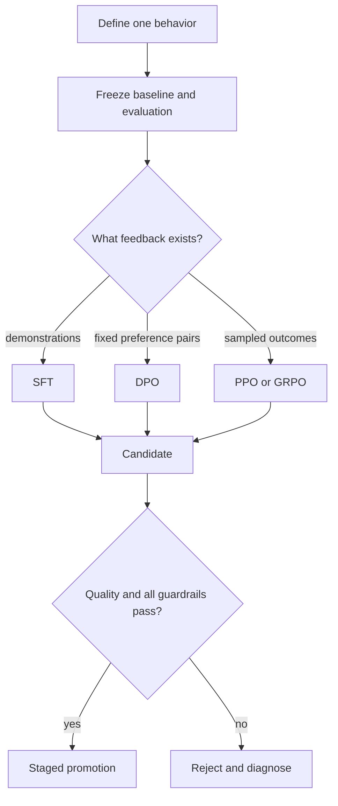

# Learn the complete post-training loop

The central idea is small: training changes a probability distribution using feedback. The hard part is making the feedback trustworthy and preserving that trust across data, algorithms, distributed systems, evaluation, and deployment.

Start at [chapter 00](spine/00-map-the-stack.md). Do not skip the data and evaluation chapters: they determine whether the later optimizer is learning the intended behavior or merely a convenient proxy.
