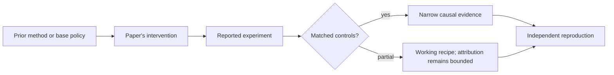

# R00. Read post-training research without being fooled

| Field | Value |
| --- | --- |
| First publication | 2026-08-12 |
| Status checked 2026-08-12 | course synthesis; not a research paper |
| Prerequisite | Spine 05, objectives and experiments |
| Repository evidence | `reported` paper claims plus a `specified-not-executed` practical |

## Why this belongs in the course

Fast-moving post-training papers often change the model, data, reward, sampling budget, and evaluation at once. A leaderboard gain can be real while the claimed cause remains uncertain. This lesson gives you an evidence contract before you read the papers that follow.

## The simplest accurate answer

Treat a paper as an argument with inspectable parts: a claim, a comparison, an intervention, observations, and limits. Your job is not to decide whether the authors are smart. Your job is to decide exactly which claim the evidence supports.

## A useful mental model

A paper is like a controlled repair report. If a mechanic changes the engine, tires, fuel, and driver and the lap becomes faster, the car is faster under that configuration. The report has not isolated which change caused the gain. The analogy stops because ML experiments also sample stochastic training and evaluation processes.

## What changed

Extract six objects: the base checkpoint; train data and contamination controls; algorithm and resolved configuration; reward or preference source; evaluation protocol including sampling budget; and comparator. Then mark each result as reported, reproduced, or independently measured. Check whether the ablation removes one causal ingredient at a time, whether seeds expose variance, and whether pass@1, pass@k, best-of-N, and token budgets are matched. Record publication status and paper version because a preprint may change.

## What the paper reports

The lessons in this track report only what the cited primary source claims. The repository does not reproduce their GPU runs. Where a paper supplies code, that improves inspectability but does not prove the published result on this machine.

This is a `reported` result. Read the paper's exact tables, model identities, prompts, token budgets, sampling counts, and exclusions before quoting a number.

## What it does not prove

A paper can demonstrate a result on named models and benchmarks without establishing a universal law, a production safety claim, or an isolated causal mechanism. Absence of a baseline is missing evidence, not evidence that the baseline loses.

## Reproduce the idea at the smallest useful scale

Pick one result table from any later lesson. Write a claim ledger with columns for claim, direct evidence, alternative explanation, missing control, and the smallest reproduction that could falsify the claim. Check the exact arXiv version and publication status on the day you read it.

Write an experiment record before running. Keep the base checkpoint, evaluation set, decoding, and compute accounting fixed. A CPU toy result stays `simulated`; a real run becomes `measured` only with the environment and raw artifacts required by the [evidence contract](../reference/evidence.md).

## Check your understanding

Can you state a paper's strongest supported claim without repeating its title or upgrading correlation into causation?

## Primary source

- [Paper or official publication page](https://arxiv.org/)
- No code link is claimed by this lesson; inspect the paper for current artifacts.

## Snapshot boundary

This lesson was selected and status-checked on 2026-08-12. “Latest” means current to that date, not permanently current. Later revisions, replications, or retractions must update the canonical research record and regenerate this page.
