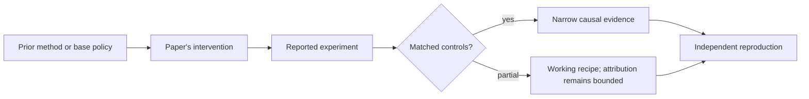

# R01. LoRA: learn a low-rank weight update instead of every weight

| Field | Value |
| --- | --- |
| First publication | 2021 |
| Status checked 2026-08-12 | ICLR 2022 conference paper |
| Prerequisite | Spine 02, matrices, and Spine 09, LoRA |
| Repository evidence | `reported` paper claims plus a `specified-not-executed` practical |

## Why this belongs in the course

LoRA changed the economics and artifact shape of model adaptation. Instead of storing a complete new copy of every trained weight, it freezes the base model and learns small low-rank matrices inside selected layers.

## The simplest accurate answer

A large weight matrix stays fixed. Training learns two thin matrices whose product is added to it. If the useful task update lies near a low-dimensional subspace, far fewer trainable numbers can approximate it.

## A useful mental model

Rather than replacing an entire wall, install a small adjustable frame that changes how forces pass through it. The frame still depends on the exact wall, and a narrow frame cannot express every possible reconstruction.

## What changed

For a base weight W with input width d and output width k, LoRA uses W plus a scaled product B*A where A and B have rank r much smaller than d or k. The base receives no gradient update; optimizer state is needed only for adapter parameters. Placement, rank, scaling, initialization, dropout, target modules, and whether adapters are merged at deployment remain explicit choices. The paper studies transformer adaptation across language tasks and analyzes update rank.

## What the paper reports

The paper reports matching or exceeding full fine-tuning on several tested models and tasks while training dramatically fewer parameters and avoiding additional inference latency when the update is merged. Read the exact model/task tables before reusing those comparisons.

This is a `reported` result. Read the paper's exact tables, model identities, prompts, token budgets, sampling counts, and exclusions before quoting a number.

## What it does not prove

Fewer trainable parameters do not imply the same reduction in activations, forward compute, wall-clock time, or total GPU memory. Low rank is an inductive bias, not proof that every task update is low rank. An adapter is tied to its base-model identity.

## Reproduce the idea at the smallest useful scale

For a 4096-by-4096 weight, compute dense update entries and rank-8 LoRA entries. Then create a memory ledger separating frozen weights, trainable adapters, gradients, optimizer states, activations, and temporary buffers. State which categories LoRA directly changes.

Write an experiment record before running. Keep the base checkpoint, evaluation set, decoding, and compute accounting fixed. A CPU toy result stays `simulated`; a real run becomes `measured` only with the environment and raw artifacts required by the [evidence contract](../reference/evidence.md).

## Check your understanding

Why can LoRA cut optimizer-state memory sharply while a long sequence still causes an out-of-memory failure?

## Primary source

- [Paper or official publication page](https://arxiv.org/abs/2106.09685)
- [Official code or artifacts](https://github.com/microsoft/LoRA)

## Snapshot boundary

This lesson was selected and status-checked on 2026-08-12. “Latest” means current to that date, not permanently current. Later revisions, replications, or retractions must update the canonical research record and regenerate this page.
