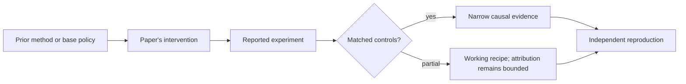

# R02. QLoRA: quantize the frozen base while training adapters

| Field | Value |
| --- | --- |
| First publication | 2023 |
| Status checked 2026-08-12 | NeurIPS 2023 paper |
| Prerequisite | LoRA lesson and Spine 09 |
| Repository evidence | `reported` paper claims plus a `specified-not-executed` practical |

## Why this belongs in the course

QLoRA made useful fine-tuning experiments possible on much smaller hardware by combining a frozen 4-bit base representation with trainable LoRA adapters and memory controls.

## The simplest accurate answer

Store the large frozen reference weights compactly, dequantize them as needed for computation, and send gradients into the small adapter weights rather than the quantized base. The model is quantized for storage during training; the learned update is not simply four-bit gradient descent on every parameter.

## A useful mental model

Keep a compressed encyclopedia on the desk and write corrections in a small notebook. You consult the encyclopedia during every answer, so compression saves shelf space but does not remove reading work or notebook quality requirements.

## What changed

The paper introduces 4-bit NormalFloat for normally distributed weights, double quantization of quantization constants, and paged optimizers for memory spikes, combined with LoRA. Gradients pass through operations involving the dequantized frozen weights into adapters. The work trains a large set of models across sizes and instruction datasets and evaluates chatbot behavior with automated and human comparisons.

## What the paper reports

The paper reports fine-tuning a 65B model on one 48GB GPU in its setup while preserving the tested full-precision fine-tuning performance, and reports Guanaco evaluation results. It also reports that common chatbot benchmarks and automated judges have reliability limitations.

This is a `reported` result. Read the paper's exact tables, model identities, prompts, token budgets, sampling counts, and exclusions before quoting a number.

## What it does not prove

A model fitting in memory does not mean it trains quickly, that its kernel path is efficient on every GPU, or that four-bit deployment is implied. 'Preserving performance' is bounded to tested tasks and configurations. Quantization errors, adapter rank, and compute dtype can interact.

## Reproduce the idea at the smallest useful scale

Given a hypothetical 7B-parameter base, derive only the raw 16-bit-versus-4-bit weight storage ratio, then explicitly list everything that estimate omits. Design a QLoRA-versus-LoRA comparison with matched data, updates, sequence length, and evaluation.

Write an experiment record before running. Keep the base checkpoint, evaluation set, decoding, and compute accounting fixed. A CPU toy result stays `simulated`; a real run becomes `measured` only with the environment and raw artifacts required by the [evidence contract](../reference/evidence.md).

## Check your understanding

Which weights receive optimizer updates in QLoRA, and why is that different from quantization-aware full-parameter training?

## Primary source

- [Paper or official publication page](https://arxiv.org/abs/2305.14314)
- [Official code or artifacts](https://github.com/artidoro/qlora)

## Snapshot boundary

This lesson was selected and status-checked on 2026-08-12. “Latest” means current to that date, not permanently current. Later revisions, replications, or retractions must update the canonical research record and regenerate this page.
