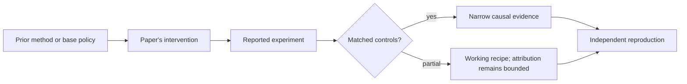

# R03. From REINFORCE to RLOO: the simple policy-gradient line

| Field | Value |
| --- | --- |
| First publication | 1992; RLOO paper 2024 |
| Status checked 2026-08-12 | REINFORCE: journal paper; RLOO: ACL 2024 paper |
| Prerequisite | Spine 13, policy gradients |
| Repository evidence | `reported` paper claims plus a `specified-not-executed` practical |

## Why this belongs in the course

REINFORCE is the small equation underneath much modern language-model RL. The 2024 RLOO study is important because it asks whether language-model feedback tasks need PPO's learned critic and complexity at all.

## The simplest accurate answer

Sample several answers to the same prompt. Score them. For each answer, compare its score with the average score of the other answers. Increase the probability of above-peer answers and decrease the probability of below-peer answers.

## A useful mental model

Imagine four runners on the same course and day. Each runner's baseline is the other three runners, not a separate coach predicting an absolute time. This controls some prompt difficulty. It fails when every runner gets the same score or when the small group is unrepresentative.

## What changed

REINFORCE weights a sampled sequence log-probability by return minus a baseline. RLOO samples k responses per prompt and gives response i a leave-one-out advantage: its reward minus the mean reward of the other k-1 responses. The baseline does not depend on response i, preserving the policy-gradient expectation under the stated sampling assumptions. The method can retain a reference-policy KL term while deleting PPO's learned value model, generalized advantage estimation, and value loss.

## What the paper reports

The ACL 2024 paper reports that REINFORCE-style methods, particularly RLOO, can match or outperform PPO and some direct-alignment methods on its tested RLHF setups while using a simpler loop. Read its tasks, judge, model scales, and compute accounting before carrying that conclusion elsewhere.

This is a `reported` result. Read the paper's exact tables, model identities, prompts, token budgets, sampling counts, and exclusions before quoting a number.

## What it does not prove

RLOO does not eliminate online sampling, reward misspecification, reference-model memory, or variance. A result on preference rewards does not establish the same ranking for sparse multi-step agent environments.

## Reproduce the idea at the smallest useful scale

Using rewards [0, 1, 1, 0.5], compute each leave-one-out baseline and advantage. Compare them with this repository's group mean and standard-deviation advantages. Then specify a matched RLOO-versus-GRPO experiment with identical prompts, samples, rewards, tokens, and update budget.

Write an experiment record before running. Keep the base checkpoint, evaluation set, decoding, and compute accounting fixed. A CPU toy result stays `simulated`; a real run becomes `measured` only with the environment and raw artifacts required by the [evidence contract](../reference/evidence.md).

## Check your understanding

Why is the leave-one-out baseline less biased than subtracting a baseline that includes the current sample's own reward?

## Primary source

- [Paper or official publication page](https://aclanthology.org/2024.acl-long.662/)
- [Official code or artifacts](https://github.com/huggingface/trl/blob/main/trl/trainer/rloo_trainer.py)

## Snapshot boundary

This lesson was selected and status-checked on 2026-08-12. “Latest” means current to that date, not permanently current. Later revisions, replications, or retractions must update the canonical research record and regenerate this page.
