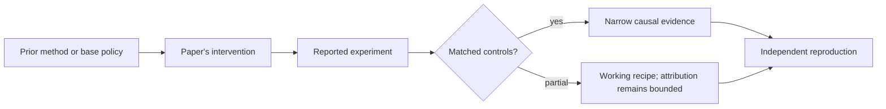

# R04. PPO: the general-purpose optimizer that entered RLHF

| Field | Value |
| --- | --- |
| First publication | 2017 |
| Status checked 2026-08-12 | arXiv technical paper; widely used algorithm |
| Prerequisite | Spine 14, PPO and KL control |
| Repository evidence | `reported` paper claims plus a `specified-not-executed` practical |

## Why this belongs in the course

PPO became a central reference point because it offered a practical compromise between one tiny on-policy update and a difficult trust-region optimization. Later post-training work is often best understood as retaining, deleting, or changing one PPO component.

## The simplest accurate answer

PPO asks: how can we learn more than once from fresh experience without letting the new policy become so different that the experience stops describing it? Its clipped surrogate limits the reward for pushing a sampled action's probability ratio too far.

## A useful mental model

A receipt from yesterday can guide today's purchase only while prices stay similar. Reusing it after prices change radically is misleading. The probability ratio measures that local change for sampled actions; the clip stops paying for some excessive movement but is not a global safety fence.

## What changed

Collect trajectories with an old policy, save old action log-probabilities, estimate advantages with returns and often a value function, then optimize minibatches for multiple epochs. The objective uses the minimum of the unclipped ratio-times-advantage and a clipped version. The original paper evaluates continuous-control and Atari environments. RLHF systems later add sequence modeling, learned rewards, reference-policy KL penalties, and distributed rollouts—those are adaptations, not all properties of the 2017 paper.

## What the paper reports

The paper reports competitive performance and simpler implementation than trust-region policy optimization across its tested environments. It does not contain modern LLM experiments; its importance to this course is algorithmic lineage.

This is a `reported` result. Read the paper's exact tables, model identities, prompts, token budgets, sampling counts, and exclusions before quoting a number.

## What it does not prove

Clipping a sampled-action ratio does not bound every distributional change, guarantee monotonic improvement, or solve reward hacking. PPO results depend on implementation details, advantage normalization, minibatching, value fitting, and sample freshness.

## Reproduce the idea at the smallest useful scale

Run `pt101 ppo` and enumerate all four sign-and-ratio cases. Then draw the state kept by a real learner: policy, old log-probabilities, rewards, advantages, reference log-probabilities, value targets, masks, and checkpoint IDs. Mark which identities must match.

Write an experiment record before running. Keep the base checkpoint, evaluation set, decoding, and compute accounting fixed. A CPU toy result stays `simulated`; a real run becomes `measured` only with the environment and raw artifacts required by the [evidence contract](../reference/evidence.md).

## Check your understanding

Which parts of an LLM PPO stack come from the original PPO algorithm, and which come from the RLHF application?

## Primary source

- [Paper or official publication page](https://arxiv.org/abs/1707.06347)
- [Official code or artifacts](https://github.com/openai/baselines)

## Snapshot boundary

This lesson was selected and status-checked on 2026-08-12. “Latest” means current to that date, not permanently current. Later revisions, replications, or retractions must update the canonical research record and regenerate this page.
