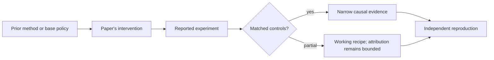

# R05. InstructGPT: demonstrations, preferences, reward model, and PPO

| Field | Value |
| --- | --- |
| First publication | 2022 |
| Status checked 2026-08-12 | NeurIPS 2022 paper |
| Prerequisite | Spine 08 through 14 |
| Repository evidence | `reported` paper claims plus a `specified-not-executed` practical |

## Why this belongs in the course

InstructGPT is the clearest influential end-to-end RLHF system paper: it connects labeler demonstrations, pairwise rankings, a learned reward model, PPO, and human evaluation into one pipeline. It also shows why parameter count and instruction-following quality are different axes.

## The simplest accurate answer

First show the model examples of desired answers. Then ask humans which sampled answers are better. Train a judge from those comparisons. Finally let the model generate answers and update it toward higher judge scores while constraining drift.

## A useful mental model

It resembles teaching, exams, and coaching, but the learned reward model is not a human conscience. It is a statistical proxy trained on a bounded comparison distribution and can be exploited outside that distribution.

## What changed

The paper starts with supervised fine-tuning on demonstrations, trains a reward model with a Bradley–Terry-style pairwise loss, and optimizes the policy using PPO against reward minus a KL-related constraint. It also mixes a pretraining objective in one variant to reduce capability regressions. Evaluation includes labeler preferences and public NLP datasets, with labeler screening and held-out customer prompts described in the paper.

## What the paper reports

The paper reports that its 1.3B InstructGPT model was preferred to 175B GPT-3 on its human evaluation distribution, alongside improvements in truthfulness and toxicity measures and some remaining mistakes. That is a reported result under the paper's models, raters, prompts, and 2022 evaluation protocol.

This is a `reported` result. Read the paper's exact tables, model identities, prompts, token budgets, sampling counts, and exclusions before quoting a number.

## What it does not prove

It does not prove all smaller aligned models outperform larger base models, that reward models capture human values, or that the pipeline removes harmful behavior. The authors explicitly discuss residual failures and alignment limitations.

## Reproduce the idea at the smallest useful scale

Draw the complete data lineage: raw prompt, demonstration, SFT checkpoint, sampled candidates, comparison, reward-model checkpoint, PPO trajectory, candidate, held-out human evaluation. For every arrow write the identity and artifact needed to reproduce it.

Write an experiment record before running. Keep the base checkpoint, evaluation set, decoding, and compute accounting fixed. A CPU toy result stays `simulated`; a real run becomes `measured` only with the environment and raw artifacts required by the [evidence contract](../reference/evidence.md).

## Check your understanding

Why is evaluation by fresh held-out labelers stronger evidence than reporting only the reward model's score after PPO?

## Primary source

- [Paper or official publication page](https://arxiv.org/abs/2203.02155)
- No code link is claimed by this lesson; inspect the paper for current artifacts.

## Snapshot boundary

This lesson was selected and status-checked on 2026-08-12. “Latest” means current to that date, not permanently current. Later revisions, replications, or retractions must update the canonical research record and regenerate this page.
