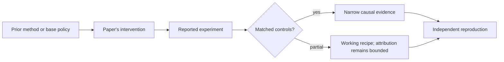

# R06. Constitutional AI: principles, self-revision, and AI feedback

| Field | Value |
| --- | --- |
| First publication | 2022 |
| Status checked 2026-08-12 | arXiv research paper |
| Prerequisite | InstructGPT lesson and Spine 16 |
| Repository evidence | `reported` paper claims plus a `specified-not-executed` practical |

## Why this belongs in the course

Constitutional AI is a foundational RLAIF recipe. It explores how written principles and model-generated critiques/preferences can reduce the amount of direct human harmlessness labeling while keeping human oversight at the level of selecting the constitution and evaluating results.

## The simplest accurate answer

Give a model a set of principles. Have it critique and revise problematic answers using those principles. Then use AI-generated preference comparisons to train a preference model and optimize an assistant.

## A useful mental model

A style guide lets editors apply consistent rules without asking the publisher about every sentence. The guide is still written and interpreted by people, can contain conflicts, and does not guarantee the editor spots every violation.

## What changed

The pipeline has a supervised self-critique-and-revision stage followed by reinforcement learning from AI feedback. A helpful-only model produces responses; a model critiques and revises them using sampled constitutional principles, creating supervised data. For the RL stage, a model compares response pairs under principles, those preferences train a preference model, and the assistant is optimized against it. The constitution, critique prompts, preference model, and human evaluation are distinct artifacts.

## What the paper reports

The paper reports improved harmlessness relative to stated baselines while seeking to preserve helpfulness, and studies a less evasive assistant. Its human evaluations are the evidence for behavior; AI preference agreement alone would be circular.

This is a `reported` result. Read the paper's exact tables, model identities, prompts, token budgets, sampling counts, and exclusions before quoting a number.

## What it does not prove

AI feedback does not remove human values, bias, or oversight—it relocates them into principles, prompts, base models, and evaluation. A written constitution is incomplete, and the policy or feedback model may exploit its surface form.

## Reproduce the idea at the smallest useful scale

Write five concrete principles for one narrow support task, including a precedence rule for conflicts. Produce one unsafe response, a principle-linked critique, and a revision. Then write an adversarial response that follows the wording while violating the intent.

Write an experiment record before running. Keep the base checkpoint, evaluation set, decoding, and compute accounting fixed. A CPU toy result stays `simulated`; a real run becomes `measured` only with the environment and raw artifacts required by the [evidence contract](../reference/evidence.md).

## Check your understanding

Where do human decisions enter an RLAIF system even when humans label no individual training comparison?

## Primary source

- [Paper or official publication page](https://arxiv.org/abs/2212.08073)
- No code link is claimed by this lesson; inspect the paper for current artifacts.

## Snapshot boundary

This lesson was selected and status-checked on 2026-08-12. “Latest” means current to that date, not permanently current. Later revisions, replications, or retractions must update the canonical research record and regenerate this page.
