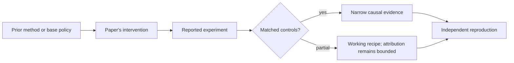

# R07. Let's Verify Step by Step: outcome versus process supervision

| Field | Value |
| --- | --- |
| First publication | 2023 |
| Status checked 2026-08-12 | arXiv research paper; PRM800K data released |
| Prerequisite | Spine 11 and 16, reward models and verifiable feedback |
| Repository evidence | `reported` paper claims plus a `specified-not-executed` practical |

## Why this belongs in the course

A final-answer reward cannot tell which intermediate step first went wrong. This paper made process reward models and step-level feedback concrete at scale for mathematical reasoning.

## The simplest accurate answer

Outcome supervision grades only the final answer. Process supervision marks each reasoning step. The second signal is denser and can identify a plausible-looking path that arrives at the right answer for the wrong reason.

## A useful mental model

Checking only a destination is like grading a navigation route by whether the driver arrived. Step checks inspect each turn. But a step grader can still miss a hidden shortcut or penalize an unconventional valid route.

## What changed

The work collects human labels on intermediate steps and trains process-supervised reward models, then compares them with outcome-supervised reward models on MATH problems. It also uses active learning to spend labels on useful examples. A process reward can rank candidate solutions by aggregating step assessments. This is reward modeling and selection evidence; do not silently translate it into a claim about a particular online RL algorithm.

## What the paper reports

The paper reports that process supervision outperformed outcome supervision in its setting and that its best process-supervised model solved 78 percent of a representative MATH test subset. PRM800K contains the released step-level labels.

This is a `reported` result. Read the paper's exact tables, model identities, prompts, token budgets, sampling counts, and exclusions before quoting a number.

## What it does not prove

The result is domain- and protocol-specific. Human step labels are expensive and can disagree. A written chain of thought is not guaranteed to be a faithful causal trace of the model's internal computation, and a process verifier can itself be gamed.

## Reproduce the idea at the smallest useful scale

Take three short arithmetic solutions: correct path/correct answer, wrong path/correct answer, and correct prefix/wrong final step. Build outcome and step label tables. Show which pairs outcome supervision cannot distinguish. Write a policy for ambiguous but valid alternative steps.

Write an experiment record before running. Keep the base checkpoint, evaluation set, decoding, and compute accounting fixed. A CPU toy result stays `simulated`; a real run becomes `measured` only with the environment and raw artifacts required by the [evidence contract](../reference/evidence.md).

## Check your understanding

When is a process label actually more informative than a trusted executable outcome checker, and when does it merely add another proxy?

## Primary source

- [Paper or official publication page](https://arxiv.org/abs/2305.20050)
- [Official code or artifacts](https://github.com/openai/prm800k)

## Snapshot boundary

This lesson was selected and status-checked on 2026-08-12. “Latest” means current to that date, not permanently current. Later revisions, replications, or retractions must update the canonical research record and regenerate this page.
