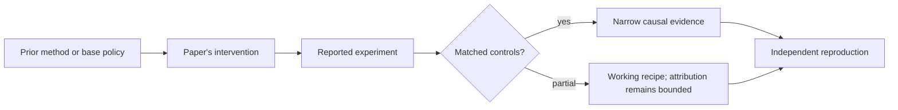

# R08. DPO: turn preference optimization into a classification loss

| Field | Value |
| --- | --- |
| First publication | 2023 |
| Status checked 2026-08-12 | NeurIPS 2023 paper |
| Prerequisite | Spine 15, Direct Preference Optimization |
| Repository evidence | `reported` paper claims plus a `specified-not-executed` practical |

## Why this belongs in the course

DPO changed the operational shape of preference optimization. Under its stated KL-regularized reward model, it derives a policy objective that uses preference pairs and a reference model without fitting an explicit reward model or running online PPO.

## The simplest accurate answer

For each chosen and rejected answer, ask whether the trainable policy prefers the chosen answer more strongly than the frozen reference does. Increase that relative margin.

## A useful mental model

A before-and-after comparison is the right analogy: the reference says how much the starting system preferred A over B; DPO rewards the candidate for moving that odds ratio toward the labeled winner. It does not discover new pairs while training.

## What changed

Compute sequence log-probabilities for chosen and rejected answers under policy and reference. Form the difference of their log-probability gaps, scale it by beta, and minimize a negative log-sigmoid loss. The derivation connects the optimal policy of a particular KL-constrained reward objective to an implicit reward parameterization. In practice, tokenization, prompt masking, length, beta convention, reference identity, and pair construction materially affect results.

## What the paper reports

The paper reports competitive or stronger results than its PPO-based RLHF baselines on sentiment control, summarization, and dialogue while using a simpler training pipeline in the tested settings.

This is a `reported` result. Read the paper's exact tables, model identities, prompts, token budgets, sampling counts, and exclusions before quoting a number.

## What it does not prove

DPO is offline preference optimization, not an interactive RL loop. Its comparisons may be stale for the updated policy. Later work finds settings where online PPO performs better, so 'DPO replaces PPO' is too broad.

## Reproduce the idea at the smallest useful scale

Run `pt101 dpo`, derive its scalar gradient, and reverse the pair. Then design an experiment comparing DPO with continued SFT and PPO using matched base model, prompts, evaluation, and total generated tokens. State how you will handle answer length.

Write an experiment record before running. Keep the base checkpoint, evaluation set, decoding, and compute accounting fixed. A CPU toy result stays `simulated`; a real run becomes `measured` only with the environment and raw artifacts required by the [evidence contract](../reference/evidence.md).

## Check your understanding

What coverage failure can no amount of DPO optimization repair if the relevant behavior never appears in the fixed preference pairs?

## Primary source

- [Paper or official publication page](https://arxiv.org/abs/2305.18290)
- [Official code or artifacts](https://github.com/eric-mitchell/direct-preference-optimization)

## Snapshot boundary

This lesson was selected and status-checked on 2026-08-12. “Latest” means current to that date, not permanently current. Later revisions, replications, or retractions must update the canonical research record and regenerate this page.
