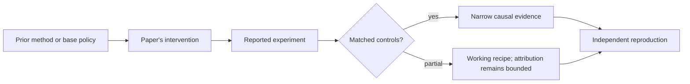

# R09. KTO: learn from desirable and undesirable examples without pairs

| Field | Value |
| --- | --- |
| First publication | 2024 |
| Status checked 2026-08-12 | ICML 2024 conference paper |
| Prerequisite | DPO lesson |
| Repository evidence | `reported` paper claims plus a `specified-not-executed` practical |

## Why this belongs in the course

DPO requires a chosen and rejected response for the same prompt. KTO is important when feedback arrives as independent thumbs-up or thumbs-down examples and natural pairs are expensive or artificial.

## The simplest accurate answer

Instead of asking which of two answers wins, label each observed answer as desirable or undesirable. Compare its policy-versus-reference likelihood signal with a distribution-level reference point and optimize a loss shaped by different attitudes toward gains and losses.

## A useful mental model

A user can say 'this trip was bad' without taking the same trip with a second driver for comparison. The missing counterfactual makes learning harder, and the interpretation depends on what counts as an ordinary outcome.

## What changed

The paper frames several alignment objectives as human-aware losses and draws on prospect-theoretic utility. KTO uses binary desirability labels, a reference policy, and a KL-related reference point. Desirable and undesirable examples can receive separately weighted loss terms, which matters when feedback classes are imbalanced. The method is offline and inherits the coverage and policy-shift limits of its fixed data.

## What the paper reports

The paper reports matching or exceeding preference-pair methods on tested model scales from 1B to 30B while learning from unary desirable/undesirable signals. It also argues that no one human-aware loss is universally superior.

This is a `reported` result. Read the paper's exact tables, model identities, prompts, token budgets, sampling counts, and exclusions before quoting a number.

## What it does not prove

Prospect theory is a modeling inspiration, not proof that the loss captures actual human psychology in deployment. Unary labels can hide which alternative would be better and are sensitive to class balance, source policy, and labeling threshold.

## Reproduce the idea at the smallest useful scale

Convert a four-pair preference dataset into eight unary labels, then remove one member from half the pairs. State what KTO can still use and what relational information is lost. Design a class-imbalance stress test.

Write an experiment record before running. Keep the base checkpoint, evaluation set, decoding, and compute accounting fixed. A CPU toy result stays `simulated`; a real run becomes `measured` only with the environment and raw artifacts required by the [evidence contract](../reference/evidence.md).

## Check your understanding

When is a cheap unary signal worth the loss of within-prompt comparative information?

## Primary source

- [Paper or official publication page](https://arxiv.org/abs/2402.01306)
- [Official code or artifacts](https://github.com/ContextualAI/HALOs)

## Snapshot boundary

This lesson was selected and status-checked on 2026-08-12. “Latest” means current to that date, not permanently current. Later revisions, replications, or retractions must update the canonical research record and regenerate this page.
