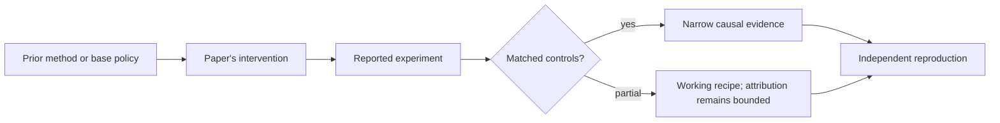

# R10. SimPO: reference-free preference optimization with a length-normalized reward

| Field | Value |
| --- | --- |
| First publication | 2024 |
| Status checked 2026-08-12 | NeurIPS 2024 conference paper |
| Prerequisite | DPO and KTO lessons |
| Repository evidence | `reported` paper claims plus a `specified-not-executed` practical |

## Why this belongs in the course

SimPO tests whether offline preference optimization needs a separate frozen reference model. It replaces DPO's policy-versus-reference implicit reward with the policy's average response log-probability and adds a target margin.

## The simplest accurate answer

Raise the chosen response's average per-token log-probability above the rejected response's by at least a desired gap. Averaging addresses raw sequence-length accumulation, and dropping the reference reduces memory and computation.

## A useful mental model

Compare average score per question rather than total points when exams have different lengths. This reduces one length effect but does not prove verbosity, brevity, or content quality is fully controlled.

## What changed

For each preference pair, SimPO computes average log-probability per response under the trainable policy, takes the chosen-minus-rejected difference, subtracts a target reward margin, and applies a Bradley–Terry-style log-sigmoid loss. There is no reference-policy forward pass. The margin asks the policy to separate responses rather than merely order them. Data source and offline coverage remain unchanged.

## What the paper reports

The NeurIPS 2024 paper reports improvements over DPO and tested variants on AlpacaEval 2, MT-Bench, Arena-Hard, and a real-user leaderboard comparison under its model and training setups, while reporting limited length exploitation in those evaluations.

This is a `reported` result. Read the paper's exact tables, model identities, prompts, token budgets, sampling counts, and exclusions before quoting a number.

## What it does not prove

Reference-free does not mean unconstrained, safe, or immune to likelihood over-optimization. Judge-based chat benchmarks can favor style. Average token log-probability introduces its own length and tokenization behavior.

## Reproduce the idea at the smallest useful scale

For a two-token chosen response and four-token rejected response, compute total and average log-probability gaps. Add a target margin and evaluate whether the loss is satisfied. Then compare memory ledgers for DPO and SimPO.

Write an experiment record before running. Keep the base checkpoint, evaluation set, decoding, and compute accounting fixed. A CPU toy result stays `simulated`; a real run becomes `measured` only with the environment and raw artifacts required by the [evidence contract](../reference/evidence.md).

## Check your understanding

What behavior was controlled by DPO's reference model that must now be detected by external regression evaluation in SimPO?

## Primary source

- [Paper or official publication page](https://papers.nips.cc/paper_files/paper/2024/hash/e099c1c9699814af0be873a175361713-Abstract-Conference.html)
- [Official code or artifacts](https://github.com/princeton-nlp/SimPO)

## Snapshot boundary

This lesson was selected and status-checked on 2026-08-12. “Latest” means current to that date, not permanently current. Later revisions, replications, or retractions must update the canonical research record and regenerate this page.
