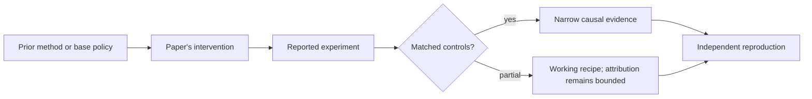

# R11. DeepSeekMath: GRPO and verifiable mathematical rewards

| Field | Value |
| --- | --- |
| First publication | 2024 |
| Status checked 2026-08-12 | arXiv technical report |
| Prerequisite | Spine 16 and 17, verifiable rewards and GRPO |
| Repository evidence | `reported` paper claims plus a `specified-not-executed` practical |

## Why this belongs in the course

DeepSeekMath introduced Group Relative Policy Optimization in a complete math-model recipe. It is the bridge between general RLHF and the later wave of reasoning models trained from executable or exact rewards.

## The simplest accurate answer

Sample a group of answers to one problem. Use the group's rewards to decide which samples were better than their peers. Update the policy without training a separate value network.

## A useful mental model

A classroom curve supplies a local baseline for one exam. It saves a separate predictor of expected grades, but it yields no ranking when everyone ties and it can be distorted by a tiny or mismatched group.

## What changed

GRPO samples multiple outputs for each question, normalizes rewards within the group to estimate advantages, and optimizes a PPO-like clipped objective with a KL term in the paper's formulation. DeepSeekMath combines this with continued pretraining on math-related data and supervised fine-tuning. The components must be separated when attributing results: the model is not evidence for GRPO alone.

## What the paper reports

The report gives DeepSeekMath model results across mathematical benchmarks and introduces GRPO as a memory-reducing alternative to PPO's critic. The exact benchmark numbers are reported evidence tied to its data, model, sampling, and evaluation settings.

This is a `reported` result. Read the paper's exact tables, model identities, prompts, token budgets, sampling counts, and exclusions before quoting a number.

## What it does not prove

Removing a critic does not remove multiple rollout samples, reference computation, reward design, or distributed synchronization. Group normalization can erase signal in constant-reward groups and later research identifies length-related biases in common implementations.

## Reproduce the idea at the smallest useful scale

Run `pt101 grpo` with mixed and equal rewards. Compute mean, standard deviation, and advantages. Then write an ablation matrix separating continued pretraining, SFT, reward choice, GRPO, sampling count, and test-time voting.

Write an experiment record before running. Keep the base checkpoint, evaluation set, decoding, and compute accounting fixed. A CPU toy result stays `simulated`; a real run becomes `measured` only with the environment and raw artifacts required by the [evidence contract](../reference/evidence.md).

## Check your understanding

Why can a paper prove that a full recipe works while leaving the marginal contribution of one algorithm uncertain?

## Primary source

- [Paper or official publication page](https://arxiv.org/abs/2402.03300)
- [Official code or artifacts](https://github.com/deepseek-ai/DeepSeek-Math)

## Snapshot boundary

This lesson was selected and status-checked on 2026-08-12. “Latest” means current to that date, not permanently current. Later revisions, replications, or retractions must update the canonical research record and regenerate this page.
