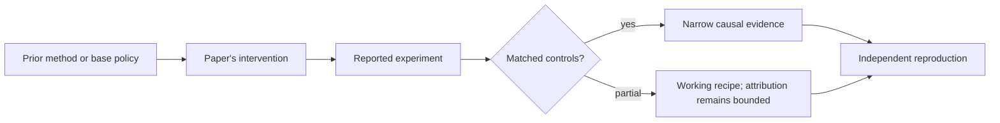

# R12. Tulu 3: an open post-training pipeline, not one magic loss

| Field | Value |
| --- | --- |
| First publication | 2024 |
| Status checked 2026-08-12 | arXiv technical report; open artifacts |
| Prerequisite | Spine 05 through 21 |
| Repository evidence | `reported` paper claims plus a `specified-not-executed` practical |

## Why this belongs in the course

Tulu 3 matters because it treats post-training as a reproducible system: data curation, SFT, preference optimization, RL with verifiable rewards, decontamination, development evaluation, unseen evaluation, and released recipes.

## The simplest accurate answer

The lesson is not that one loss won. The lesson is that a strong model is assembled through staged data and evaluation decisions, and failed methods are useful evidence when the comparisons are controlled.

## A useful mental model

A restaurant is not explained by its oven alone. Ingredients, preparation order, quality checks, and service all affect the meal. Likewise, a trainer name cannot summarize a post-training pipeline.

## What changed

The report builds on Llama 3.1 base models and uses SFT, DPO, and a method called RLVR. It emphasizes multi-task development and unseen evaluations, benchmark decontamination, dataset mixing, and open release of data, code, model weights, and configurations. Inspect the exact recipe for each checkpoint rather than assuming every Tulu 3 model passed through identical stages.

## What the paper reports

The paper reports strong results for its open post-trained models relative to named open and closed comparators and discusses methods that did not reliably help. Its unusually broad artifact release makes it a useful reproduction target.

This is a `reported` result. Read the paper's exact tables, model identities, prompts, token budgets, sampling counts, and exclusions before quoting a number.

## What it does not prove

A complete open recipe still does not make its aggregate score a universal measure, guarantee uncontaminated data, or prove every stage is necessary. Closed-model comparisons can drift as APIs change.

## Reproduce the idea at the smallest useful scale

Choose one Tulu 3 checkpoint and produce an artifact graph from base revision to final evaluation. Mark every dataset, code revision, stage, and evaluator. Then propose a tiny reproduction that keeps the stage order but reduces model and data scale, and state which claims it cannot test.

Write an experiment record before running. Keep the base checkpoint, evaluation set, decoding, and compute accounting fixed. A CPU toy result stays `simulated`; a real run becomes `measured` only with the environment and raw artifacts required by the [evidence contract](../reference/evidence.md).

## Check your understanding

Why is unseen evaluation after development tuning different from merely adding more benchmark rows to one reported average?

## Primary source

- [Paper or official publication page](https://arxiv.org/abs/2411.15124)
- [Official code or artifacts](https://github.com/allenai/open-instruct)

## Snapshot boundary

This lesson was selected and status-checked on 2026-08-12. “Latest” means current to that date, not permanently current. Later revisions, replications, or retractions must update the canonical research record and regenerate this page.
