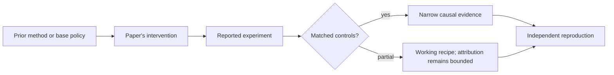

# R13. DeepSeek-R1: pure RL experiment versus the production recipe

| Field | Value |
| --- | --- |
| First publication | 2025 |
| Status checked 2026-08-12 | arXiv technical report; open model artifacts |
| Prerequisite | DeepSeekMath lesson and Spine 16 |
| Repository evidence | `reported` paper claims plus a `specified-not-executed` practical |

## Why this belongs in the course

DeepSeek-R1 made large-scale RL for reasoning visible, but its most important teaching distinction is between R1-Zero and R1. R1-Zero tests RL without an SFT warm-up; R1 uses cold-start data and multiple stages to improve readability, language consistency, and overall behavior.

## The simplest accurate answer

R1-Zero asks whether verifiable reward can amplify reasoning behavior from a base model. R1 asks how to turn that experiment into a more usable model through curated starts, RL, rejection sampling, supervised training, and additional alignment.

## A useful mental model

Letting a student discover a solution style from exam scores tests exploration. Giving a small set of worked formats first makes the writing usable. The analogy does not show what reasoning was already latent in pretraining.

## What changed

The report applies large-scale RL with rule-based accuracy and format rewards to DeepSeek-V3-Base for R1-Zero. The R1 pipeline adds cold-start supervised data, reasoning-oriented RL, rejection sampling and SFT, and another RL phase spanning helpfulness and harmlessness. It also distills reasoning outputs into smaller Qwen- and Llama-based dense models. These are distinct interventions and checkpoints.

## What the paper reports

The paper reports reasoning benchmark results for R1-Zero, R1, and distilled models, plus observed behaviors such as longer reasoning and self-reflection. It also reports R1-Zero problems including readability and language mixing.

This is a `reported` result. Read the paper's exact tables, model identities, prompts, token budgets, sampling counts, and exclusions before quoting a number.

## What it does not prove

An observed 'aha moment' is not proof that RL created a capability absent from pretraining. Benchmark comparison does not isolate training compute, data, base-model strength, or test-time token budget. Distillation results are not direct RL results for the student models.

## Reproduce the idea at the smallest useful scale

Create a table with rows R1-Zero, R1, and distilled student and columns base model, SFT before RL, reward, later SFT, direct RL weight update, and reported limitation. This prevents collapsing three different training paths into one claim.

Write an experiment record before running. Keep the base checkpoint, evaluation set, decoding, and compute accounting fixed. A CPU toy result stays `simulated`; a real run becomes `measured` only with the environment and raw artifacts required by the [evidence contract](../reference/evidence.md).

## Check your understanding

Which DeepSeek-R1 artifact received direct RL gradients, and which artifacts learned by supervised distillation instead?

## Primary source

- [Paper or official publication page](https://arxiv.org/abs/2501.12948)
- [Official code or artifacts](https://github.com/deepseek-ai/DeepSeek-R1)

## Snapshot boundary

This lesson was selected and status-checked on 2026-08-12. “Latest” means current to that date, not permanently current. Later revisions, replications, or retractions must update the canonical research record and regenerate this page.
