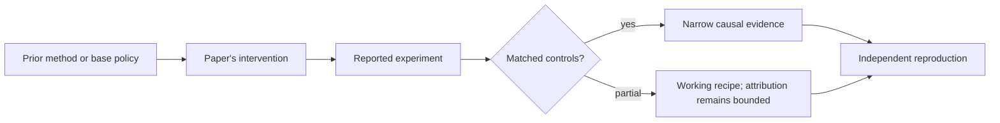

# R14. Kimi k1.5: long-context RL and long-to-short transfer

| Field | Value |
| --- | --- |
| First publication | 2025 |
| Status checked 2026-08-12 | arXiv technical report |
| Prerequisite | DeepSeek-R1 lesson and Spine 19 |
| Repository evidence | `reported` paper claims plus a `specified-not-executed` practical |

## Why this belongs in the course

Kimi k1.5 broadens the reasoning-RL picture beyond one algorithm. It emphasizes long-context rollouts, improved policy optimization, multimodal data, infrastructure, and transferring long reasoning into shorter responses.

## The simplest accurate answer

The recipe spends training compute letting the policy explore long solutions, then uses those solutions to improve a model that answers more briefly. Training-time exploration length and serving-time answer length can be separate design choices.

## A useful mental model

A researcher may use a long scratchpad while discovering a proof and later write a concise solution. But a model's visible tokens are sampled outputs, not guaranteed faithful private thoughts, and shorter distillation can discard useful diversity.

## What changed

The report describes an RL framework without Monte Carlo tree search, a learned value function, or a process reward model. It discusses long-context scaling, rollout and policy-optimization techniques, multimodal training, partial rollout reuse, and several long-to-short approaches including model merging, shortest rejection sampling, DPO, and long-CoT-to-short-CoT SFT. Treat these as a system recipe, not one ablated variable.

## What the paper reports

The paper reports strong benchmark results on mathematical, coding, and multimodal reasoning for long- and short-chain-of-thought variants. Those numbers depend on the stated evaluation and test-time setup and remain reported, not reproduced here.

This is a `reported` result. Read the paper's exact tables, model identities, prompts, token budgets, sampling counts, and exclusions before quoting a number.

## What it does not prove

The report does not show that longer reasoning is always better, that tree search is unnecessary for all tasks, or that a short model internalizes the same mechanism as the long model. Infrastructure scale limits direct reproduction.

## Reproduce the idea at the smallest useful scale

For one task, define matched pass@1, pass@k, and token-budget evaluations for a long and short policy. Specify how you would distinguish accuracy gained by training from accuracy gained by sampling more tokens at test time.

Write an experiment record before running. Keep the base checkpoint, evaluation set, decoding, and compute accounting fixed. A CPU toy result stays `simulated`; a real run becomes `measured` only with the environment and raw artifacts required by the [evidence contract](../reference/evidence.md).

## Check your understanding

Why must a claimed long-to-short improvement be evaluated under a fixed output-token budget as well as ordinary benchmark settings?

## Primary source

- [Paper or official publication page](https://arxiv.org/abs/2501.12599)
- No code link is claimed by this lesson; inspect the paper for current artifacts.

## Snapshot boundary

This lesson was selected and status-checked on 2026-08-12. “Latest” means current to that date, not permanently current. Later revisions, replications, or retractions must update the canonical research record and regenerate this page.
