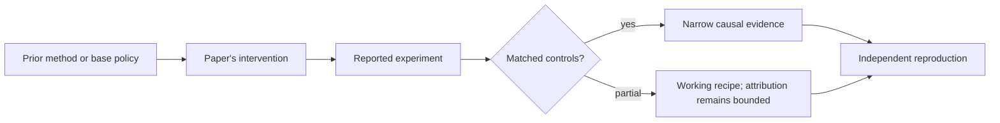

# R15. DAPO: make large-scale reasoning RL trainable and inspectable

| Field | Value |
| --- | --- |
| First publication | 2025 |
| Status checked 2026-08-12 | arXiv technical report; code and data released |
| Prerequisite | DeepSeek-R1 lesson and Spine 14 through 19 |
| Repository evidence | `reported` paper claims plus a `specified-not-executed` practical |

## Why this belongs in the course

DAPO is important as an engineering paper: it identifies concrete failure modes encountered while scaling reasoning RL and releases a recipe intended to make the training path reproducible.

## The simplest accurate answer

A mathematically valid optimizer can still stall when every sampled answer ties, when clipping suppresses useful changes asymmetrically, or when long answers receive accidental advantages. DAPO changes sampling and loss details to keep useful learning signal flowing.

## A useful mental model

Think of a factory line with four jams. Fixing the product blueprint is insufficient; each jam needs an operational control. The analogy does not prove every control generalizes beyond the reported model and math task.

## What changed

DAPO names four techniques: decoupled clipping with separate lower and upper ranges; dynamic sampling that filters groups with no reward variation; token-level policy-gradient loss; and overlong-reward shaping. The system is implemented using verl and reports a Qwen2.5-32B math run. Each technique changes either which samples reach training or how their token losses and constraints are aggregated.

## What the paper reports

The paper reports a score of 50 on AIME 2024 for its Qwen2.5-32B base-model recipe and provides code, processed data, and training details. Its ablations are the primary evidence for the proposed techniques.

This is a `reported` result. Read the paper's exact tables, model identities, prompts, token budgets, sampling counts, and exclusions before quoting a number.

## What it does not prove

A single benchmark score does not establish general instruction following, safety, or cross-domain transfer. Dynamic filtering changes the effective training distribution. Overlong penalties can suppress valid long solutions if the budget is poorly chosen.

## Reproduce the idea at the smallest useful scale

Create four synthetic reward groups: all wrong, all correct, mixed, and one outlier. Show which dynamic sampling retains. Then compare sequence-level and token-level averaging for one short and one long response with the same advantage.

Write an experiment record before running. Keep the base checkpoint, evaluation set, decoding, and compute accounting fixed. A CPU toy result stays `simulated`; a real run becomes `measured` only with the environment and raw artifacts required by the [evidence contract](../reference/evidence.md).

## Check your understanding

How can filtering zero-variance groups improve optimizer efficiency while also hiding that the current curriculum is too easy or too hard?

## Primary source

- [Paper or official publication page](https://arxiv.org/abs/2503.14476)
- [Official code or artifacts](https://github.com/volcengine/verl/blob/main/docs/algo/dapo.md)

## Snapshot boundary

This lesson was selected and status-checked on 2026-08-12. “Latest” means current to that date, not permanently current. Later revisions, replications, or retractions must update the canonical research record and regenerate this page.
