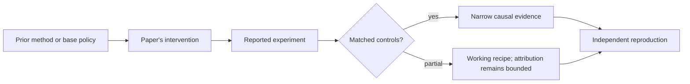

# R16. Dr. GRPO: find length bias before celebrating longer reasoning

| Field | Value |
| --- | --- |
| First publication | 2025 |
| Status checked 2026-08-12 | arXiv critical study; code released |
| Prerequisite | GRPO and DeepSeek-R1 lessons |
| Repository evidence | `reported` paper claims plus a `specified-not-executed` practical |

## Why this belongs in the course

This paper is important because it challenges two tempting stories: that reasoning behaviors necessarily emerge only during RL, and that longer outputs during GRPO necessarily mean deeper reasoning.

## The simplest accurate answer

Inspect the base model before crediting RL, and inspect the loss normalization before crediting longer thought. An optimizer can accidentally reward response length even when extra tokens belong to incorrect answers.

## A useful mental model

If a race score is divided by each runner's distance in one place and by a fixed distance elsewhere, incentives can favor running farther rather than reaching the finish efficiently. The exact analogy depends on the loss normalization being studied.

## What changed

The authors evaluate several base models for pre-existing reasoning behaviors and analyze common GRPO normalization. They argue that sample-level and token-level normalization choices introduce an optimization bias that increases response length, especially for incorrect outputs. Dr. GRPO removes the identified normalization terms in their formulation. The paper also presents a smaller R1-Zero-style training recipe.

## What the paper reports

The paper reports strong AIME 2024 performance for its 7B setup, improved token efficiency, and evidence that some apparent 'aha' behavior exists in base models before RL. These are reported findings under its prompts, models, and sampling analysis.

This is a `reported` result. Read the paper's exact tables, model identities, prompts, token budgets, sampling counts, and exclusions before quoting a number.

## What it does not prove

The critique does not show that all length growth is spurious, that RL cannot discover new strategies, or that Dr. GRPO wins on all domains. Base-model sampling has finite coverage, so failure to observe a behavior is not proof of absence.

## Reproduce the idea at the smallest useful scale

Construct two responses with equal reward and advantage but lengths 10 and 100. Apply per-sequence and per-token normalization choices and inspect total gradient weight. Then design a plot splitting correct and incorrect response lengths over training.

Write an experiment record before running. Keep the base checkpoint, evaluation set, decoding, and compute accounting fixed. A CPU toy result stays `simulated`; a real run becomes `measured` only with the environment and raw artifacts required by the [evidence contract](../reference/evidence.md).

## Check your understanding

What evidence would distinguish useful additional reasoning from an optimizer-induced length artifact?

## Primary source

- [Paper or official publication page](https://arxiv.org/abs/2503.20783)
- [Official code or artifacts](https://github.com/sail-sg/understand-r1-zero)

## Snapshot boundary

This lesson was selected and status-checked on 2026-08-12. “Latest” means current to that date, not permanently current. Later revisions, replications, or retractions must update the canonical research record and regenerate this page.
