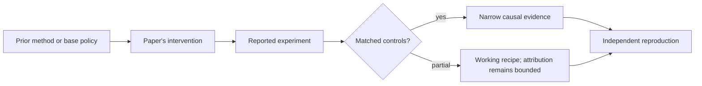

# R17. ProRL: does prolonged RL expand the reasoning boundary?

| Field | Value |
| --- | --- |
| First publication | 2025 |
| Status checked 2026-08-12 | arXiv research paper; weights released |
| Prerequisite | DeepSeek-R1 and Dr. GRPO lessons |
| Repository evidence | `reported` paper claims plus a `specified-not-executed` practical |

## Why this belongs in the course

A central dispute is whether RL teaches new reasoning strategies or only makes already-likely correct samples more common. ProRL attacks that question with longer training and pass@k comparisons against extensive base-model sampling.

## The simplest accurate answer

If the trained model solves problems that the base model still misses after many attempts, the result is harder to explain as merely choosing a previously common answer. It is evidence of an expanded sampled solution region, subject to finite-search limits.

## A useful mental model

Searching a library longer can reveal a book that was always present; learning can also write a new route into the catalog. Finite base-model sampling cannot prove a route was absent, but matched large-k curves give stronger evidence than pass@1 alone.

## What changed

ProRL combines prolonged online RL, KL control, reference-policy resetting, and diverse tasks. It evaluates both pass@1 and pass@k, including tasks where extensive base sampling fails. Reference resetting changes which policy anchors the KL constraint over a long run. Diverse tasks aim to avoid narrow collapse and keep the reward frontier active.

## What the paper reports

The paper reports that its RL models outperform base models across pass@k evaluations and solve some tested problems not reached by large base-model sample sets. It reports relationships among base competence, duration, and gains and releases model weights.

This is a `reported` result. Read the paper's exact tables, model identities, prompts, token budgets, sampling counts, and exclusions before quoting a number.

## What it does not prove

Finite pass@k cannot prove mathematical absence from the base distribution. Training data or verifier leakage can create apparent novelty. The result does not settle whether all RL gains across models are capability expansion rather than distribution sharpening.

## Reproduce the idea at the smallest useful scale

Plot hypothetical pass@k curves for base and candidate at k=1, 8, 64, and 1024. Define three patterns: pure pass@1 sharpening, persistent candidate frontier, and uncertain crossing. State the sample and token matching needed for each inference.

Write an experiment record before running. Keep the base checkpoint, evaluation set, decoding, and compute accounting fixed. A CPU toy result stays `simulated`; a real run becomes `measured` only with the environment and raw artifacts required by the [evidence contract](../reference/evidence.md).

## Check your understanding

What claim remains justified if the base model eventually matches the RL model at very large k but costs 100 times more samples?

## Primary source

- [Paper or official publication page](https://arxiv.org/abs/2505.24864)
- [Official code or artifacts](https://huggingface.co/nvidia/Nemotron-Research-Reasoning-Qwen-1.5B)

## Snapshot boundary

This lesson was selected and status-checked on 2026-08-12. “Latest” means current to that date, not permanently current. Later revisions, replications, or retractions must update the canonical research record and regenerate this page.
