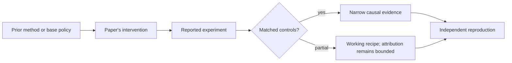

# R18. Breaking Barriers: RL gains often fail to cross domains

| Field | Value |
| --- | --- |
| First publication | 2026 conference publication; first posted 2025 |
| Status checked 2026-08-12 | ICLR 2026 conference paper |
| Prerequisite | Spine 05, 07, and 20 |
| Repository evidence | `reported` paper claims plus a `specified-not-executed` practical |

## Why this belongs in the course

This is an important negative result. Post-training can produce large gains near its training domain while improvements shrink or disappear on domains that require different reasoning patterns.

## The simplest accurate answer

Training on one kind of puzzle can teach a model to recognize that puzzle's structure without teaching a general problem-solving method. You need evaluations that cross the boundary you claim the model learned to cross.

## A useful mental model

A student drilled on algebra may improve on new algebra worksheets but not geometry. That is not failure if algebra was the task; it is failure only if the claim was general mathematical reasoning.

## What changed

The paper uses two forms of evidence. Its observational study compares multiple open-weight reinforcement-post-trained models with their corresponding base models across seen and unseen domains. Its interventional study trains on individual domains and evaluates across multiple domains. Agreement between these approaches strengthens the distribution-specific interpretation, though neither covers every model or domain.

## What the paper reports

The ICLR 2026 paper reports substantial gains on tasks similar to training data and inconsistent transfer, including gains that vanish on domains with different reasoning patterns.

This is a `reported` result. Read the paper's exact tables, model identities, prompts, token budgets, sampling counts, and exclusions before quoting a number.

## What it does not prove

The paper does not show that RL never generalizes, that in-domain specialization lacks value, or that its chosen domain taxonomy captures every transferable skill. Negative transfer evidence must still be tied to exact datasets and models.

## Reproduce the idea at the smallest useful scale

Build a train-by-test matrix with at least four problem families. Freeze family-level splits before training. Report both diagonal in-domain gains and off-diagonal transfer, plus a general-capability suite. Refuse to publish one blended average that hides the matrix.

Write an experiment record before running. Keep the base checkpoint, evaluation set, decoding, and compute accounting fixed. A CPU toy result stays `simulated`; a real run becomes `measured` only with the environment and raw artifacts required by the [evidence contract](../reference/evidence.md).

## Check your understanding

What is the narrowest honest capability claim supported by an in-domain gain with zero off-domain transfer?

## Primary source

- [Paper or official publication page](https://openreview.net/forum?id=mvLhN0veUd)
- No code link is claimed by this lesson; inspect the paper for current artifacts.

## Snapshot boundary

This lesson was selected and status-checked on 2026-08-12. “Latest” means current to that date, not permanently current. Later revisions, replications, or retractions must update the canonical research record and regenerate this page.
