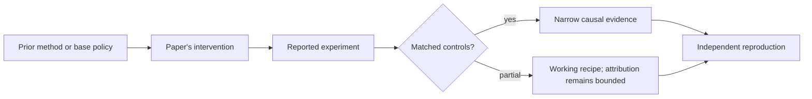

# R19. Easy-to-hard curriculum RL: keep the policy in a learnable zone

| Field | Value |
| --- | --- |
| First publication | 2026 conference publication; first posted 2025 |
| Status checked 2026-08-12 | ICLR 2026 conference paper |
| Prerequisite | DAPO dynamic sampling and cross-domain lessons |
| Repository evidence | `reported` paper claims plus a `specified-not-executed` practical |

## Why this belongs in the course

Sparse rewards on hard tasks can give nearly every rollout a zero, leaving no contrast for policy gradients. Easy-to-hard curriculum learning changes the prompt distribution so the policy first receives informative successes, then shifts toward the target difficulty.

## The simplest accurate answer

Practice where success is possible, then increase difficulty. Remove easy drills after they have served their purpose, or the model spends its budget repeating mastered behavior.

## A useful mental model

A climbing wall needs reachable holds before the final overhang. But a curriculum can teach shortcuts specific to the easy stages, and a human difficulty label may not match the current policy's difficulty.

## What changed

E2H Reasoner partitions or schedules task distributions from easier to harder and fades easy tasks during training. The paper frames the process using approximate policy iteration and provides sample-complexity analysis under its assumptions. Empirically it studies small language models across multiple reasoning domains. The curriculum changes data selection; the underlying reward and policy optimizer must still be specified.

## What the paper reports

The ICLR 2026 paper reports better reasoning performance than direct hard-task RL for tested 1.5B-to-3B models and finds that fading easy tasks helps prevent overfitting. It reports theoretical guarantees for its formalized setting, not arbitrary neural training.

This is a `reported` result. Read the paper's exact tables, model identities, prompts, token budgets, sampling counts, and exclusions before quoting a number.

## What it does not prove

Difficulty is policy-dependent and changes during training. A static bucket can become stale. Easy-to-hard gains do not prove cross-domain transfer, and theoretical assumptions may not hold for the full LLM system.

## Reproduce the idea at the smallest useful scale

Create four prompt buckets using baseline success probability, not topic labels. At each evaluation checkpoint compute reward variance and mastery. Write a promotion rule that advances difficulty and a retirement rule that removes mastered easy prompts.

Write an experiment record before running. Keep the base checkpoint, evaluation set, decoding, and compute accounting fixed. A CPU toy result stays `simulated`; a real run becomes `measured` only with the environment and raw artifacts required by the [evidence contract](../reference/evidence.md).

## Check your understanding

Why is baseline error rate a more operational difficulty signal than a human label, and when can it still mislead?

## Primary source

- [Paper or official publication page](https://openreview.net/forum?id=KJvHnl3kUv)
- [Official code or artifacts](https://github.com/divelab/E2H-Reasoning)

## Snapshot boundary

This lesson was selected and status-checked on 2026-08-12. “Latest” means current to that date, not permanently current. Later revisions, replications, or retractions must update the canonical research record and regenerate this page.
