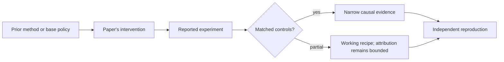

# R20. Scalable Power Sampling: test distribution sharpening before training

| Field | Value |
| --- | --- |
| First publication | 2026 |
| Status checked 2026-08-12 | ICML 2026 conference paper |
| Prerequisite | ProRL lesson and Spine 01 |
| Repository evidence | `reported` paper claims plus a `specified-not-executed` practical |

## Why this belongs in the course

This paper represents the strongest counterargument to broad claims that RL creates new reasoning. It asks whether sharpening the base model's existing distribution at inference time can recover similar gains without training or external rewards.

## The simplest accurate answer

Before paying to update weights, test whether a better sampling rule can make high-quality paths that already exist become easier to draw. If it can, the product gain may be real while the capability-acquisition story is too strong.

## A useful mental model

A weighted die can be sharpened so its already-likely faces occur more often; no new face is created. Language sequences are harder because token choices affect future paths, so local temperature alone is not identical to a global sequence power distribution.

## What changed

The work starts from a power distribution over complete sequences and derives an autoregressive approximation using scaled low-temperature sampling plus a factor representing future trajectory quality. It positions the method against expensive MCMC approaches and one-shot GRPO comparisons. Because it is training-free and verifier-free, it provides a useful control for separating policy-distribution changes from newly learned task information.

## What the paper reports

The ICML 2026 paper reports matching or surpassing one-shot GRPO on tested math, QA, and code tasks across four models, with much lower latency than MCMC-based power sampling.

This is a `reported` result. Read the paper's exact tables, model identities, prompts, token budgets, sampling counts, and exclusions before quoting a number.

## What it does not prove

Matching one-shot GRPO does not match prolonged RL, all model scales, or all domains. A sampling algorithm can spend more inference compute or use approximations that change latency and quality. The result does not show RL is useless.

## Reproduce the idea at the smallest useful scale

For one base model, compare greedy, temperature sweep, best-of-N with a verifier, power sampling, and an RL checkpoint under equal total generated tokens and wall-clock reporting. Plot pass@1 and pass@k. Do not tune sampling on the test set.

Write an experiment record before running. Keep the base checkpoint, evaluation set, decoding, and compute accounting fixed. A CPU toy result stays `simulated`; a real run becomes `measured` only with the environment and raw artifacts required by the [evidence contract](../reference/evidence.md).

## Check your understanding

If training-free sharpening matches RL at pass@1 but RL retains a pass@k frontier, what different product and scientific conclusions follow?

## Primary source

- [Paper or official publication page](https://openreview.net/forum?id=SVyjXhZlDe)
- No code link is claimed by this lesson; inspect the paper for current artifacts.

## Snapshot boundary

This lesson was selected and status-checked on 2026-08-12. “Latest” means current to that date, not permanently current. Later revisions, replications, or retractions must update the canonical research record and regenerate this page.
