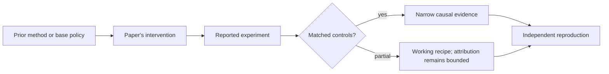

# R21. Re²: teach the policy to abandon a bad reasoning path

| Field | Value |
| --- | --- |
| First publication | 2026-03-07 |
| Status checked 2026-08-12 | arXiv preprint; frontier snapshot |
| Prerequisite | DeepSeek-R1 and ProRL lessons |
| Repository evidence | `reported` paper claims plus a `specified-not-executed` practical |

## Why this belongs in the course

Longer reasoning is not useful when the initial direction is wrong and the model keeps elaborating it. Re² studies a different behavior: explicitly restart the solution rather than always extend the current chain.

## The simplest accurate answer

When a path is clearly unproductive, begin again from the problem instead of spending every remaining token defending the first idea. The policy must learn both when to restart and how to use the fresh attempt.

## A useful mental model

A maze solver can backtrack to the entrance rather than continue down a dead end. Natural-language reasoning has no perfect dead-end detector, so unnecessary restarts can waste compute or discard a nearly complete solution.

## What changed

The paper defines reinforcement learning with re-solving, giving the policy an opportunity or structure to abandon a prior chain and produce a new solution. It uses verifiable rewards and studies changes in redo behavior, solution direction, training-compute-matched performance, and test-time sampling. Inspect the exact prompt and trajectory construction before treating restart as an environment action.

## What the paper reports

The March 2026 preprint reports increasing rare redo behavior from about 0.5 percent to above 30 percent and performance gains over its standard RLVR comparison under the paper's training-compute budget.

This is a `reported` result. Read the paper's exact tables, model identities, prompts, token budgets, sampling counts, and exclusions before quoting a number.

## What it does not prove

This is a preprint, not an independently reproduced result here. More restart tokens can alter effective test-time compute. A behavior-frequency change does not by itself prove improved reasoning quality or generalization.

## Reproduce the idea at the smallest useful scale

Design a toy search task where the first branch is sometimes poisoned. Compare commit-only, backtracking, and full restart policies under the same action budget. Record success, wasted steps, false restarts, and success conditional on initial branch quality.

Write an experiment record before running. Keep the base checkpoint, evaluation set, decoding, and compute accounting fixed. A CPU toy result stays `simulated`; a real run becomes `measured` only with the environment and raw artifacts required by the [evidence contract](../reference/evidence.md).

## Check your understanding

What matched-budget measurement distinguishes useful re-solving from simply buying a second independent sample?

## Primary source

- [Paper or official publication page](https://arxiv.org/abs/2603.07197)
- No code link is claimed by this lesson; inspect the paper for current artifacts.

## Snapshot boundary

This lesson was selected and status-checked on 2026-08-12. “Latest” means current to that date, not permanently current. Later revisions, replications, or retractions must update the canonical research record and regenerate this page.
