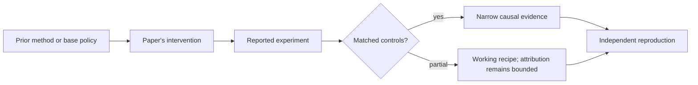

# R22. Agent² RL-Bench: can agents engineer their own post-training loop?

| Field | Value |
| --- | --- |
| First publication | 2026-04-12 |
| Status checked 2026-08-12 | arXiv preprint and Microsoft Research publication page; frontier snapshot |
| Prerequisite | Spine 18 through 21 |
| Repository evidence | `reported` paper claims plus a `specified-not-executed` practical |

## Why this belongs in the course

This work moves the object of evaluation up one level. The policy being judged is an engineering agent that must design, implement, and run a post-training pipeline—not merely the model produced by one fixed trainer.

## The simplest accurate answer

Give an agent a bounded workspace, training task, grading API, and budget. Score both the improved model and the process used to reach it. Static code generation is easier than closing the loop over real training results.

## A useful mental model

It resembles a lab practical where a student must run the experiment, diagnose failures, and revise the method. The driver model, scaffold, tools, and budget are part of the experimental subject.

## What changed

The benchmark defines six tasks across three levels, from static rule-based construction to online RL with trajectory collection. Isolated workspaces, submission instrumentation, code revisions, and post-hoc reports make the process auditable. It evaluates multiple agent systems and driver models and separates gains from SFT warm-up and online RL where possible.

## What the paper reports

The April 2026 paper reports large interactive gains on some tasks and marginal gains within evaluation noise on others. It reports strong driver-model effects and finds that supervised pipelines dominate under fixed budgets in much of the benchmark, with online RL the final best route only in a subset.

This is a `reported` result. Read the paper's exact tables, model identities, prompts, token budgets, sampling counts, and exclusions before quoting a number.

## What it does not prove

This is a benchmark result, not proof that autonomous agents can safely operate unrestricted training infrastructure. Task graders can be gamed, and scaffold or driver changes confound broad claims about 'the agent.'

## Reproduce the idea at the smallest useful scale

Design a levelled benchmark for this repository: level 1 selects an algorithm from a manifest, level 2 fixes a broken toy reward loop, level 3 iterates against held-out results. Log every patch, command, artifact digest, budget, and grader response.

Write an experiment record before running. Keep the base checkpoint, evaluation set, decoding, and compute accounting fixed. A CPU toy result stays `simulated`; a real run becomes `measured` only with the environment and raw artifacts required by the [evidence contract](../reference/evidence.md).

## Check your understanding

Why must an agentic post-training benchmark score the engineering trajectory and environment integrity, not only the final model metric?

## Primary source

- [Paper or official publication page](https://arxiv.org/abs/2604.10547)
- [Official code or artifacts](https://github.com/microsoft/RD-Agent/tree/main/rdagent/scenarios/rl/autorl_bench)

## Snapshot boundary

This lesson was selected and status-checked on 2026-08-12. “Latest” means current to that date, not permanently current. Later revisions, replications, or retractions must update the canonical research record and regenerate this page.
