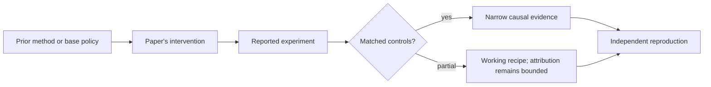

# R23. RL with Verifiable Physics: replace binary reward with graded reality

| Field | Value |
| --- | --- |
| First publication | 2026-07-11 |
| Status checked 2026-08-12 | arXiv preprint; latest dated frontier lesson in this snapshot |
| Prerequisite | Spine 16 and the process-supervision lesson |
| Repository evidence | `reported` paper claims plus a `specified-not-executed` practical |

## Why this belongs in the course

Many RLVR tasks reduce reward to pass or fail. Scientific and engineering tasks often contain richer error structure: two programs can execute while one is orders of magnitude more accurate. This July 2026 paper studies hybrid executable and continuous physics rewards for PDE solver generation.

## The simplest accurate answer

First reject programs that do not run. Among programs that run, score how closely the numerical solution satisfies the target physics. The policy receives more information than a single compiler bit.

## A useful mental model

A bridge inspection first checks that the bridge exists, then measures deflection and stress rather than labeling every standing bridge equally correct. The simulator and discretization still approximate reality and can contain exploitable blind spots.

## What changed

RLVP combines hard program-validity checks with continuous rewards based on function-space accuracy and PDE-residual consistency. A single policy is trained across multiple partial-differential-equation families, and evaluation includes held-out PDEs. The reward therefore encodes both software execution and domain equations. Exact environment versions, numerical tolerances, grids, and resource limits become part of the reward contract.

## What the paper reports

The July 2026 preprint reports improvements over pretrained and supervised-only baselines on its PDE benchmarks, transfer to held-out PDEs, and compositional reuse of numerical motifs. These are reported frontier findings awaiting independent reproduction here.

This is a `reported` result. Read the paper's exact tables, model identities, prompts, token budgets, sampling counts, and exclusions before quoting a number.

## What it does not prove

A low residual on sampled points does not guarantee stability, convergence, physical validity under all conditions, or production solver quality. Continuous rewards can be scaled poorly, dominated by easy terms, or exploited between evaluation points.

## Reproduce the idea at the smallest useful scale

Build a tiny reward for approximating dy/dx=y with a generated Euler step: syntax validity, finite output, residual error, and held-out initial condition. Vary reward scaling and show how a large syntax bonus can drown out accuracy improvements.

Write an experiment record before running. Keep the base checkpoint, evaluation set, decoding, and compute accounting fixed. A CPU toy result stays `simulated`; a real run becomes `measured` only with the environment and raw artifacts required by the [evidence contract](../reference/evidence.md).

## Check your understanding

What independent numerical test would catch a policy that optimizes residual samples while producing an unstable solver between them?

## Primary source

- [Paper or official publication page](https://arxiv.org/abs/2607.10474)
- No code link is claimed by this lesson; inspect the paper for current artifacts.

## Snapshot boundary

This lesson was selected and status-checked on 2026-08-12. “Latest” means current to that date, not permanently current. Later revisions, replications, or retractions must update the canonical research record and regenerate this page.
