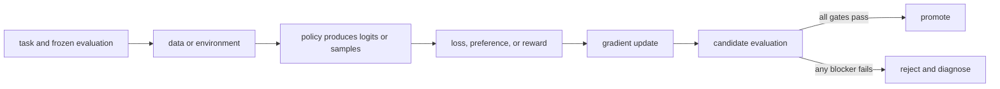

# 00. Map the post-training stack

**Question:** What are we changing, and why does a pretrained model need another training stack?

**Evidence in this chapter:** stable concepts are explained from cited primary sources. All `pt101` outputs are deterministic `simulated` teaching evidence, not measurements of an LLM.

## The simplest accurate answer

Pretraining teaches a model broad statistical patterns by predicting tokens. Post-training deliberately changes its behavior for a narrower purpose: follow instructions, prefer better answers, solve verifiable tasks, use tools, or satisfy a product contract. Model optimization is the larger loop that chooses data, objective, algorithm, system, and promotion rule—not just the optimizer in code.

## A useful mental model

A pretrained model is like a broadly educated apprentice. Post-training is the apprenticeship for a particular job. A curriculum supplies demonstrations, a reviewer supplies preferences, a scorecard supplies rewards, and exams decide whether the apprentice may serve customers. The analogy stops at agency: a model is a parameterized function, not a person with intent.

## How it works

Every method in this course fits one loop: define behavior; collect task-shaped data; compute a scalar training signal; update parameters; evaluate on held-out tasks; reject or promote the candidate. SFT gets the signal from demonstrated tokens. Preference methods get it from chosen-versus-rejected responses. Online RL gets it from sampled actions and rewards. The production system must preserve dataset, model, code, and evaluator identities so a result is reproducible.

## Work one example

Suppose the prompt is `2 + 3 =`. A base model assigns probabilities to many continuations. SFT raises the probability of a demonstrated `5`. DPO raises the relative probability of `5` over a rejected `6`. RL can sample answers and use an exact checker that returns 1 for `5` and 0 otherwise. These are different paths to a training signal, not interchangeable names for the same algorithm.

## Do it yourself

Run `pt101 pipeline --output build/pipeline.json`. Follow one number from base logits through SFT, reward modeling, DPO, PPO, GRPO, evaluation, and the promotion gate. Label every result `simulated`.

Record the input, configuration, output, evidence label, and one sentence stating what the output **does not** prove. If you change two variables, split the work into two experiments.

## Check your understanding

Can you name the five objects that must exist before an optimizer step is meaningful: task, data or environment, policy, objective or reward, and evaluator?

## Common failure

Do not start with a fashionable trainer. If the evaluation cannot distinguish a better model from a worse one, faster training only produces an untrustworthy candidate sooner.

## Sources

- [Training language models to follow instructions with human feedback](https://arxiv.org/abs/2203.02155)
- [Hugging Face TRL documentation](https://huggingface.co/docs/trl/main/index)

## Course position

- Prerequisite: None. Start here.
- Next: [Chapter 01](../spine/01-numbers-probability-and-sampling.md)
