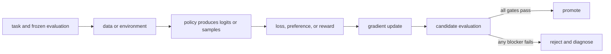

# 01. Numbers, probability, and sampling

**Question:** How does a model turn scores into a choice?

**Evidence in this chapter:** stable concepts are explained from cited primary sources. All `pt101` outputs are deterministic `simulated` teaching evidence, not measurements of an LLM.

## The simplest accurate answer

A model emits logits: unrestricted scores, one per possible token or action. Softmax converts them into non-negative probabilities that sum to one. Training changes logits; sampling turns probabilities into actual outputs. You need this boundary because losses usually operate on log-probabilities while users observe sampled text.

## A useful mental model

Think of logits as adjustable heights and softmax as water flowing downhill into probability buckets. Raising one height changes every bucket after normalization. This analogy explains competition among actions, but temperature and truncation are explicit mathematical transforms, not physical heat or cutting a bucket.

## How it works

For logits z, softmax gives p_i = exp(z_i) / sum_j exp(z_j). Subtracting the maximum logit before exponentiating gives the same probabilities and avoids overflow. A categorical sample chooses action i with probability p_i. Temperature divides logits before softmax; lower temperature sharpens the distribution. Top-k and top-p remove candidates and renormalize, which changes the behavior policy that generated RL data.

## Work one example

With logits [0, 0], two actions each have probability 0.5. After one toy SFT step the logits become approximately [-0.2, 0.2], so the demonstrated action becomes more likely. Nothing deterministic happened: the policy distribution moved. Greedy decoding would hide this distinction by always selecting the larger logit.

## Do it yourself

Run `pt101 sft`. Recompute the two probabilities by hand using a calculator. Then add the same constant to both logits and prove the probabilities do not change.

Record the input, configuration, output, evidence label, and one sentence stating what the output **does not** prove. If you change two variables, split the work into two experiments.

## Check your understanding

Why is a generated completion evidence about a sample, but not a complete description of the policy?

## Common failure

Never compare token probabilities from different tokenizers or prompt templates as if their event spaces were identical.

## Sources

- [PyTorch automatic differentiation](https://docs.pytorch.org/docs/stable/autograd.html)

## Course position

- Prerequisite: [Chapter 00](../spine/00-map-the-stack.md)
- Next: [Chapter 02](../spine/02-vectors-matrices-and-neural-networks.md)
