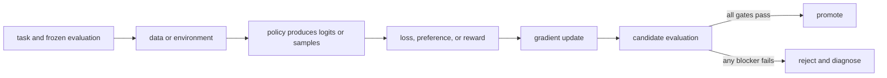

# 02. Vectors, matrices, and neural networks

**Question:** What are the objects inside a model before they become probabilities?

**Evidence in this chapter:** stable concepts are explained from cited primary sources. All `pt101` outputs are deterministic `simulated` teaching evidence, not measurements of an LLM.

## The simplest accurate answer

A scalar is one number, a vector is an ordered list of numbers, and a matrix is a rectangular grid of numbers. A tensor generalizes these objects to more axes. Neural networks repeatedly multiply tensors, add learned offsets, and apply simple nonlinear functions. The numbers being learned are the parameters.

## A useful mental model

A spreadsheet is a useful picture of a matrix: rows and columns organize numbers, and a formula can combine them. Matrix multiplication is not ordinary cell-by-cell multiplication; each output cell is a dot product that measures how one row combines with one column.

## How it works

For vector x and matrix W, a linear layer computes y = W*x + b. Each element of y is a weighted sum of x. A nonlinear activation between linear layers prevents the whole stack from collapsing into one linear transformation. An embedding table maps a discrete token ID to a learned vector. A transformer then mixes token vectors through attention and feed-forward layers. Shape notation matters: batch, sequence, hidden dimension, vocabulary, and attention heads name axes with different meanings.

## Work one example

Let x=[2,3] and one output row of W be [0.5,-1]. Their dot product is 0.5*2 + (-1)*3 = -2. Add bias 0.25 and the output is -1.75. A second row produces a second output number. Millions or billions of parameters repeat this same kind of arithmetic at larger shapes.

## Do it yourself

Compute a two-by-two matrix times a two-element vector by hand. Write the shape of every input and output. Then count the parameters in a linear layer with 4 inputs, 3 outputs, and one bias per output.

Record the input, configuration, output, evidence label, and one sentence stating what the output **does not** prove. If you change two variables, split the work into two experiments.

## Check your understanding

Why does changing one matrix row affect one output feature directly, while changing one input element can affect every output feature?

## Common failure

Do not treat tensor shape errors as mere syntax problems. A transposed or broadcast axis can silently optimize a different computation when dimensions happen to fit.

## Sources

- [Attention Is All You Need](https://arxiv.org/abs/1706.03762)
- [PyTorch automatic differentiation](https://docs.pytorch.org/docs/stable/autograd.html)

## Course position

- Prerequisite: [Chapter 01](../spine/01-numbers-probability-and-sampling.md)
- Next: [Chapter 03](../spine/03-parameters-forward-loss-gradient.md)
