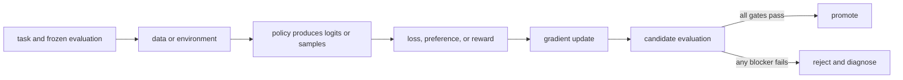

# 03. Parameters, forward passes, losses, and gradients

**Question:** What physically changes when a model learns?

**Evidence in this chapter:** stable concepts are explained from cited primary sources. All `pt101` outputs are deterministic `simulated` teaching evidence, not measurements of an LLM.

## The simplest accurate answer

Parameters are stored numbers used by the forward pass. The forward pass maps inputs to logits. A loss maps predictions and targets to one scalar where lower means better for the declared objective. A gradient says how a tiny change in each parameter would change that loss. An optimizer uses gradients to propose a parameter update.

## A useful mental model

Walking downhill is useful: the loss is altitude, a gradient points uphill, and subtracting it takes a downhill step. But real neural losses are high-dimensional, noisy, and can have flat or sharp regions; there is no guarantee that each stochastic step improves held-out behavior.

## How it works

For parameter w and loss L, gradient descent applies w <- w - learning_rate * dL/dw. Backpropagation efficiently applies the chain rule from the scalar loss back through every differentiable operation. A batch averages or sums examples before the update. Optimizers such as Adam maintain moving statistics, but they still need a correctly constructed loss and gradients. Zeroing gradients, choosing precision, clipping norms, and scheduling the learning rate are system decisions with behavioral consequences.

## Work one example

If a one-parameter model predicts y_hat = w*x and squared loss is (y_hat-y)^2, then dL/dw = 2(w*x-y)x. At x=2, y=6, w=1, the gradient is -16. With learning rate 0.1, w becomes 2.6 and the prediction moves from 2 toward 6.

## Do it yourself

Work the one-parameter example for three steps. Change the learning rate to 1.0 and observe overshoot. Record parameters, loss, gradient, and update separately.

Record the input, configuration, output, evidence label, and one sentence stating what the output **does not** prove. If you change two variables, split the work into two experiments.

## Check your understanding

Can you explain why a loss decreasing on the training batch does not prove the model improved on new tasks?

## Common failure

A gradient is local sensitivity, not a causal explanation of model behavior and not a guarantee of generalization.

## Sources

- [PyTorch automatic differentiation](https://docs.pytorch.org/docs/stable/autograd.html)

## Course position

- Prerequisite: [Chapter 02](../spine/02-vectors-matrices-and-neural-networks.md)
- Next: [Chapter 04](../spine/04-language-model-from-tokens-to-loss.md)
