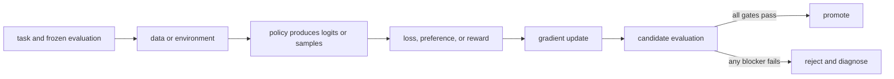

# 04. A language model from tokens to loss

**Question:** Where do post-training losses attach to a transformer?

**Evidence in this chapter:** stable concepts are explained from cited primary sources. All `pt101` outputs are deterministic `simulated` teaching evidence, not measurements of an LLM.

## The simplest accurate answer

A tokenizer maps text to token IDs. The model maps a prefix of IDs to logits for the next token. Repeating that step produces a completion. During teacher-forced training, the model sees known preceding tokens and cross-entropy penalizes low probability on each target token. Instruction tuning usually masks prompt tokens so the loss is charged only on the desired response.

## A useful mental model

Autocomplete is the right starting analogy: at every position the model predicts the next piece. The analogy breaks because a transformer shares parameters across positions, attends to a bounded context, and operates on tokenizer pieces rather than human words.

## How it works

For a response with tokens y_1...y_T, the negative log-likelihood is -sum_t log pi(y_t | prompt, y_<t). Sequence log-probability is therefore a sum of token log-probabilities. Length normalization, end-of-sequence handling, chat templates, padding masks, and truncation can silently change what an objective optimizes. Preference and RL methods often reuse these same sequence log-probabilities inside a different outer loss.

## Work one example

For target-token probabilities [0.5, 0.25], the summed negative log-likelihood is -log(0.5)-log(0.25), about 2.08. A four-token response can accumulate a more negative log-probability than a two-token response even when its per-token predictions are equally good, so raw sequence scores carry a length effect.

## Do it yourself

Write down the exact tokens whose loss is active for one chat record containing system, user, and assistant messages. State what happens if the final response is truncated.

Record the input, configuration, output, evidence label, and one sentence stating what the output **does not** prove. If you change two variables, split the work into two experiments.

## Check your understanding

Why must the tokenizer and chat template be versioned as part of a training run?

## Common failure

Do not call perplexity a complete instruction-following metric; it measures predictive fit to a token distribution.

## Sources

- [Attention Is All You Need](https://arxiv.org/abs/1706.03762)
- [Training language models to follow instructions with human feedback](https://arxiv.org/abs/2203.02155)

## Course position

- Prerequisite: [Chapter 03](../spine/03-parameters-forward-loss-gradient.md)
- Next: [Chapter 05](../spine/05-objectives-and-experiments.md)
