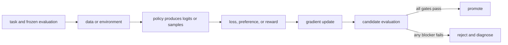

# 05. Objectives, baselines, and experiments

**Question:** How do we know an update caused a useful improvement?

**Evidence in this chapter:** stable concepts are explained from cited primary sources. All `pt101` outputs are deterministic `simulated` teaching evidence, not measurements of an LLM.

## The simplest accurate answer

An objective is what training directly optimizes. An evaluator is what you use to judge the resulting model. They may overlap, but keeping them separate is essential: optimizing a proxy can improve the proxy while harming the real task. A baseline and a controlled comparison turn an anecdote into an experiment.

## A useful mental model

A speedometer is a proxy for safe driving. Maximizing its number would be absurd because the goal is not the instrument. Training rewards and automated judges are also instruments. They are valuable only while their relationship to the real behavior remains tested.

## How it works

Freeze the task set before looking at candidate results. Split train, development, and test data by leakage units such as user, source document, problem family, or time—not merely by random rows. Compare a candidate with the exact baseline under the same decoding and evaluator settings. Report central tendency, tails, uncertainty, regressions, cost, and the number of independent seeds when training variance matters.

## Work one example

If pass rate rises from 60/100 to 66/100, the observed lift is six percentage points. That does not prove the true lift is exactly six points. Inspect which six changed, whether any prior passes regressed, whether the items leaked into training, and whether the evaluator would accept subtly wrong answers.

## Do it yourself

Create a one-page experiment card with hypothesis, single changed variable, frozen test set, primary metric, three guardrails, seed plan, stop condition, and promotion rule.

Record the input, configuration, output, evidence label, and one sentence stating what the output **does not** prove. If you change two variables, split the work into two experiments.

## Check your understanding

What observation would falsify your claim that the training method—not a prompt-template change—caused the lift?

## Common failure

Changing data, template, decoding, and algorithm in one run produces a candidate but not an attribution.

## Sources

- [Training language models to follow instructions with human feedback](https://arxiv.org/abs/2203.02155)

## Course position

- Prerequisite: [Chapter 04](../spine/04-language-model-from-tokens-to-loss.md)
- Next: [Chapter 06](../spine/06-data-pipeline.md)
