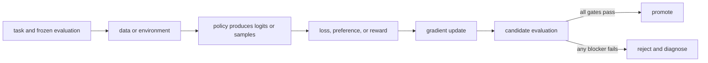

# 06. Build the data pipeline

**Question:** How do raw interactions become trustworthy training records?

**Evidence in this chapter:** stable concepts are explained from cited primary sources. All `pt101` outputs are deterministic `simulated` teaching evidence, not measurements of an LLM.

## The simplest accurate answer

Post-training data is a product specification written in examples. A useful pipeline defines a schema, validates it, removes or controls duplicates, records provenance and consent, transforms records deterministically, and freezes immutable train and evaluation snapshots.

## A useful mental model

Ingredients determine what a cook can make. Cleaning labels on jars matters, but it cannot turn a biased ingredient set into a balanced meal. Likewise, schema validation prevents malformed records; it does not prove coverage, correctness, or representativeness.

## How it works

Common record shapes are prompt-response demonstrations, prompt-chosen-rejected preference pairs, and prompt-completion-reward trajectories. Preserve raw source IDs, transformation code version, tokenizer/template identity, filtering reason, annotator or judge policy, and dataset digest. Deduplicate before splitting so near-identical examples do not cross the evaluation boundary. Treat model-generated synthetic data as generated evidence and audit error amplification.

## Work one example

A preference record should not be only two strings. It needs the shared prompt, chosen response, rejected response, rubric or collection protocol, source identity, and flags for ties or invalid comparisons. Otherwise downstream code cannot distinguish a genuine preference from formatting noise.

## Do it yourself

Design JSON schemas for demonstration, preference, and trajectory records. List five rejection cases and create a dataset card that states known coverage gaps.

Record the input, configuration, output, evidence label, and one sentence stating what the output **does not** prove. If you change two variables, split the work into two experiments.

## Check your understanding

Can you trace one final token back to its raw record, transform, template, and license or consent boundary?

## Common failure

Do not randomly split after generating many variants of the same seed prompt; that leaks problem identity.

## Sources

- [TRL dataset formats](https://huggingface.co/docs/trl/main/dataset_formats)
- [Datasheets for Datasets](https://arxiv.org/abs/1803.09010)

## Course position

- Prerequisite: [Chapter 05](../spine/05-objectives-and-experiments.md)
- Next: [Chapter 07](../spine/07-evaluation-harness.md)
