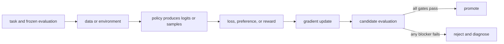

# 07. Build the evaluation harness first

**Question:** What must be measured before any training run?

**Evidence in this chapter:** stable concepts are explained from cited primary sources. All `pt101` outputs are deterministic `simulated` teaching evidence, not measurements of an LLM.

## The simplest accurate answer

A baseline evaluation establishes whether the task, runner, and scoring rule work before model weights change. The harness must pin prompts, decoding, environment, judge, retries, and aggregation. It should store per-example artifacts so a score can be audited.

## A useful mental model

A before-and-after photograph only helps if the camera, lighting, angle, and subject are controlled. In model evaluation, prompt formatting, sampling temperature, tool availability, and judge version are the camera settings.

## How it works

Use exact or executable checkers when the task supports them. Use human or model judges for open-ended properties, but calibrate them against adjudicated examples, randomize answer order, measure position bias, and keep judge prompts versioned. Track task success as the primary metric, then safety, regressions, latency, token cost, and format validity as guardrails. Aggregate scores never replace per-slice analysis.

## Work one example

If a code agent passes 8/10 tasks but modifies forbidden files on two passing tasks, raw pass rate hides a contract violation. A correct harness makes workspace integrity a guardrail and denies promotion.

## Do it yourself

Run the untrained toy pipeline and inspect `evaluation` and `promotion`. Add a hypothetical safety regression even while quality rises; make the gate fail.

Record the input, configuration, output, evidence label, and one sentence stating what the output **does not** prove. If you change two variables, split the work into two experiments.

## Check your understanding

Could a candidate learn the evaluator's surface pattern without learning the intended behavior? Name one adversarial test.

## Common failure

Do not train directly against a held-out judge set and still call it held out.

## Sources

- [Holistic Evaluation of Language Models](https://arxiv.org/abs/2211.09110)
- [Training language models to follow instructions with human feedback](https://arxiv.org/abs/2203.02155)

## Course position

- Prerequisite: [Chapter 06](../spine/06-data-pipeline.md)
- Next: [Chapter 08](../spine/08-supervised-fine-tuning.md)
