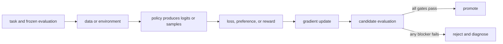

# 08. Supervised fine-tuning

**Question:** How does imitation turn examples into a usable instruction model?

**Evidence in this chapter:** stable concepts are explained from cited primary sources. All `pt101` outputs are deterministic `simulated` teaching evidence, not measurements of an LLM.

## The simplest accurate answer

Supervised fine-tuning (SFT) continues next-token training on curated demonstrations. It teaches the response distribution directly: given this prompt and previous response tokens, raise the probability of the demonstrated next token. SFT is usually the simplest strong baseline and often establishes formats and skills needed before preference optimization or online RL.

## A useful mental model

SFT is copying worked solutions with feedback from an answer key. It efficiently transfers demonstrated patterns. It cannot learn a better response than the demonstrations merely because the loss ran longer.

## How it works

Format each record with the production chat template, mask non-response tokens according to the declared objective, pack examples only when boundaries and attention masks remain correct, and monitor token-level loss. Choose learning rate, effective batch size, epochs or steps, sequence length, precision, and checkpoint cadence. Evaluate during training but make promotion decisions on a frozen test set. More epochs can memorize narrow data and erase general capabilities.

## Work one example

The toy SFT command starts with two equal logits. Cross-entropy's gradient is probability minus one-hot target, so the target logit rises and the other falls. A real model performs the same conceptual operation across vocabulary logits at every active response token.

## Do it yourself

Run `pt101 sft --output build/sft.json`. Derive the gradient by hand. Then plan a real SFT dry run with 32 records and a tiny open model, but label it `specified-not-executed` until artifacts exist.

Record the input, configuration, output, evidence label, and one sentence stating what the output **does not** prove. If you change two variables, split the work into two experiments.

## Check your understanding

What behavior can never be learned if no demonstration or transferable pattern gives the model evidence for it?

## Common failure

A falling SFT loss can mean memorization. Always compare held-out task behavior and general-capability regressions.

## Sources

- [Training language models to follow instructions with human feedback](https://arxiv.org/abs/2203.02155)
- [TRL SFT Trainer](https://huggingface.co/docs/trl/main/sft_trainer)

## Course position

- Prerequisite: [Chapter 07](../spine/07-evaluation-harness.md)
- Next: [Chapter 09](../spine/09-lora-and-memory.md)
