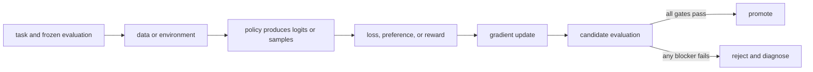

# 09. LoRA, adapters, and training memory

**Question:** How can we update a large model without training every weight?

**Evidence in this chapter:** stable concepts are explained from cited primary sources. All `pt101` outputs are deterministic `simulated` teaching evidence, not measurements of an LLM.

## The simplest accurate answer

Low-Rank Adaptation (LoRA) freezes a base weight matrix and learns a product of two smaller matrices as its update. It reduces trainable parameters and optimizer-state memory. It does not make activations, attention, data quality, or evaluation free.

## A useful mental model

Instead of rebuilding a large wall, LoRA bolts on a thin adjustable frame. The frame can redirect the structure's behavior with fewer new pieces, but the original wall still occupies space and the fit depends on where the frame attaches.

## How it works

For base matrix W, LoRA uses W' = W + scale * B*A where A and B have rank r much smaller than W's dimensions. Decide target modules, rank, scaling, dropout, and whether to train biases. QLoRA additionally stores the frozen base in a quantized representation while computing adapter updates at a suitable precision. Deployment may keep adapters separate or merge them, each with provenance and serving implications.

## Work one example

A 4096 by 4096 dense update has about 16.8 million entries. Two rank-8 factors have 4096*8 + 8*4096 = 65,536 entries, about 256 times fewer update entries. This derived parameter ratio is not a claim of 256 times faster end-to-end training.

## Do it yourself

Compute dense-versus-LoRA trainable entries for three layer sizes and ranks. Write a memory ledger containing weights, gradients, optimizer states, activations, temporary buffers, and allocator headroom.

Record the input, configuration, output, evidence label, and one sentence stating what the output **does not** prove. If you change two variables, split the work into two experiments.

## Check your understanding

Why can LoRA reduce optimizer memory substantially while leaving long-sequence activation memory as a blocker?

## Common failure

Do not translate trainable-parameter reduction directly into wall-clock speedup or quality equivalence.

## Sources

- [LoRA: Low-Rank Adaptation of Large Language Models](https://arxiv.org/abs/2106.09685)
- [QLoRA: Efficient Finetuning of Quantized LLMs](https://arxiv.org/abs/2305.14314)

## Course position

- Prerequisite: [Chapter 08](../spine/08-supervised-fine-tuning.md)
- Next: [Chapter 10](../spine/10-preference-data.md)
