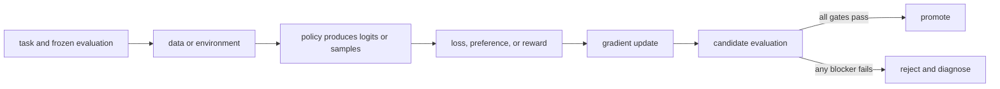

# 10. Preference data and feedback

**Question:** How do we turn human or AI judgments into usable comparisons?

**Evidence in this chapter:** stable concepts are explained from cited primary sources. All `pt101` outputs are deterministic `simulated` teaching evidence, not measurements of an LLM.

## The simplest accurate answer

Preference learning asks which response is better under a rubric. A pairwise comparison is often easier than assigning an absolute score, but it is still a measurement made by a person, model, or program under a specific protocol.

## A useful mental model

A tournament can rank players from wins and losses without giving an absolute skill score. Yet matchups matter: repeatedly pairing one player only with beginners gives a distorted ranking. Preference data also depends on candidate diversity and pairing policy.

## How it works

Sample candidates from declared policies and decoding settings. Randomize display order, allow ties or invalid items, train annotators on a concrete rubric, use overlap to estimate agreement, adjudicate hard cases, and preserve slice labels. AI feedback can scale collection, but it imports judge biases and may reward stylistic imitation. Preference coverage should match the deployment prompt distribution and include negative examples that expose important failure modes.

## Work one example

If both candidates are wrong but one is more fluent, a vague `which is better?` rubric may select fluent error. A correctness-first rubric plus an executable checker changes the observation. The pair is not ground truth outside that rubric.

## Do it yourself

Write five candidate pairs for one task. Include a tie, two jointly bad pairs, and a pair where verbosity conflicts with correctness. Create explicit adjudication rules.

Record the input, configuration, output, evidence label, and one sentence stating what the output **does not** prove. If you change two variables, split the work into two experiments.

## Check your understanding

Would reversing response order or hiding formatting change the label? Test it before scaling collection.

## Common failure

Do not discard disagreement automatically; it may reveal an underspecified task or heterogeneous user preferences.

## Sources

- [Training language models to follow instructions with human feedback](https://arxiv.org/abs/2203.02155)
- [Constitutional AI: Harmlessness from AI Feedback](https://arxiv.org/abs/2212.08073)

## Course position

- Prerequisite: [Chapter 09](../spine/09-lora-and-memory.md)
- Next: [Chapter 11](../spine/11-reward-models.md)
