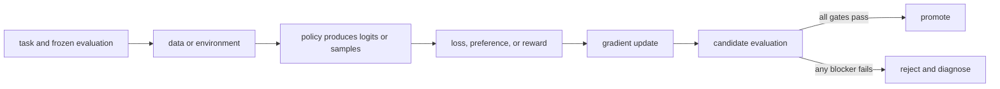

# 11. Reward models

**Question:** How can comparisons train a scalar scorer?

**Evidence in this chapter:** stable concepts are explained from cited primary sources. All `pt101` outputs are deterministic `simulated` teaching evidence, not measurements of an LLM.

## The simplest accurate answer

A reward model maps a prompt-response pair to a scalar. Pairwise training raises the chosen response's score above the rejected response's score. The scalar is useful for ranking and RL, but it is a learned proxy whose reliability is bounded by the comparison distribution.

## A useful mental model

A trained judge learns from past verdicts. It can make future review cheaper, but a clever contestant may exploit patterns in the judge rather than satisfy the real rules. That exploitation is reward hacking.

## How it works

A common Bradley-Terry loss is -log sigmoid(r_chosen-r_rejected). Only score differences matter, so adding the same constant to both rewards changes nothing. Evaluate pairwise accuracy, calibration where meaningful, slice robustness, out-of-distribution behavior, and sensitivity to superficial features. During RL the policy distribution moves, so a reward model accurate on old candidates can become unreliable on new ones.

## Work one example

At equal scores the model assigns 0.5 probability that the chosen item wins and loss is about 0.693. One gradient step increases the score gap. Run the toy reward model to see that movement; it proves the formula implementation, not judge quality.

## Do it yourself

Run `pt101 reward-model`. Create adversarial responses that are longer, more confident, or copy rubric words while remaining wrong. Check whether a proposed scorer is fooled.

Record the input, configuration, output, evidence label, and one sentence stating what the output **does not** prove. If you change two variables, split the work into two experiments.

## Check your understanding

What new candidate distribution would make the reward model's held-out accuracy irrelevant?

## Common failure

Never report reward increase alone as product improvement; audit real task outcomes on fresh samples.

## Sources

- [Training language models to follow instructions with human feedback](https://arxiv.org/abs/2203.02155)
- [TRL Reward Trainer](https://huggingface.co/docs/trl/main/reward_trainer)

## Course position

- Prerequisite: [Chapter 10](../spine/10-preference-data.md)
- Next: [Chapter 12](../spine/12-rl-from-bandits-to-mdps.md)
