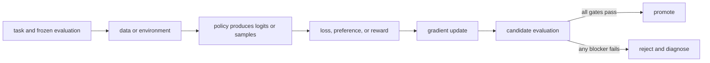

# 12. RL from bandits to Markov decision processes

**Question:** What makes reinforcement learning different from supervised learning?

**Evidence in this chapter:** stable concepts are explained from cited primary sources. All `pt101` outputs are deterministic `simulated` teaching evidence, not measurements of an LLM.

## The simplest accurate answer

Reinforcement learning trains a policy from consequences of sampled actions. In a bandit there is one decision and reward. In a Markov decision process (MDP), actions change state, rewards can arrive later, and the policy must account for future outcomes.

## A useful mental model

Trying restaurants is a bandit: choose once and observe a meal. Navigating a city is sequential: an early turn changes which later streets are reachable. The analogy breaks when a language model's state is a token history and the environment may include tools, users, or program execution.

## How it works

An MDP defines states, actions, transitions, rewards, and a discount factor. A trajectory is s_0,a_0,r_0,... . Return is the discounted sum of future rewards. A value function predicts expected return from a state; an action-value function conditions on an action; an advantage compares an action with the baseline expectation. LLM generation can be modeled with token actions, but sequence-level actions are often used for tractability.

## Work one example

For rewards [0,0,1] and discount 0.9, return from the start is 0.81. The terminal success supplies credit to earlier actions. With sparse rewards, many samples provide little information, which motivates better exploration, shaping, curricula, or process feedback.

## Do it yourself

Draw an MDP for a two-step tool task. Specify terminal states, invalid actions, timeout reward, success reward, and which observations the policy receives.

Record the input, configuration, output, evidence label, and one sentence stating what the output **does not** prove. If you change two variables, split the work into two experiments.

## Check your understanding

Is your task truly sequential, or is contextual-bandit feedback enough? Using a simpler model can reduce variance and system complexity.

## Common failure

Do not call DPO online RL: it learns from a fixed preference dataset and does not sample environment consequences during each update.

## Sources

- [Reinforcement Learning: An Introduction](http://incompleteideas.net/book/the-book-2nd.html)

## Course position

- Prerequisite: [Chapter 11](../spine/11-reward-models.md)
- Next: [Chapter 13](../spine/13-policy-gradients.md)
