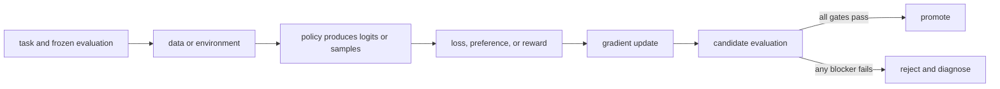

# 13. Policy gradients and REINFORCE

**Question:** How can a non-differentiable reward change differentiable model weights?

**Evidence in this chapter:** stable concepts are explained from cited primary sources. All `pt101` outputs are deterministic `simulated` teaching evidence, not measurements of an LLM.

## The simplest accurate answer

The policy-gradient trick differentiates the log-probability of sampled actions and weights it by observed return. The reward itself need not be differentiable. Actions with above-baseline outcomes become more likely; below-baseline actions become less likely.

## A useful mental model

A coach cannot differentiate the final score, but can reinforce decisions associated with better-than-expected games. This analogy hides confounding: one sampled game is noisy evidence about each decision.

## How it works

REINFORCE estimates gradient E[R * grad log pi(a|s)]. Subtracting a baseline independent of the sampled action preserves the expectation while reducing variance. In sequence models, sum token log-probabilities for the sampled completion and multiply by an advantage estimate. Batches, reward normalization, value baselines, entropy bonuses, and KL penalties stabilize learning but also change the effective objective.

## Work one example

With two equally likely actions, choosing action 1 and receiving reward above baseline increases action 1's logit relative to action 0. A second sample may push the other way. The average across representative trajectories estimates the desired direction.

## Do it yourself

Use the Python API `reinforce_step([0,0], action=1, reward=1, baseline=0.5)`. Repeat for below-baseline reward and explain the sign change.

Record the input, configuration, output, evidence label, and one sentence stating what the output **does not** prove. If you change two variables, split the work into two experiments.

## Check your understanding

Why does a baseline reduce noise without changing which policy is optimal in expectation?

## Common failure

High reward variance, stale samples, and incorrect masks can overwhelm the useful learning signal even when the formula looks right.

## Sources

- [Simple Statistical Gradient-Following Algorithms](https://link.springer.com/article/10.1007/BF00992696)
- [Reinforcement Learning: An Introduction](http://incompleteideas.net/book/the-book-2nd.html)

## Course position

- Prerequisite: [Chapter 12](../spine/12-rl-from-bandits-to-mdps.md)
- Next: [Chapter 14](../spine/14-ppo-and-kl-control.md)
