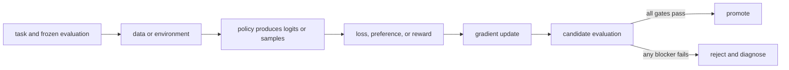

# 14. PPO and KL control

**Question:** Why constrain how far the policy moves?

**Evidence in this chapter:** stable concepts are explained from cited primary sources. All `pt101` outputs are deterministic `simulated` teaching evidence, not measurements of an LLM.

## The simplest accurate answer

Proximal Policy Optimization (PPO) reuses sampled trajectories while limiting incentives for large probability-ratio changes. In LLM post-training it is commonly paired with a value model for advantages and a reference policy or KL penalty to preserve useful behavior.

## A useful mental model

If feedback comes from yesterday's driving, a driver should not rewrite every habit overnight. PPO's clip is a guardrail on the update incentive, not a guarantee that the final model is safe or close everywhere.

## How it works

For sampled action a, ratio = pi_new(a|s)/pi_old(a|s). The clipped surrogate takes the smaller of ratio*A and clip(ratio,1-epsilon,1+epsilon)*A. Positive and negative advantages produce asymmetric constraints. A complete PPO loop needs rollout policy identity, stored old log-probabilities, returns, advantage estimation, minibatch epochs, value loss, entropy or KL terms, and freshness controls.

## Work one example

Run the toy case ratio 1.35, advantage 0.8, epsilon 0.2. The unclipped objective is 1.08 but the clipped objective is 0.96, so the surrogate stops rewarding that extra increase for this sample. Gradients and aggregate behavior still require the full batch.

## Do it yourself

Run `pt101 ppo`. Evaluate four cases: ratio above and below the interval crossed with positive and negative advantages. Explain each minimum.

Record the input, configuration, output, evidence label, and one sentence stating what the output **does not** prove. If you change two variables, split the work into two experiments.

## Check your understanding

Why does clipping the sampled-action ratio not bound KL divergence for every prompt and token?

## Common failure

A PPO run is on-policy only within a freshness tolerance; serving rollouts from unidentified or lagging weights corrupts ratios.

## Sources

- [Proximal Policy Optimization Algorithms](https://arxiv.org/abs/1707.06347)
- [Training language models to follow instructions with human feedback](https://arxiv.org/abs/2203.02155)
- [TRL PPO Trainer](https://huggingface.co/docs/trl/main/ppo_trainer)

## Course position

- Prerequisite: [Chapter 13](../spine/13-policy-gradients.md)
- Next: [Chapter 15](../spine/15-dpo.md)
