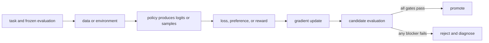

# 15. Direct Preference Optimization

**Question:** Can we optimize preferences without an explicit reward-model-and-PPO loop?

**Evidence in this chapter:** stable concepts are explained from cited primary sources. All `pt101` outputs are deterministic `simulated` teaching evidence, not measurements of an LLM.

## The simplest accurate answer

Direct Preference Optimization (DPO) trains a policy directly on chosen and rejected responses while comparing both with a fixed reference policy. It converts a particular KL-regularized preference objective into a classification-style loss.

## A useful mental model

DPO is like teaching from side-by-side corrections without first hiring a separate judge who assigns reusable scores. This is operationally simpler, but the corrections are fixed: the learner does not discover new mistakes by acting in an environment during training.

## How it works

For each pair, compute policy and reference sequence log-probability gaps between chosen and rejected. DPO increases beta times the policy gap relative to the reference gap through a log-sigmoid loss. Beta controls the scale in the stated formulation, but implementations and conventions must be checked. Tokenization, length effects, reference identity, pair quality, and loss variants all matter.

## Work one example

If policy and reference gaps are equal, the DPO margin is zero and loss is about 0.693. The gradient increases the policy's chosen-minus-rejected gap. `pt101 dpo` performs that scalar step.

## Do it yourself

Run `pt101 dpo`. Recompute the margin and loss. Then swap chosen and rejected and show why the update reverses.

Record the input, configuration, output, evidence label, and one sentence stating what the output **does not** prove. If you change two variables, split the work into two experiments.

## Check your understanding

When would online sampling and environment feedback reveal failures that a frozen preference dataset cannot cover?

## Common failure

DPO is not automatically better than PPO; it trades a simpler training loop for dependence on static comparison coverage.

## Sources

- [Direct Preference Optimization](https://arxiv.org/abs/2305.18290)
- [TRL DPO Trainer](https://huggingface.co/docs/trl/main/dpo_trainer)

## Course position

- Prerequisite: [Chapter 14](../spine/14-ppo-and-kl-control.md)
- Next: [Chapter 16](../spine/16-verifiable-rewards-and-rlaif.md)
