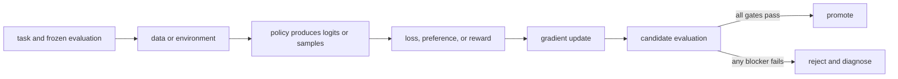

# 16. Verifiable rewards, human feedback, and AI feedback

**Question:** Where should rewards come from?

**Evidence in this chapter:** stable concepts are explained from cited primary sources. All `pt101` outputs are deterministic `simulated` teaching evidence, not measurements of an LLM.

## The simplest accurate answer

Reward sources form a spectrum: executable checkers, environment outcomes, human judgments, AI judgments, and learned reward models. Choose the most direct reliable signal available, and combine it with guardrails for behavior the scalar omits.

## A useful mental model

A unit test gives crisp feedback on code that has a formal contract; an editor judges clarity that no single test captures. Using an editor where a compiler suffices adds cost and variance. Using a compiler to judge prose misses the task.

## How it works

Verifiable rewards work well for math answers, code tests, games, and tool outcomes, but checkers can be incomplete or exploitable. Human feedback captures nuanced preferences but is slow and inconsistent. AI feedback scales but inherits the evaluator model's blind spots and correlated errors. Constitutional AI is one approach that uses written principles and AI feedback; it does not eliminate the need to validate the resulting behavior.

## Work one example

A code reward of `tests_passed / total_tests` can be hacked by deleting tests unless workspace integrity and hidden tests are enforced. The reward function is part of the attack surface.

## Do it yourself

Threat-model a reward for a coding, math, or tool-use task. List ten ways the policy could earn reward without satisfying user intent, then add independent checks.

Record the input, configuration, output, evidence label, and one sentence stating what the output **does not** prove. If you change two variables, split the work into two experiments.

## Check your understanding

What trusted mechanism produces each reward bit, and can the policy influence that mechanism?

## Common failure

Reward shaping can accelerate learning while changing the optimum; prove or test that shaping preserves the intended task.

## Sources

- [Constitutional AI: Harmlessness from AI Feedback](https://arxiv.org/abs/2212.08073)
- [Training language models to follow instructions with human feedback](https://arxiv.org/abs/2203.02155)

## Course position

- Prerequisite: [Chapter 15](../spine/15-dpo.md)
- Next: [Chapter 17](../spine/17-grpo.md)
