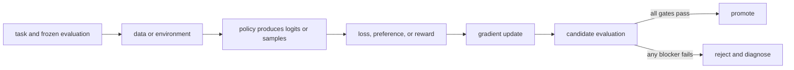

# 17. GRPO and group-relative advantages

**Question:** How can a group of completions provide a baseline without a separate critic?

**Evidence in this chapter:** stable concepts are explained from cited primary sources. All `pt101` outputs are deterministic `simulated` teaching evidence, not measurements of an LLM.

## The simplest accurate answer

Group Relative Policy Optimization (GRPO) samples multiple completions for the same prompt and normalizes their rewards within the group to form relative advantages. The original DeepSeekMath formulation was introduced as a PPO variant that avoids a separate value model.

## A useful mental model

A class curve tells which solutions were better than classmates on the same exam. It removes the need to predict an absolute expected grade, but a class where everyone receives the same score gives no ranking signal.

## How it works

For rewards r_1...r_G, a common group-relative estimate subtracts the group mean and divides by group standard deviation. Implementations add details such as clipping, KL terms, token-level aggregation, multiple update iterations, or different normalization. Groups must share the intended conditioning context; mixing unrelated tasks makes the baseline harder to interpret. Zero-variance groups produce no relative signal in the toy implementation.

## Work one example

For rewards [0,1,1,0.5], the mean is 0.625. Above-mean samples get positive advantages and below-mean samples negative ones. Run the command to inspect normalized values and verify their mean is approximately zero.

## Do it yourself

Run `pt101 grpo`. Try all-equal rewards, one extreme outlier, and group sizes two and eight. Explain variance and robustness tradeoffs.

Record the input, configuration, output, evidence label, and one sentence stating what the output **does not** prove. If you change two variables, split the work into two experiments.

## Check your understanding

What happens if one prompt is much harder than another but their samples are incorrectly combined into a group?

## Common failure

GRPO removes a learned critic in the stated design; it does not remove rollout cost, reward design, reference control, or evaluation.

## Sources

- [DeepSeekMath and GRPO](https://arxiv.org/abs/2402.03300)
- [TRL GRPO Trainer](https://huggingface.co/docs/trl/main/grpo_trainer)

## Course position

- Prerequisite: [Chapter 16](../spine/16-verifiable-rewards-and-rlaif.md)
- Next: [Chapter 18](../spine/18-agents-tools-and-environments.md)
