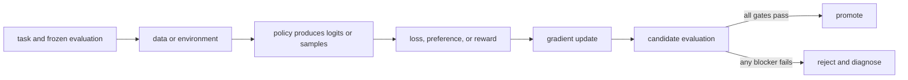

# 18. Agents, tools, and environments

**Question:** What changes when the model acts over multiple steps?

**Evidence in this chapter:** stable concepts are explained from cited primary sources. All `pt101` outputs are deterministic `simulated` teaching evidence, not measurements of an LLM.

## The simplest accurate answer

Agent post-training couples a policy to a stateful environment. The model observes, emits text or tool calls, receives tool results, and continues until success, failure, or a limit. The training record must preserve the whole trajectory and environment identity.

## A useful mental model

Training a chess move from the final result is harder than grading a single answer because early actions change later choices. Tool agents add another complication: the board itself may be nondeterministic, permissioned, or mutable.

## How it works

Define an environment reset, observation schema, action grammar, transition, reward, terminal condition, timeout, and sandbox. Separate model errors from tool failures and harness failures. Pin tool versions and fixtures. Use idempotent or disposable environments for training. For real systems, enforce least privilege and prevent reward channels from authorizing broader actions.

## Work one example

A bug-fixing agent may earn success when tests pass. A valid environment also checks the requested tests existed, forbidden files were untouched, dependencies were not maliciously replaced, and the patch actually addresses a hidden case.

## Do it yourself

Design a three-step calculator environment on paper, then a repository-fix environment. Mark every mutation boundary and cleanup action.

Record the input, configuration, output, evidence label, and one sentence stating what the output **does not** prove. If you change two variables, split the work into two experiments.

## Check your understanding

Can two replays of the same trajectory produce different observations? If yes, how will you attribute the reward?

## Common failure

Never let training rewards grant permissions. Authorization is an external system constraint, not a behavior learned from penalties.

## Sources

- [TRL GRPO Trainer](https://huggingface.co/docs/trl/main/grpo_trainer)

## Course position

- Prerequisite: [Chapter 17](../spine/17-grpo.md)
- Next: [Chapter 19](../spine/19-training-systems.md)
