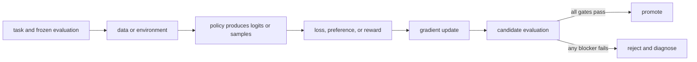

# 19. The training system: memory, parallelism, and rollouts

**Question:** How does an algorithm become a reliable distributed job?

**Evidence in this chapter:** stable concepts are explained from cited primary sources. All `pt101` outputs are deterministic `simulated` teaching evidence, not measurements of an LLM.

## The simplest accurate answer

A post-training system moves model weights, activations, gradients, optimizer states, batches, rollouts, log-probabilities, and checkpoints through hardware. Algorithm correctness and systems correctness meet at identities: every sample must be scored and updated against the intended policy, reference, reward, and tokenizer.

## A useful mental model

A factory can have a perfect recipe and still ship wrong products if parts are mislabeled or assembly lines are out of sync. Distributed training failures are often identity and freshness failures, not only numerical failures.

## How it works

Data parallelism replicates computation and combines gradients. Sharded data parallelism partitions parameters, gradients, and optimizer state with communication around computation. Tensor and pipeline parallelism split model execution. Online RL also needs rollout workers and sometimes separate inference engines, creating policy-lag and weight-broadcast problems. Build a memory ledger and communication timeline before choosing a topology.

## Work one example

If a model, gradients, and two Adam moments each occupy one unit per parameter at the chosen precision, naive replicated training already needs multiple parameter-sized units before activations and temporary buffers. Sharding changes residency and communication, not the mathematical need to update parameters.

## Do it yourself

Draft a topology for SFT and for online RL. For each process, list resident models, mutable state, input queue, output artifact, synchronization event, and failure recovery.

Record the input, configuration, output, evidence label, and one sentence stating what the output **does not** prove. If you change two variables, split the work into two experiments.

## Check your understanding

How does the learner prove that a stored old log-probability came from the exact rollout policy checkpoint?

## Common failure

Do not choose FSDP, ZeRO, tensor parallelism, or an inference engine from model size alone; derive memory, bandwidth, latency, and operational constraints.

## Sources

- [PyTorch Fully Sharded Data Parallel](https://docs.pytorch.org/docs/stable/fsdp.html)
- [DeepSpeed ZeRO](https://www.deepspeed.ai/tutorials/zero/)
- [TRL distributed training](https://huggingface.co/docs/trl/main/distributing_training)

## Course position

- Prerequisite: [Chapter 18](../spine/18-agents-tools-and-environments.md)
- Next: [Chapter 20](../spine/20-failure-modes-and-safety.md)
