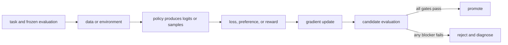

# 21. Promotion, deployment, monitoring, and iteration

**Question:** When is a trained checkpoint ready to serve?

**Evidence in this chapter:** stable concepts are explained from cited primary sources. All `pt101` outputs are deterministic `simulated` teaching evidence, not measurements of an LLM.

## The simplest accurate answer

A checkpoint becomes a release candidate only after reproducible offline evaluation, artifact validation, and a promotion decision against predeclared gates. Deployment then needs staged exposure, online monitoring, rollback, and a feedback path that does not silently turn production traffic into ungoverned training data.

## A useful mental model

Releasing a model resembles releasing code with an extra statistical surface. Unit tests and checksums matter, but behavior varies across prompts and sampling. Canary exposure is an experiment, not a substitute for pre-release evidence.

## How it works

Bind base model, adapters or weights, tokenizer, template, training code, configuration, datasets, environment, reward, evaluator, and metrics by immutable IDs. Compare baseline and candidate blindly where possible. Start with shadow or internal traffic, then a bounded canary. Monitor task outcomes, safety signals, refusals, latency, cost, drift, and rollback triggers. Preserve sampled traces under privacy and retention controls.

## Work one example

The toy pipeline promotes only if preferred-action probability improves and KL remains below a limit. A real gate should also require confidence, no critical slice regression, artifact integrity, operational readiness, and human approval for material risk.

## Do it yourself

Run `pt101 pipeline`. Modify the gate on paper to add safety, latency, and cost. Decide which are hard blockers and which permit bounded tradeoffs.

Record the input, configuration, output, evidence label, and one sentence stating what the output **does not** prove. If you change two variables, split the work into two experiments.

## Check your understanding

What exact evidence would cause automatic rollback after deployment?

## Common failure

Never continuously train on production feedback without provenance, consent, contamination controls, and a new evaluation cycle.

## Sources

- [Training language models to follow instructions with human feedback](https://arxiv.org/abs/2203.02155)

## Course position

- Prerequisite: [Chapter 20](../spine/20-failure-modes-and-safety.md)
- Next: [Chapter 22](../spine/22-capstone.md)
