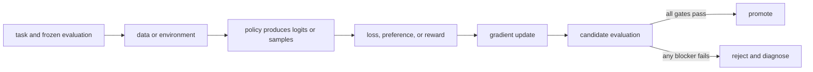

# 22. Capstone: optimize one small model end to end

**Question:** Can you operate the entire stack without confusing a proxy, a simulation, and a measured result?

**Evidence in this chapter:** stable concepts are explained from cited primary sources. All `pt101` outputs are deterministic `simulated` teaching evidence, not measurements of an LLM.

## The simplest accurate answer

The capstone asks you to improve one narrow behavior while preserving explicit guardrails. Start with the CPU toy pipeline to prove your reasoning. Then, only if hardware and licenses permit, replace components with a small open model and a real framework while keeping the same contracts.

## A useful mental model

This is a flight simulator followed by a supervised flight. The simulator teaches control relationships cheaply. It cannot certify performance of a real aircraft, so the real run needs its own environment record and evidence.

## How it works

Phase A freezes a task contract and baseline. Phase B creates demonstration and preference data. Phase C runs SFT and evaluates. Phase D chooses either DPO for fixed pairs or online RL for an executable environment, with the choice justified by feedback availability. Phase E performs independent regression and safety evaluation. Phase F packages immutable artifacts and makes a promote-or-reject decision. Every phase has a stop condition.

## Work one example

A suitable task is structured transformation or arithmetic with exact validation and a format guardrail. An unsuitable first capstone is open-domain truthfulness with a single model judge, because the ground truth and evaluator boundary are too weak for a beginner experiment.

## Do it yourself

Follow `docs/capstones/end-to-end.md`. Produce an experiment card, dataset cards, baseline record, training manifest, per-example evaluation, failure register, model card, and promotion decision. Run `python3.12 scripts/validate_all.py` before claiming completion.

Record the input, configuration, output, evidence label, and one sentence stating what the output **does not** prove. If you change two variables, split the work into two experiments.

## Check your understanding

Can another person reproduce the candidate and independently reach the same promotion decision from your frozen artifacts?

## Common failure

Do not upgrade `specified-not-executed` plans or CPU simulations to `measured` claims. Evidence labels are part of the result.

## Sources

- [Hugging Face TRL documentation](https://huggingface.co/docs/trl/main/index)
- [PyTorch Fully Sharded Data Parallel](https://docs.pytorch.org/docs/stable/fsdp.html)

## Course position

- Prerequisite: [Chapter 21](../spine/21-production-loop.md)
- Next: Proceed to the capstone packet.
